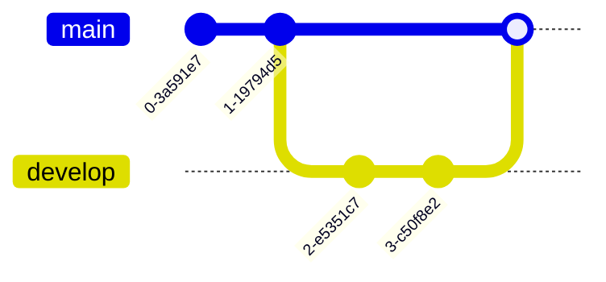

# AI Agent Guide for Astro Modular Theme

This document contains essential information for AI agents working with this Astro-based blog theme. It combines development practices, folder-based content organization, technical implementation details, and the project's vision for seamless Obsidian-to-web publishing.

## 🚨 CRITICAL: Primary Information Sources

**⚠️ AI AGENTS MUST READ THIS SECTION FIRST ⚠️**

**The most up-to-date and accurate information is found in these blog posts:**

1. **[Getting Started Guide](src/content/posts/getting-started.md)** - Complete setup, configuration, and workflow information
2. **[Astro Suite Vault Guide](src/content/posts/obsidian-vault-guide.md)** - Obsidian vault configuration and usage

**These blog posts should be treated as the authoritative source of truth.** Use the information in this AGENTS.md file as supplementary technical documentation, but always reference the blog posts for the most current and accurate user-facing information.

**When in doubt, check the blog posts first.**

## 🚨 CRITICAL: Most Common AI Agent Mistakes

**⚠️ READ THESE FIRST - These are the #1 issues that keep coming up:**

1. **🚨 NEVER EDIT MARKDOWN CONTENT** - NEVER edit markdown files in `src/content/` without explicit user permission
2. **🚨 USE `id` NOT `slug`** - `slug` is deprecated in Astro v6. ALWAYS use `entry.id` instead. [See detailed solution](#-critical-use-id-not-slug)
3. **🚨 SWUP BREAKS JAVASCRIPT** - Interactive elements stop working after page transitions. [See detailed solution](#-critical-javascript-re-initialization-after-page-transitions)
4. **🚨 MATH RENDERING DUPLICATION** - Math appears twice due to wrong CSS. [See solution](#1--math-rendering-duplication-most-critical)
5. **🚨 PRODUCTION LOGGING** - Never use raw `console.log()` in production code
6. **🚨 IMAGE SYSTEM CONFUSION** - Post cards vs post content images are separate systems
7. **🚨 URL MAPPING SYSTEM CONFUSION** - URL mapping is for rendering only, doesn't affect linked mentions/graph view
8. **🚨 FOLDER-BASED CONTENT ASSUMPTIONS** - ALL content types support folder-based organization, not just posts
9. **🚨 FOLDER-BASED POST ID DETECTION** - Astro v6 folder-based posts have IDs like 'folder-name', NOT 'folder-name/index'
10. **🚨 PLUGIN ORDER AND EMBED HANDLING** - Plugins execute sequentially - changes affect subsequent plugins. [See detailed solution](#12--plugin-order-and-embed-handling-critical)
11. **🚨 NEVER DISABLE ASTRO DEV TOOLBAR** - The dev toolbar must remain enabled (`devToolbar.enabled: true`) - do NOT disable it to resolve module loading errors

**These issues are documented in detail in the [Common AI Agent Mistakes](#common-ai-agent-mistakes) section.**

## 🚨 CRITICAL: Use `id` Not `slug` (Astro v6)

**⚠️ AI AGENTS MUST READ THIS SECTION CAREFULLY ⚠️**

**The `slug` property is DEPRECATED in Astro v6 and MUST NOT be used.**

### **The Breaking Change**

According to the [Astro v6 Upgrade Guide](https://deploy-preview-12322--astro-docs-2.netlify.app/en/guides/upgrade-to/v6/#upgrade-astro), the `slug` property on collection entries has been removed in favor of `id`:

- **Old (WRONG)**: `post.slug` - This is deprecated and will cause "undefined" URLs
- **New (CORRECT)**: `post.id` - This is the modern API and always works correctly

### **Why This Matters**

Previously, Astro used:
- `id` - Based on the filename (e.g., `getting-started/index.md` → `"getting-started/index"`)
- `slug` - A URL-friendly version (e.g., `"getting-started"`)

Now in Astro v5/v6:
- `id` - IS the slug (e.g., `"getting-started"`)
- `slug` - REMOVED/DEPRECATED (causes undefined values)

### **Common Mistakes**

**❌ WRONG - Using `slug`:**
```typescript
// DON'T DO THIS - slug is deprecated
const posts = await getCollection('posts');
posts.map(post => ({
  url: `/posts/${post.slug}`,  // ❌ Will be undefined!
  id: post.slug                 // ❌ Will be undefined!
}));
```

**✅ CORRECT - Using `id`:**
```typescript
// DO THIS - id is the modern API
const posts = await getCollection('posts');
posts.map(post => ({
  url: `/posts/${post.id}`,    // ✅ Works correctly
  id: post.id                   // ✅ Works correctly
}));
```

### **Where to Check**

Search your codebase for these patterns and replace `slug` with `id`:
- API endpoints: `src/pages/api/*.json.ts`
- Dynamic routes: `src/pages/[...slug].astro`
- Component props: Any component receiving collection entries
- URL generation: Anywhere constructing URLs from collection entries

### **Files Already Fixed**

These files have been updated to use `id` instead of `slug`:
- ✅ `src/pages/api/posts.json.ts`
- ✅ `src/pages/api/pages.json.ts`
- ✅ `src/pages/api/projects.json.ts`
- ✅ `src/pages/api/docs.json.ts`

**This is CRITICAL for command palette search, navigation, and all URL generation.**

## 🚨 CRITICAL: Astro v6 Compatibility Status

**⚠️ AI AGENTS MUST READ THIS SECTION CAREFULLY ⚠️**

**This theme is FULLY PREPARED for Astro v6 compatibility.** All legacy v4 patterns have been removed and the theme uses modern v5/v6 APIs.

### **Current Status (January 2025)**
- **Astro Version**: 5.15.1 (current stable)
- **v6 Readiness**: ✅ **Fully prepared** - no breaking changes expected
- **Content Collections**: ✅ Using modern v5/v6 API
- **Config Location**: ✅ `src/content.config.ts` (v6 requirement)
- **Legacy Patterns**: ✅ All removed
- **Using `id` not `slug`**: ✅ All files updated

### **What Was Fixed for v6 Compatibility**
1. **Config File Location**: Moved from `src/content/config.ts` to `src/content.config.ts`
2. **Collection Definitions**: Removed `type: 'content'` from all collections
3. **ViewTransitions Import**: Removed unused import (v6 breaking change)
4. **Image Field Safety**: Added type checking for `null` image fields
5. **Legacy API Usage**: Verified no deprecated APIs are used
6. **Slug to ID Migration**: All references to `entry.slug` replaced with `entry.id`

### **Verified Clean (No Issues Found)**
- ✅ No experimental flags in use
- ✅ No legacy collection patterns
- ✅ No deprecated APIs (`Astro.glob`, `emitESMImage`, etc.)
- ✅ No `handleForms` prop on ClientRouter
- ✅ No legacy collection methods
- ✅ All integrations v6 compatible
- ✅ Using `id` instead of deprecated `slug`

### **When Astro v6 Releases**
- **No action required** - theme will work immediately
- **No breaking changes** expected
- **All features** will continue to work
- **Build process** will remain unchanged

**This theme is future-proof and ready for Astro v6.**

## Table of Contents

1. [Project Vision & Philosophy](#project-vision--philosophy)
2. [Development Environment](#development-environment)
3. [Content Organization](#content-organization)
4. [Obsidian Integration](#obsidian-integration)
5. [Image Handling](#image-handling)
6. [Mathematical Notation Support](#mathematical-notation-support)
7. [Mermaid Diagram Support](#mermaid-diagram-support)
8. [Interactive Force-Graph Implementation](#interactive-force-graph-implementation)
9. [Command Palette Theme Switcher](#command-palette-theme-switcher)
10. [Build Process](#build-process)
   - [RSS and Atom Feeds](#rss-and-atom-feeds)
11. [Version Management](#version-management)
12. [Configuration & Customization](#configuration--customization)
   - [Typography Configuration](#typography-configuration)
13. [Troubleshooting](#troubleshooting)
14. [Best Practices](#best-practices)
15. [Common AI Agent Mistakes](#common-ai-agent-mistakes)

## Project Vision & Philosophy

### Core Mission
Astro Modular is an Astro blog theme template designed for **Obsidian users**, created by [David V. Kimball](https://davidvkimball.com). This theme turns Obsidian into a powerful CMS for instant blog publishing, bridging the gap between your Obsidian vault and a production-ready blog.

The theme is built on four core principles:

#### **Clarity First**
Content should be the star, not the design. Every element is carefully crafted to enhance readability and focus attention on what matters most - your ideas and writing.

#### **Highly Performant**
Fast loading times and smooth interactions are not optional. Every aspect of this theme has been optimized to deliver exceptional performance across all devices.

#### **Works with Obsidian**
If you use Obsidian, this theme is a natural extension of your workflow. All rich markdown and extended markdown features, including Wikilinks, callouts, and other embedded features, display seamlessly between your vault and published site.

#### **Modular Design**
Every feature can be toggled on or off through a single configuration file. Enable only what you need, keeping your site fast and focused on your specific use case.

### Key Design Principles

#### 1. **Built for Obsidian Users**
- **Direct Obsidian integration** - Write in a dedicated vault, publish to your blog
- **Wikilinks support** - `[[Internal Links]]` and `[[Link|Custom Text]]` work seamlessly
- **Obsidian callouts** - Full support for `> [!note]`, `> [!tip]`, `> [!warning]` and more
- **Tag compatibility** - Your Obsidian tags become blog tags automatically
- **Frontmatter sync** - Compatible metadata structure between Obsidian and Astro
- **Folder-based organization** - Keep content and assets together in dedicated folders
- **Obsidian bracket syntax** - Support for `[[image.jpg]]` syntax in image references
- **[Astro Suite Obsidian Vault](https://github.com/davidvkimball/obsidian-astro-suite) built-in** - Includes Obsidian vault configuration for streamlined publishing

#### 2. **Flexible & Customizable**
- **Modular design** - Each feature can be enabled/disabled independently
- **Multiple color options** - Select from a variety of prebuilt themes (Oxygen, Minimal, Atom, Ayu, Catppuccin, Charcoal, Dracula, Everforest, Flexoki, Gruvbox, macOS, Nord, Obsidian, Rosé Pine, Sky, Solarized, and Things)
- **Custom typography** - Separate font configuration for headings and body text with 20+ supported fonts
- **TypeScript throughout** for type safety and better development experience
- **Command palette** - Press `Ctrl+K` (or custom hotkey) for instant navigation and search
- **Responsive image grids** - Automatic layouts for multiple consecutive images
- **Dark/light themes** - System preference detection with manual toggle
- **SEO ready** - Automatic sitemaps, RSS feeds, and Open Graph images

#### 3. **Content Management Excellence**
- **Markdown-first** with enhanced processing and reading time estimation
- **Folder-based posts** - Organize content and assets in dedicated folders
- **Draft support** - Show drafts in development, hide in preview and production (works for posts, pages, projects, and docs)
- **Image optimization** with WebP format priority and responsive layouts
- **Table of contents** auto-generation from headings

#### 4. **Navigation & Discovery**
- **Fuzzy search** through all content via command palette
- **Linked mentions** - See which posts reference each other
- **Tag filtering** and next/previous navigation between posts

### Target Audience
- **Obsidian power users** who want to publish their notes
- **Content creators** who prefer markdown-first workflows
- **Developers** who want a customizable, performant blog
- **Writers** who value seamless editing and publishing experience

## Development Environment

### Package Management
- **Package Manager**: This project uses `pnpm` instead of `npm` for all package and script commands
- **Scripts**: All commands should use `pnpm run <script-name>`

### Development Server
- **Command**: `pnpm run dev`
- **Port**: 5000 (with fallback to 5001 if occupied)
- **Host**: localhost
- **Hot Reload**: Enabled with file watching

### 🚨 CRITICAL: Vite File System Security

**⚠️ AI AGENTS MUST READ THIS SECTION CAREFULLY ⚠️**

**NEVER disable `vite.server.fs.strict`** in the Astro configuration. This is a **CRITICAL security requirement**.

#### **Why This Matters**
- **Security**: `fs.strict: false` allows access to files outside the project directory
- **Network Exposure**: Files on your machine become accessible on your network
- **Best Practice**: Vite's strict mode is the default for good security reasons
- **Professional Standards**: Production sites should maintain proper file system boundaries

#### **What NOT to Do**
```javascript
// ❌ WRONG - Never disable Vite strict mode
vite: {
  server: {
    fs: {
      strict: false,  // NEVER DO THIS
      allow: ['..']   // NEVER DO THIS
    }
  }
}
```

#### **What to Do Instead**
- **Keep Vite strict mode enabled** (default behavior)
- **Use proper file paths** within the project directory
- **Handle file system errors gracefully** without compromising security
- **Use environment variables** for development-specific configurations

**This is CRITICAL for maintaining security and professional development standards.**

### 🚨 CRITICAL: Production Logging Guidelines

**⚠️ AI AGENTS MUST READ THIS SECTION CAREFULLY ⚠️**

**NEVER use raw `console.log()` statements in production code.** This project maintains clean console output for professional deployments.

#### **Why This Matters**
- **Production Performance**: Console logs slow down production sites
- **User Experience**: Console spam degrades user experience
- **Professional Standards**: Production sites should have clean console output

#### **Simple Rule**
- **Development**: Console logs are acceptable for debugging
- **Production**: No console output should appear in the final build
- **Use the project's logger utility** (`src/utils/logger.ts`) for any logging needs

### 🎨 CRITICAL: Color Usage Guidelines

**⚠️ AI AGENTS MUST READ THIS SECTION CAREFULLY ⚠️**

This project uses a **dynamic theming system** where colors are defined in theme variables, not hardcoded values. This is **CRITICAL** for maintaining theme consistency and allowing users to switch between different color schemes.

#### **Why This Matters**
- **Theme Consistency**: All colors should work across all 17+ available themes
- **User Experience**: Users can switch themes and colors should adapt automatically
- **Maintainability**: Color changes only need to be made in one place (theme definitions)
- **Professional Standards**: Hardcoded colors break the theming system

#### **How to Use Theme Colors**

**✅ CORRECT - Use theme variables from Tailwind config**
```typescript
// Use Tailwind classes that reference theme variables
@apply bg-primary-50 dark:bg-primary-800
@apply text-primary-900 dark:text-primary-100
@apply border-primary-200 dark:border-primary-600
@apply text-highlight-600 dark:text-highlight-400
```

**❌ WRONG - Never use hardcoded color values**
```typescript
// BAD - Hardcoded colors break theming
background: white;
color: #1f2937;
border: 1px solid #e5e7eb;
box-shadow: 0 4px 6px -1px rgb(0 0 0 / 0.1);
```

#### **Available Theme Color Variables**

**Primary Colors** (defined in `src/themes/index.ts`):
- `primary-50` through `primary-950` - Main theme colors
- `primary-100` - Light backgrounds, subtle elements
- `primary-200` - Borders, dividers, table headers
- `primary-300` - Muted text, secondary elements
- `primary-400` - Medium emphasis text
- `primary-500` - Default text color
- `primary-600` - High emphasis text
- `primary-700` - Dark backgrounds, strong elements
- `primary-800` - Darker backgrounds, headers
- `primary-900` - Darkest backgrounds, high contrast text

**Highlight Colors** (accent colors):
- `highlight-50` through `highlight-950` - Accent colors
- `highlight-400` - Links, interactive elements (light mode)
- `highlight-600` - Links, interactive elements (dark mode)
- `highlight-500` - Default highlight color

#### **Theme Color Usage Patterns**

**Backgrounds:**
```typescript
// Light backgrounds
@apply bg-primary-50 dark:bg-primary-800
@apply bg-primary-100 dark:bg-primary-700

// Dark backgrounds
@apply bg-primary-900 dark:bg-primary-50
@apply bg-primary-800 dark:bg-primary-100
```

**Text Colors:**
```typescript
// High contrast text
@apply text-primary-900 dark:text-primary-50
@apply text-primary-800 dark:text-primary-100

// Medium emphasis text
@apply text-primary-600 dark:text-primary-300
@apply text-primary-500 dark:text-primary-400

// Muted text
@apply text-primary-400 dark:text-primary-500
```

**Borders and Dividers:**
```typescript
// Subtle borders
@apply border-primary-200 dark:border-primary-600
@apply border-primary-300 dark:border-primary-500

// Strong borders
@apply border-primary-400 dark:border-primary-400
```

**Interactive Elements:**
```typescript
// Links and buttons
@apply text-highlight-600 dark:text-highlight-400
@apply hover:text-highlight-700 dark:hover:text-highlight-300

// Focus states
@apply focus:ring-highlight-500 dark:focus:ring-highlight-400
```

#### **Where to Find Theme Definitions**

1. **Main Theme Config**: `src/themes/index.ts` - Contains all theme definitions
2. **Tailwind Config**: `tailwind.config.mjs` - Maps theme variables to Tailwind classes
3. **Current Theme**: `src/config.ts` - Shows which theme is currently active

#### **Action Required for AI Agents**

1. **ALWAYS** use Tailwind classes that reference theme variables
2. **NEVER** use hardcoded color values like `#ffffff`, `rgb(255, 255, 255)`, or `white`
3. **CHECK** existing code for hardcoded colors and replace them
4. **USE** the dark mode variants (`dark:`) for all color definitions
5. **REFERENCE** the theme files to understand available color scales

#### **Example Conversion**

```typescript
// Before (BAD - hardcoded colors)
.table-wrapper {
  background: white;
  border: 1px solid #e5e7eb;
  color: #1f2937;
  box-shadow: 0 4px 6px -1px rgb(0 0 0 / 0.1);
}

.dark .table-wrapper {
  background: #1e293b;
  border-color: #475569;
  color: #f1f5f9;
}

// After (GOOD - theme variables)
.table-wrapper {
  @apply bg-white dark:bg-primary-800;
  @apply border border-primary-200 dark:border-primary-600;
  @apply text-primary-900 dark:text-primary-100;
  @apply shadow-sm;
}
```

**This is CRITICAL for maintaining the theming system and user experience across all themes.**

### Key Scripts
```bash
pnpm run dev              # Start development server
pnpm run build            # Build for production
pnpm run check-images     # Check for missing images
pnpm run sync-images      # Sync images from content to public
pnpm run process-aliases  # Process content aliases
pnpm run generate-deployment-config # Generate deployment configs
```


## Content Organization

### Folder-Based Posts Structure

The theme supports both traditional single-file posts and folder-based posts for better asset organization.

#### Traditional Posts
```
src/content/posts/
├── traditional-post.md
└── another-post.md
```

#### Folder-Based Posts
```
src/content/posts/
├── traditional-post.md
├── folder-based-post/
│   ├── index.md          # Main content file
│   ├── hero-image.jpg    # Assets co-located
│   ├── attachments/      # Optional: Obsidian subfolder setting
│   │   ├── cover.png
│   │   └── diagram.svg
│   ├── gallery-1.jpg
│   ├── diagram.png
│   └── document.pdf
└── another-folder-post/
    ├── index.md
    └── cover.jpg
```

### URL Generation
- **Folder name becomes the slug**: `folder-based-post` → `/posts/folder-based-post/`
- **index.md contains the content**: Main content goes in the `index.md` file
- **Assets are co-located**: All related files stay in the same folder

### Folder-Based Content Support

**All content types support folder-based organization:**

#### **Posts** (`src/content/posts/`)
- **Folder-based**: `folder-based-post/index.md` → `/posts/folder-based-post/`
- **Single-file**: `traditional-post.md` → `/posts/traditional-post/`

#### **Pages** (`src/content/pages/`)
- **Folder-based**: `folder-based-page/index.md` → `/folder-based-page/`
- **Single-file**: `about.md` → `/about/`

#### **Projects** (`src/content/projects/`)
- **Folder-based**: `project-name/index.md` → `/projects/project-name/`
- **Single-file**: `project.md` → `/projects/project/`

#### **Documentation** (`src/content/docs/`)
- **Folder-based**: `guide-name/index.md` → `/docs/guide-name/`
- **Single-file**: `guide.md` → `/docs/guide/`

**Key Benefits:**
- **Asset Co-location**: Images, PDFs, and other files stay with content
- **Obsidian Compatibility**: Works seamlessly with Obsidian's folder-based organization
- **Clean URLs**: Folder name becomes the URL slug automatically
- **Flexible Organization**: Mix single-file and folder-based content as needed

**Technical Implementation:**
- **Astro Content Collections**: Automatically handles folder-based content
- **Asset Syncing**: `scripts/sync-images.js` copies assets to public directory
- **URL Generation**: Folder name becomes slug, `index.md` provides content
- **Image Processing**: Co-located images work with both `[[image.jpg]]` and `` syntax

### Obsidian Subfolder Support
The theme supports Obsidian's "subfolder" setting where attachments are stored in an `attachments/` subfolder within folder-based content:

```
src/content/posts/my-post/
├── index.md
├── attachments/      # Obsidian subfolder setting
│   ├── cover.png
│   └── diagram.svg
└── other-file.jpg    # Co-located assets still work
```

**How it works:**
- Images in `attachments/` subfolders are automatically processed
- They're copied to the public directory without the `attachments/` prefix
- Both `attachments/image.png` and `image.png` references work seamlessly
- This prevents breaking when users switch between Obsidian's subfolder settings

### Content Types

The theme supports multiple content types for different purposes:

#### Posts (`src/content/posts/`)
- **Purpose**: Blog posts and articles
- **URL Structure**: `/posts/post-slug`
- **Features**: Tags, reading time, linked mentions, comments
- **Organization**: Single files or folder-based with co-located assets

#### Pages (`src/content/pages/`)
- **Purpose**: Static pages (About, Contact, etc.)
- **URL Structure**: `/page-slug`
- **Features**: Simple content without blog-specific features
- **Organization**: Single files or folder-based with co-located assets

#### Projects (`src/content/projects/`)
- **Purpose**: Portfolio items, side projects, work showcases
- **URL Structure**: `/projects/project-slug`
- **Features**: Categories, status, repository/demo links, featured flag
- **Organization**: Single files or folder-based with co-located assets
- **Frontmatter**: `title`, `description`, `date`, `categories`, `repositoryUrl`, `demoUrl`, `status`, `image`, `imageAlt`, `hideCoverImage`, `draft`, `noIndex`, `featured`

#### Documentation (`src/content/docs/`)
- **Purpose**: Technical documentation, guides, API references
- **URL Structure**: `/docs/doc-slug`
- **Features**: Categories, version control, table of contents, featured flag
- **Organization**: Single files or folder-based with co-located assets
- **Frontmatter**: `title`, `description`, `category`, `order`, `lastModified`, `version`, `image`, `imageAlt`, `hideCoverImage`, `hideTOC`, `draft`, `noIndex`, `showTOC`, `featured`

### Category Logic

The theme includes intelligent category handling that adapts based on your content:

#### Projects Categories
- **If NO projects have categories**: Hide the entire category system
  - Remove category display from project cards
  - Remove category display from individual project pages
  - Remove the category filtering block from the projects index page
- **If SOME projects have categories**: Show categories normally

#### Documentation Categories
- **If NO docs have categories**: Remove category system entirely
  - Remove category headings and TOC-like structure on the docs index page
  - Just list docs by their `order` number
- **If SOME docs have categories**:
  - Docs with categories go to their assigned category
  - Docs without categories go to a new "Unsorted" category
  - Keep the category structure

#### Individual Documentation TOC Control
- **`hideTOC` field**: Each doc can hide its table of contents with `hideTOC: true` in frontmatter
- **Separate from global setting**: This is independent of the global posts TOC setting
- **Default behavior**: TOC shows unless explicitly hidden

### Content Schema

#### Posts Collection
```typescript
{
  title: string;
  description: string;
  date: Date;
  tags?: string[];
  draft?: boolean;
  image?: string;
  imageOG?: boolean;
  imageAlt?: string;
  hideCoverImage?: boolean;
  targetKeyword?: string;
  // Note: author is global via siteConfig.author, not per-post
  // Note: noIndex is available but typically used for pages only
}
```

#### Pages Collection
```typescript
{
  title: string;
  description: string;
  draft?: boolean;
  lastModified?: Date;
  image?: string;
  imageAlt?: string;
  hideCoverImage?: boolean;
  hideTOC?: boolean;
  noIndex?: boolean;  // Commonly used for pages
}
```

#### Projects Collection
```typescript
{
  title: string;
  description: string;
  date: Date;
  categories?: string[];
  repositoryUrl?: string;
  demoUrl?: string;
  status?: 'in-progress' | 'released';
  image?: string;
  imageAlt?: string;
  hideCoverImage?: boolean;
  hideTOC?: boolean;
  draft?: boolean;
  noIndex?: boolean;
  featured?: boolean;
}
```

#### Documentation Collection
```typescript
{
  title: string;
  description: string;
  category: string;
  order: number;
  lastModified?: Date;
  version?: string;
  image?: string;
  imageAlt?: string;
  hideCoverImage?: boolean;
  hideTOC?: boolean;
  draft?: boolean;
  noIndex?: boolean;
  showTOC?: boolean;
  featured?: boolean;
}
```

### H1 Title Handling - CRITICAL DISTINCTION

**IMPORTANT**: Both Posts and Pages now handle H1 titles the same way:

#### Posts (PostLayout)
- **H1 is HARDCODED** in the layout using `{post.data.title}` from frontmatter
- **NO H1 in markdown content** - posts should NOT have `# Title` in their markdown
- **Layout controls styling** - H1 styling is handled by the PostLayout component
- **Example**: Post frontmatter has `title: "My Post"` → Layout renders `<h1>My Post</h1>`

#### Pages (PageLayout)
- **H1 is HARDCODED** in the layout using `{page.data.title}` from frontmatter
- **NO H1 in markdown content** - pages should NOT have `# Title` in their markdown
- **Layout controls styling** - H1 styling is handled by the PageLayout component
- **Example**: Page frontmatter has `title: "About"` → Layout renders `<h1>About</h1>`

#### Why This Matters
- **Both Posts and Pages**: Title comes from frontmatter, layout handles presentation
- **Content starts with H2**: Since H1 is hardcoded in the layout, all content should start with `##` headings
- **Consistency**: Both use the same approach for titles and content structure
- **AI Agents**: NEVER add H1 to any markdown content - both posts and pages have hardcoded H1s from frontmatter

### Table of Contents (TOC) Behavior - CRITICAL DISTINCTION

**IMPORTANT**: Posts have different TOC behavior than other content types:

#### Posts (PostLayout)
- **Uses global setting**: Controlled by `siteConfig.postOptions.tableOfContents` in `config.ts`
- **Can be overridden**: Use `hideTOC: true` in post frontmatter to hide TOC
- **Global control**: All posts respect the global setting unless individually overridden
- **Example**: If `tableOfContents: true` in config, all posts show TOC unless `hideTOC: true` in frontmatter
- **Override behavior**: Posts can only opt-out when global setting is enabled, cannot opt-in when global setting is disabled

#### Pages, Projects, Documentation (PageLayout, ProjectLayout, DocumentationLayout)
- **Independent TOC logic**: NOT affected by global `postOptions.tableOfContents` setting
- **Default behavior**: TOC shows by default (equivalent to `true`)
- **Frontmatter control**: Use `hideTOC: true` to hide TOC, `showTOC: false` to hide TOC
- **Per-content control**: Each content type has its own TOC behavior independent of posts

#### Why This Matters
- **Posts**: Global setting controls all posts, individual posts can override with `hideTOC: true`
- **Other content types**: Each has independent TOC behavior, not affected by posts setting
- **AI Agents**: Don't assume all content types use the same TOC logic - posts are different
- **Configuration**: Only `postOptions.tableOfContents` affects posts, not other content types

## Obsidian Integration

For complete Obsidian setup and usage instructions, see the [Astro Suite Vault Guide](src/content/posts/astro-suite-vault-modular-guide.md).

### Astro Suite Vault Philosophy
The included Obsidian vault follows three core principles:
1. **Plug-and-play Astro blogging experience**
2. **Emphasis on modularity**
3. **Customize your experience to get it just right**

### Vault Setup & Configuration

#### Obsidian Settings for Best Compatibility

**Critical Settings:**
- **Files & Links → New link format**: Set to **"Absolute path in Vault"** - This ensures paths like `bases/home.base` or `attachments/image.jpg` work correctly with the theme's image processing logic
- **Files & Links → Default location for new attachments**: `./attachments` (as configured in vault)
- **Files & Links → Use `[[]]` style links**: Can be enabled if you prefer wikilinks, but standard markdown links work better for cross-content-type linking

**Why "Absolute path in Vault" is Recommended:**
- Matches the theme's path processing logic which expects paths like `bases/home.base` (not `../bases/home.base` or just `home.base`)
- Prevents issues with relative path resolution (`../` patterns aren't explicitly handled)
- Maintains consistent paths when moving files around in Obsidian
- Works seamlessly with the theme's image optimization functions

**Path Format Examples:**
- ✅ **Absolute path in Vault**: `bases/home.base` → Processes correctly
- ❌ **Relative paths**: `../bases/home.base` → May cause resolution issues
- ❌ **Shortest path possible**: `home.base` → Loses folder context

#### Theme & Visual Experience
- **Minimal Theme** - Understated color scheme with high contrast options
- **Minimal Theme Settings** - Complete control over your experience
- **Hider Plugin** - Remove distracting UI elements
- **Style Settings** - Fine-tune visual appearance
- **Custom CSS Snippets** - Optional enhancements for window management and mobile interface
  - `astro-modular-styling` - Gives embedded HTML elements similar look to frontend
  - `custom-draggable-top-area.css` - Makes window moving easier when frame is hidden
  - `hide-properties-heading-and-add-properties-button.css` - Alternative to Style Settings plugin
  - `hide-tabs-icon-mobile.css` - Removes tabs icon in mobile version
  - `hide-longpress-flair-mobile.css` - Simplifies mobile interface
  - `hide-header-title-mobile.css` - Simplifies mobile interface

#### Essential Hotkeys for AI Agents
When working with the Obsidian vault, these hotkeys are crucial:
- **Toggle left side panel**: `CTRL + ALT + Z`
- **Toggle right side panel**: `CTRL + ALT + X`
- **Toggle tab bar**: `CTRL + ALT + S`
- **Navigate back**: `ALT + ←`
- **Navigate forward**: `ALT + →`
- **Open homepage**: `CTRL + M`
- **Add property**: `CTRL + ;`
- **Toggle reading view**: `CTRL + E`
- **Toggle Zen mode**: `CTRL + SHIFT + Z`
- **Insert image**: `CTRL + '`
- **Insert callout**: `CTRL + SHIFT + C`
- **Rename note**: `CTRL + R`
- **Start Terminal**: `CTRL + SHIFT + D`
- **Open config file**: `CTRL + SHIFT + ,`
- **Git Commit and Sync**: `CTRL + SHIFT + S`

*Note: On Mac, `CTRL` = `CMD`*

### Key Plugins for Content Creation

#### Astro Composer
- **Purpose**: Easily create new notes as Astro blog posts
- **Functionality**:
  - Creates kebab-case filenames from titles automatically
  - Supports `CTRL + R` for easy renaming
  - Generates default properties automatically
  - Works with both wikilinks and standard markdown links
  - Supports "Standardize properties" command for organizing properties
  - Allows copying heading links by right-clicking headings
- **Critical**: Unlike other themes, this theme supports **any internal link that works with Obsidian** without conversion

#### Homepage and Default New Tab Page
- **Home Base**: Default screen shows a `.base` file with all blog posts in reverse-chronological order
- **Location**: Nested in `bases` folder
- **Customization**: Note properties in views can be customized

#### Content Management Plugins
- **Paste Image Rename**: Quickly rename images with kebab-case, SEO-friendly names
- **Image Inserter**: Pull images from Unsplash with `CTRL + '`
- **Title-Only Tab**: Uses `title` property instead of filename for tabs
- **Property Over Filename**: Use `title` property as primary identifier for linking/searching
- **Alias Filename History**: Stores old filenames as aliases for URL redirects
  - Automatically stores old filenames when renaming posts/pages
  - Configurable regex for ignoring names (like `Untitled` or `_` prefix)
  - Adjustable timeout and parent folder name tracking

#### Focus & Productivity
- **ProZen**: Full-screen writing mode with `CTRL + SHIFT + Z`
- **Disable Tabs**: Optional - new tabs replace current ones (great with hidden tab bar)
- **Shell Commands**: Quick access to terminal and config file
- **BRAT (Temporary)**: Used temporarily to load plugins before they're available in the official directory

### Git Integration
- **Git Plugin**: Publish to Astro blog without leaving Obsidian
- **Command**: `CTRL + SHIFT + S` for commit and sync
- **Configuration**: Requires git setup to enable

### Content Workflow
1. **Write in Obsidian** using the configured vault
2. **Use wikilinks** for internal connections (`[[Post Title]]` or `[[Post Title|Custom Text]]`)
3. **Add images** with `CTRL + '` and automatic SEO-friendly naming
4. **Create callouts** with `CTRL + SHIFT + C`
5. **Publish** with `CTRL + SHIFT + S` (git commit and sync)
6. **Content appears** on your Astro blog automatically

### Linking Behavior: Wikilinks vs Standard Links

This theme supports two distinct linking behaviors, each with specific use cases:

#### **Wikilinks (Obsidian-style) - Posts Only**
- **Syntax**: `[[Post Title]]` or `[[Post Title|Custom Text]]`
- **Purpose**: Obsidian's special linking syntax for seamless vault-to-blog publishing
- **Scope**: **ONLY works with posts collection**
- **Examples**:
  - `[[Getting Started]]` → `/posts/getting-started`
  - `[[My Post|Custom Link Text]]` → `/posts/my-post` with custom display text
  - `![[image.jpg]]` → Image reference (works in any content type)
- **Why posts only**: Maintains simplicity and matches Obsidian's primary use case for blog content

#### **Standard Markdown Links - All Content Types**
- **Syntax**: `[text](url)`
- **Purpose**: Standard markdown linking that works everywhere
- **Scope**: **Works with ALL content types** (posts, pages, projects, docs)
- **Examples**:
  - `[Post Title](posts/post-slug)` or `[Post Title](post-slug)` → Posts
  - `[Page Title](pages/page-slug)` or `[Page Title](page-slug)` → Pages
  - `[Project Title](projects/project-slug)` → Projects
  - `[Doc Title](docs/doc-slug)` → Documentation
  - `[Home](special/home)` or `[Home](homepage)` → Special pages

#### **When to Use Which**
- **Use Standard Markdown Links** (`[text](url)`) for linking between different content types - this is the most ideal approach if you care about cross-content-type linking
- **Use Wikilinks** (`[[Post Title]]`) only if you exclusively link between posts and want the Obsidian-native feel - they work seamlessly for posts but don't support other content types
- **Best Practice**: If you plan to link between posts, pages, projects, or docs, use standard markdown links for maximum flexibility
- **Both work together** - you can mix wikilinks and standard links in the same document

#### **Technical Implementation**
- **File**: `src/utils/internallinks.ts` (renamed from `wikilinks.ts` for clarity)
- **Wikilink Processing**: `remarkWikilinks()` - handles `[[...]]` syntax (posts only)
- **Standard Link Processing**: `remarkStandardLinks()` - handles `[text](url)` syntax (all content types)
- **Combined Processing**: `remarkInternalLinks()` - combines both for Astro configuration

### URL Mapping System for Obsidian Compatibility

The theme includes a sophisticated URL mapping system that ensures Obsidian-style relative links work seamlessly on the live website while maintaining full Obsidian compatibility.

#### **Purpose**
- **Obsidian Compatibility**: Links written in Obsidian work naturally without conversion
- **Live Site Functionality**: Relative links resolve correctly on the published website
- **Seamless Publishing**: Write in Obsidian, publish to blog with identical link behavior

#### **Supported URL Mappings**

**Pages Collection Mapping:**
- `[About](/pages/about)` → `/about` (removes `/pages` prefix)
- `[About](/pages/about/)` → `/about` (handles trailing slashes)
- `[Contact](pages/contact)` → `/contact` (handles both leading slash variants)

**Special Pages Mapping:**
- `[Home](/special/home)` → `/` (homepage)
- `[Home](/special/home/)` → `/` (handles trailing slashes)
- `[404 Page](/special/404)` → `/404` (404 error page)
- `[Projects](/special/projects)` → `/projects` (projects index)
- `[Docs](/special/docs)` → `/docs` (documentation index)

**Direct Index Mapping:**
- `[Home](/index)` → `/` (homepage)
- `[Home](/index/)` → `/` (handles trailing slashes)

#### **Technical Implementation**

**Core Functions:**
- **`mapRelativeUrlToSiteUrl()`**: Main URL mapping function in `src/utils/internallinks.ts`
- **`extractLinkTextFromUrlWithAnchor()`**: Processes URLs and extracts link text
- **`remarkStandardLinks()`**: Applies URL mapping during markdown processing

**Processing Flow:**
1. **Link Detection**: `isInternalLink()` identifies relative links
2. **URL Mapping**: `mapRelativeUrlToSiteUrl()` transforms Obsidian paths to site URLs
3. **Rendering**: `remarkStandardLinks()` applies mappings during HTML generation
4. **Anchor Handling**: Anchors (`#section`) are preserved and properly formatted

#### **Linked Mentions & Graph View Integration**

**Important Distinction**: URL mapping is applied for **rendering only**. The linked mentions and graph view features maintain their **posts-only** filtering:

- **URL Mapping**: Applied to all content types for proper rendering
- **Linked Mentions**: Only includes posts (filtered by `isPostLink` logic)
- **Graph View**: Only includes posts (filtered by `isPostLink` logic)

**Why This Design:**
- **Rendering**: All links work correctly on the live site
- **Features**: Linked mentions and graph view remain focused on blog content
- **Performance**: No unnecessary processing of non-post content for these features

#### **Edge Cases Handled**

**Trailing Slashes:**
- `/pages/about/` → `/about`
- `/special/home/` → `/`
- `/index/` → `/`

**Mixed Formats:**
- Both `/pages/about` and `pages/about` work identically
- Both `/special/home` and `special/home` work identically
- Obsidian's flexible linking is fully supported

**Anchor Preservation:**
- `[About](/pages/about#section)` → `/about#section`
- `[Home](/special/home#top)` → `/#top`
- Anchors are properly slugified for web compatibility

#### **Best Practices for AI Agents**

**URL Mapping Implementation:**
- **Always use `mapRelativeUrlToSiteUrl()`** for URL transformations
- **Test both leading slash variants** (`/pages/about` and `pages/about`)
- **Handle trailing slashes** in all mapping logic
- **Preserve anchors** during URL transformation

**Content Creation:**
- **Use Obsidian-style links** - they work seamlessly on the live site
- **Test URL mappings** with various link formats
- **Don't manually convert links** - the system handles it automatically
- **Include examples** in documentation for all supported formats

**Performance Considerations:**
- **URL mapping is lightweight** - minimal performance impact
- **Caching friendly** - mappings are applied during build time
- **No runtime overhead** - all processing happens during markdown compilation

### Automatic Aliases & Redirects
When you rename a post or page in Obsidian, the old filename is automatically stored as an alias. Astro processes these aliases and creates redirect rules, so old URLs continue to work. You don't need to add aliases manually - they appear automatically when you use Obsidian's rename functionality.

### Content Collections Structure

The theme uses Astro's content collections system with predefined collections:

#### **Standard Collections**
```
src/content/
├── posts/                   # Blog posts collection
│   ├── attachments/           # Shared post images
│   ├── getting-started.md   # File-based post
│   ├── sample-folder-post/  # Folder-based post
│   │   ├── index.md         # Main content file
│   │   ├── hero-image.jpg   # Post-specific assets
│   │   ├── diagram.png
│   │   └── document.pdf
│   └── another-post/        # Another folder-based post
│       ├── index.md
│       └── cover.jpg
├── pages/                   # Static pages collection
│   ├── attachments/           # Shared page images
│   ├── about.md
│   ├── contact.md
│   └── privacy.md
├── projects/                # Projects collection
│   ├── attachments/           # Shared project images
│   ├── project-1.md
│   └── project-2/
│       ├── index.md
│       └── screenshot.png
├── docs/                    # Documentation collection
│   ├── attachments/           # Shared doc images
│   ├── guide-1.md
│   └── guide-2/
│       ├── index.md
│       └── diagram.png
└── special/                 # Special pages collection
    ├── home.md             # Homepage blurb content
    ├── 404.md               # 404 page content
    ├── projects.md          # Projects index page content
    └── docs.md              # Docs index page content
```

#### **Special Collection**

The `special` collection contains content for specific pages that have special routing logic:

**Purpose**: Provides content for pages that need custom behavior or fixed URLs

**Files and Their Uses**:
- **`home.md`** - Homepage blurb content (controlled by `homeOptions.blurb.placement`)
- **`404.md`** - 404 error page content
- **`posts.md`** - Posts index page content (meta title, description, H1 heading)
- **`projects.md`** - Projects index page content (if `homeOptions.projects.enabled: true`)
- **`docs.md`** - Documentation index page content (if `homeOptions.docs.enabled: true`)

**URL Mapping**:
- `special/home.md` → `/` (homepage blurb)
- `special/404.md` → `/404` (404 error page)
- `special/posts.md` → `/posts` (posts index page)
- `special/projects.md` → `/projects` (projects index)
- `special/docs.md` → `/docs` (documentation index)

**Important Notes**:
- These files have **fixed URLs** determined by their filename, not frontmatter
- They use a simplified schema (title, description, hideTOC only)
- They're processed by the `[...slug].astro` catch-all route
- They're excluded from the main pages collection to avoid conflicts

#### **Special Pages Detailed Behavior**

**Homepage (`special/home.md`)**:
- **Purpose**: Controls homepage blurb content
- **Usage**: Content appears when `homeOptions.blurb.placement` is not "none"
- **Content**: Markdown content below frontmatter is rendered as the blurb
- **Fallback**: If file doesn't exist, no blurb is shown
- **Schema**: `title`, `description`, `hideTOC`

**404 Page (`special/404.md`)**:
- **Purpose**: Controls 404 error page content
- **Usage**: Content appears on any "not found" page
- **Content**: Markdown content below frontmatter is rendered
- **Fallback**: If file doesn't exist, uses default 404 page
- **Schema**: `title`, `description`, `hideTOC`

**Posts Index (`special/posts.md`)**:
- **Purpose**: Controls posts index page meta data and heading
- **Usage**: `title` field becomes H1 heading and meta title, `description` becomes meta description
- **Content**: Only frontmatter is used, content below is ignored
- **Fallback**: If file doesn't exist, uses "All Posts" title and dynamic description
- **Schema**: `title`, `description` (no content below frontmatter)
- **Dynamic Behavior**: When tag filtering is active, uses dynamic title/description logic

**Projects Index (`special/projects.md`)**:
- **Purpose**: Controls projects index page content
- **Usage**: Content appears when `homeOptions.projects.enabled: true`
- **Content**: Markdown content below frontmatter is rendered
- **Fallback**: If file doesn't exist, uses default projects page
- **Schema**: `title`, `description`, `hideTOC`

**Documentation Index (`special/docs.md`)**:
- **Purpose**: Controls documentation index page content
- **Usage**: Content appears when `homeOptions.docs.enabled: true`
- **Content**: Markdown content below frontmatter is rendered
- **Fallback**: If file doesn't exist, uses default docs page
- **Schema**: `title`, `description`, `hideTOC`

#### **Special Pages Implementation Details**

**Content Loading Pattern**:
```typescript
// Example from posts/index.astro
let postsPageContent;
try {
  postsPageContent = await getCollection('special', ({ slug }) => slug === 'posts');
} catch (error) {
  postsPageContent = [];
}
const postsPageData = postsPageContent.length > 0 ? postsPageContent[0] : null;
```

**Fallback Logic**:
- **Title**: `postsPageData?.data.title || 'Default Title'`
- **Description**: `postsPageData?.data.description || 'Dynamic Description'`
- **Content**: Only used for pages that support content (home, 404, projects, docs)

**Schema Differences**:
- **Posts**: Only uses frontmatter (`title`, `description`)
- **Others**: Use frontmatter + content below frontmatter
- **All**: Support `hideTOC` field for table of contents control

**URL Generation**:
- **Fixed URLs**: Special pages have predetermined URLs based on filename
- **No Slug Processing**: URLs are not generated from frontmatter titles
- **Catch-all Route**: All special pages are handled by `[...slug].astro`

**Error Handling**:
- **Graceful Fallbacks**: All special pages have fallback behavior if files don't exist
- **Try-Catch Blocks**: Content loading is wrapped in try-catch for robustness
- **Empty Collections**: Handles cases where special collection doesn't exist

#### **Custom Collections**

**Recommended Approach: Use Subfolders Within Pages Collection**

Instead of creating custom collections at the content level (which triggers Astro's auto-generation warnings), use subfolders within the existing `pages` collection:

**Example Structure**:
```
src/content/pages/
├── about.md
├── contact.md
├── services/
│   ├── web-development.md
│   ├── consulting.md
│   └── design.md
└── products/
    ├── software-solutions.md
    └── consulting-services.md
```

**URL Generation**:
- `src/content/pages/services/web-development.md` → `/services/web-development`
- `src/content/pages/services/consulting.md` → `/services/consulting`
- `src/content/pages/products/software-solutions.md` → `/products/software-solutions`

**Alternative: Nested Folders with index.md**:
```
src/content/pages/services/
├── web-development/
│   └── index.md
└── consulting/
    └── index.md
```

**Same URL Results**:
- `src/content/pages/services/web-development/index.md` → `/services/web-development`
- `src/content/pages/services/consulting/index.md` → `/services/consulting`

**Benefits of This Approach**:
- **No Astro warnings** - works within existing pages collection
- **No configuration needed** - uses standard Astro folder-based routing
- **Same URL structure** - creates the same `/services/...` URLs you want
- **Easy linking** - all internal links work automatically
- **Standard frontmatter** - uses the same schema as regular pages

**Linking to Custom Pages**:
- **From other pages**: `[Web Development](/services/web-development)`
- **From posts**: `[Our Services](/services/consulting)`
- **From any content**: Standard markdown links work out of the box

**Why This Design**:
- **Avoids Astro auto-generation** - no deprecation warnings
- **Maximum flexibility** - create any URL structure you want
- **Zero configuration** - works out of the box
- **Clean and simple** - leverages Astro's built-in folder routing

### Vault Structure
```
src/content/
├── posts/                   # Blog posts
├── pages/                   # Static pages
├── projects/                # Projects
├── docs/                    # Documentation
├── special/                 # Special pages
└── .obsidian/               # Obsidian vault setup
    ├── plugins/             # Configured plugins
    ├── themes/              # Minimal theme
    └── snippets/            # Custom CSS snippets
```

## Page Transitions with Swup

### Swup Integration

This project uses **Swup** for client-side page transitions to provide a smooth, app-like navigation experience.

#### Configuration
- **Location**: `astro.config.mjs` - Swup is configured as an Astro integration
- **Accessibility**: Currently disabled (`accessibility: false`) to prevent invalid `tabindex` attributes on body elements
- **Containers**: Uses `#swup-container` as the main content container
- **Smooth Scrolling**: Disabled (handled by custom implementation)
- **Caching**: Enabled for better performance
- **Preloading**: Enabled for faster navigation
- **Back/Forward Navigation**: Completely disabled for Swup (`skipPopStateHandling: true`) to let browser handle naturally

#### 🚨 CRITICAL: Scroll Behavior Issues

**⚠️ AI AGENTS MUST READ THIS SECTION CAREFULLY ⚠️**

**The most common and frustrating issue with Swup is scroll behavior during back/forward navigation.** This section documents the exact cause and solution.

#### **The Problem: "Dumb Little Scroll Thing"**

When users navigate back/forward using browser buttons, they experience:
- Page jumps to top, then slowly scrolls down
- Unnatural scroll behavior that feels broken
- Loss of scroll position restoration

#### **Root Cause: `handleInitialHashScroll()` Function**

The issue is caused by the `handleInitialHashScroll()` function in `BaseLayout.astro` being called in the `visit:end` hook:

```javascript
// ❌ WRONG - This causes scroll issues
swup.hooks.on('visit:end', () => {
  // ... other code ...
  handleInitialHashScroll(); // ← THIS IS THE CULPRIT
});
```

**What `handleInitialHashScroll()` does:**
1. Calls `window.scrollTo(0, 0)` - Forces scroll to top
2. Performs custom smooth scroll animation
3. Interferes with browser's natural scroll restoration

#### **The Solution: Remove from `visit:end` Hook**

**✅ CORRECT - Fixed version:**
```javascript
swup.hooks.on('visit:end', () => {
  // Update navigation highlighting after page transition is complete
  updateNavigationHighlighting();
  // Initialize linked mentions after page transition is complete
  if (window.initializeLinkedMentions) {
    window.initializeLinkedMentions();
  }
  // Don't call handleInitialHashScroll() here - it interferes with back/forward navigation
});
```

#### **Why This Works**

1. **Browser handles scroll naturally** - No JavaScript interference
2. **Back/forward navigation preserved** - Browser's scroll restoration works
3. **No forced scrolling** - No `window.scrollTo(0, 0)` calls
4. **No custom animations** - No interference with natural behavior

#### **Additional Swup Scroll Configuration**

The project also uses these Swup configurations to prevent scroll issues:

```javascript
// In astro.config.mjs
swup({
  smoothScrolling: false,           // Disable Swup's smooth scrolling
  plugins: [],                      // Disable all plugins including scroll
  skipPopStateHandling: (event) => {
    // ALWAYS skip Swup handling for back/forward navigation
    return true;
  }
})
```

#### **🚨 CRITICAL: JavaScript Re-initialization After Page Transitions**

**⚠️ AI AGENTS MUST READ THIS SECTION CAREFULLY ⚠️**

**The #1 most common issue with Swup is that JavaScript stops working after page transitions.** This is because Swup replaces DOM content without triggering `DOMContentLoaded`, so event listeners and component initialization are lost.

#### **The Problem: "It works on first load but not after navigation"**

When users navigate between pages, they experience:
- Interactive elements stop responding to clicks
- Event listeners are lost after page transitions
- Components appear but don't function
- "It works on first load but not after navigation"

#### **Root Cause: DOM Content Replacement**

Swup replaces the content inside `#swup-container` without triggering `DOMContentLoaded`, so:
1. **Event listeners are lost** - They're attached to DOM elements that no longer exist
2. **Component initialization is skipped** - `DOMContentLoaded` doesn't fire again
3. **JavaScript state is lost** - Any component state is reset

#### **The Solution: Re-initialize After Every Page Transition**

**✅ CORRECT - Component Pattern:**
```javascript
// In component files (e.g., TableOfContents.astro, CommandPalette.astro)
function initializeMyComponent() {
  // Remove existing event listeners to prevent duplicates
  const existingElement = document.querySelector('.my-component');
  if (existingElement) {
    const newElement = existingElement.cloneNode(true);
    existingElement.parentNode?.replaceChild(newElement, existingElement);
  }

  // Get fresh references after cloning
  const element = document.querySelector('.my-component');
  if (element) {
    element.addEventListener('click', handleClick);
    // ... other initialization
  }
}

// Make function globally available
window.initializeMyComponent = initializeMyComponent;

// Initialize on DOMContentLoaded
document.addEventListener('DOMContentLoaded', initializeMyComponent);
```

**✅ CORRECT - BaseLayout.astro Integration:**
```javascript
// In BaseLayout.astro - add to BOTH hooks
window.swup.hooks.on('page:view', () => {
  // ... other code ...
  if (window.initializeMyComponent) {
    window.initializeMyComponent();
  }
});

window.swup.hooks.on('visit:end', () => {
  // ... other code ...
  if (window.initializeMyComponent) {
    window.initializeMyComponent();
  }
});
```

#### **Why This Works**

1. **Global functions** - Available to Swup hooks from any component
2. **Event listener cleanup** - Prevents duplicate listeners by cloning elements
3. **Fresh DOM references** - Gets new elements after content replacement
4. **Both hooks** - Ensures initialization happens regardless of transition timing

#### **Common Components That Need This Pattern**

- **Table of Contents** - Collapse/expand functionality
- **Command Palette** - Search and navigation
- **Theme Toggle** - Dark/light mode switching
- **Mobile Menu** - Navigation menu interactions
- **Image Galleries** - Lightbox and gallery controls
- **Mermaid Diagrams** - Diagram rendering and interactions
- **Linked Mentions** - Post connection highlighting

#### **Important Notes for AI Agents**
- **NEVER call `handleInitialHashScroll()` in Swup hooks** - It breaks back/forward navigation
- **ALWAYS re-initialize JavaScript after page transitions** - Use the pattern above
- **Let browser handle scroll restoration** - Don't interfere with natural behavior
- **Accessibility Warnings**: Swup can add `tabindex` attributes to body elements, causing accessibility warnings. This is why `accessibility: false` is set in the config.
- **Container Structure**: All page content must be wrapped in `#swup-container` for transitions to work
- **Image Loading**: Swup doesn't interfere with image loading attributes - these are handled by the PostCard and ImageWrapper components
- **Navigation**: Internal links automatically use Swup transitions when available

#### **Swup Hooks and Custom Behavior**
The project includes custom Swup behavior in `BaseLayout.astro`:
- **Scroll Management**: Custom scroll behavior to prevent unwanted scrolling during transitions
- **Content Replacement**: Handles content updates after page transitions
- **Mobile Menu**: Closes mobile menu on navigation
- **NO scroll interference**: Back/forward navigation is handled entirely by the browser

## Image Handling

### Critical Distinction: Post Cards vs Post Content Images

**IMPORTANT**: There are two completely separate image systems in this project:

#### 1. Post Card Images (Listings, Homepage, Tag Pages)
- **Controlled by**: `siteConfig.postOptions.showPostCardCoverImages` in `config.ts`
- **Options**: `"all"`, `"featured"`, `"home"`, `"posts"`, `"featured-and-posts"`, `"none"`
- **Current Setting**: `"featured-and-posts"` (shows on featured posts and posts/tags pages)
- **Frontmatter**: The `image` field in post frontmatter is used for card images
- **NOT affected by**: `hideCoverImage` frontmatter field
- **Loading**: Uses `eager` loading for first post on pages, `lazy` for others
- **Scope**: **ONLY affects post cards** - projects and documentation cards are not controlled by this setting

#### 2. Post Content Images (Inside Individual Posts)
- **Controlled by**: `hideCoverImage` frontmatter field
- **Purpose**: Controls whether the main post image appears in the post content
- **Loading**: Always uses `eager` loading and `fetchpriority="high"`
- **Location**: Rendered by `PostContent.astro` component

#### 3. Project Card Images
- **Controlled by**: Always show when available (not controlled by postOptions)
- **Purpose**: Project cards always display cover images when present
- **Frontmatter**: Controlled by `hideCoverImage` frontmatter field
- **Loading**: Uses `eager` loading for first project, `lazy` for others

#### 4. Documentation Card Images
- **Controlled by**: Always show when available (not controlled by postOptions)
- **Purpose**: Documentation cards always display cover images when present
- **Frontmatter**: Controlled by `hideCoverImage` frontmatter field
- **Loading**: Uses `eager` loading for first doc, `lazy` for others
- **Homepage Exception**: Hidden on homepage for cleaner look

#### Key Rules for AI Agents
- **Never confuse these two systems** - they are completely independent
- **Post card visibility** is controlled by `showPostCardCoverImages` config, not frontmatter
- **Post content visibility** is controlled by `hideCoverImage` frontmatter
- **Performance warnings** about "unoptimized loading" typically refer to post card images
- **Accessibility warnings** about "redundant alt text" can affect both systems

### Development Mode Graceful Error Handling

When working with Obsidian and actively editing content, missing image errors are handled gracefully:

1. **Graceful Fallbacks**: Missing images are automatically replaced with placeholder images
2. **Development Warnings**: Console warnings help identify missing images (only in dev mode)
3. **Continued Development**: The build process continues even with missing images
4. **Visual Indicators**: Placeholder images clearly indicate missing assets

### Placeholder Images

The system automatically uses placeholder images when assets are missing:
- **Posts**: `/posts/attachments/placeholder.jpg`
- **Pages**: `/pages/attachments/placeholder.jpg`
- **Default**: `/posts/attachments/placeholder.jpg`

### Image Reference Formats

#### Relative Paths (Recommended)
```markdown


```

#### Obsidian Bracket Syntax
```markdown


```

#### Frontmatter Images
```yaml
---
image: cover.jpg
imageAlt: Cover image description
---
```

Or with Obsidian bracket syntax:
```yaml
---
image: "[[cover.jpg]]"
imageAlt: Cover image description
---
```

### Image Resolution Logic

The theme automatically handles image resolution for folder-based posts:
- **Relative paths** (`image.jpg`) → `/posts/post-slug/image.jpg`
- **Absolute paths** (`/attachments/image.jpg`) → `/attachments/image.jpg`
- **External URLs** (`https://...`) → Used as-is

### Development Tools

#### Check Missing Images
```bash
pnpm run check-images
```

This script will:
- Scan all markdown files for image references
- Check if referenced images exist
- Report missing images with file locations and line numbers
- Provide helpful tips for fixing issues

#### Development Configuration

Located in `src/config/dev.ts`:

```typescript
export const devConfig = {
  images: {
    showPlaceholders: true,        // Show placeholder images
    logMissingImages: true,        // Log missing images to console
    fallbacks: {
      posts: '/posts/attachments/placeholder.jpg',
      pages: '/pages/attachments/placeholder.jpg',
      default: '/posts/attachments/placeholder.jpg'
    }
  },
  content: {
    continueOnMissingAssets: true, // Continue processing with missing assets
    logWarnings: true              // Log content processing warnings
  }
};
```

## Build Process

### Asset Sync

The build process automatically syncs folder-based assets to the public directory:

```
src/content/posts/my-post/
├── index.md
├── image.jpg
├── audio.wav
├── video.mp4
└── document.pdf

↓ (build process) ↓

public/posts/my-post/
├── image.jpg
├── audio.wav
├── video.mp4
└── document.pdf
```

**Supported Media Types:**
- **Images**: JPG, JPEG, PNG, GIF, WEBP, SVG, BMP, TIFF, TIF, ICO
- **Audio**: MP3, WAV, OGG, M4A, 3GP, FLAC, AAC
- **Video**: MP4, WEBM, OGV, MOV, MKV, AVI
- **Documents**: PDF

### Build Scripts

The build process includes several pre-build steps:
1. **Sync Media Files**: Copy images, audio, video, and PDF files from content to public directory
2. **Process Aliases**: Convert content aliases to redirects
3. **Generate Redirects**: Create redirect rules for deployment platforms
4. **Build Astro**: Compile the site

### RSS and Atom Feeds

The theme automatically generates both RSS and Atom feeds for content syndication:

#### Feed Generation
- **RSS Feed**: Available at `/rss.xml` - Uses `@astrojs/rss` integration
- **Atom Feed**: Available at `/feed.xml` - Custom implementation in `src/pages/feed.xml.ts`
- **Auto-generated**: Both feeds are automatically generated during the build process
- **Content Source**: Feeds include all published posts (excludes drafts in production)

#### Feed Features
- **Post Filtering**: Only includes non-draft posts in production builds
- **Sorting**: Posts are sorted by date (newest first)
- **Metadata**: Includes post title, description, publication date, and tags
- **Image Support**: RSS feed includes post images when `imageOG: true` is set
- **Categories**: Post tags are included as RSS categories and Atom categories
- **Author Information**: Uses global author from `siteConfig.author`

#### Feed Buttons
Both RSS and Atom feed buttons are available on all post listing pages:
- **Posts Index** (`/posts`) - Main posts listing
- **Paginated Posts** (`/posts/[page]`) - Paginated post listings
- **Tag Pages** (`/posts/tag/[...tag]`) - Posts filtered by tag
- **Paginated Tag Pages** (`/posts/tag/[...tag]/[page]`) - Paginated tag listings

#### Feed Button Styling
- **Consistent Design**: Both buttons use identical styling with theme-aware colors
- **Icons**: RSS uses Lucide RSS icon, Atom uses Lucide atom icon
- **Accessibility**: Proper `title` attributes and `data-no-swup` for Swup compatibility
- **Responsive**: Buttons adapt to different screen sizes and themes

#### Technical Implementation
- **RSS**: Uses `@astrojs/rss` with custom data processing for images and metadata
- **Atom**: Custom XML generation with proper Atom 1.0 specification compliance
- **Caching**: Both feeds include appropriate cache headers (1 hour cache, 1 day s-maxage)
- **Content Type**: RSS serves as `application/rss+xml`, Atom as `application/xml`

### Deployment Platforms

The theme supports deployment to all major platforms with an elegant configuration system:

#### Platform Selection
Set your deployment platform once in `src/config.ts`:
```typescript
deployment: {
  platform: "netlify", // "netlify" | "vercel" | "github-pages" | "cloudflare-workers"
}
```

#### Supported Platforms
- **Netlify**: Generates `netlify.toml` with redirects and build settings
- **Vercel**: Generates `vercel.json` with redirects and headers
- **GitHub Pages**: Generates `public/_redirects` and `public/_headers` for GitHub Pages
- **Cloudflare Workers** (recommended): Generates `wrangler.toml` (Workers-compatible configuration) and `public/_redirects`/`public/_headers` (redirects and headers)

**Note:** Cloudflare recommends using Workers instead of Pages. Workers supports static assets with the same features as Pages, plus additional capabilities. The script generates Workers-compatible `wrangler.toml` configuration using `assets.directory` instead of the old `pages_build_output_dir` format. See the [Cloudflare migration guide](https://developers.cloudflare.com/workers/static-assets/migration-guides/migrate-from-pages/) for details.

#### Build Process
The build process automatically detects your chosen platform and generates the correct configuration files:
```bash
pnpm run build  # Works for all platforms - no environment variables needed!
```

#### Platform-Specific Features
- **Netlify**: Includes `netlify.toml` with redirects, build settings, and 404 handling
- **Vercel**: Generates `vercel.json` with redirects and cache headers for assets
- **GitHub Pages**: Creates `public/_redirects` and `public/_headers` in the format required by GitHub Pages
- **Cloudflare Workers**: Creates `wrangler.toml` (Workers-compatible config with name, compatibility_date, assets.directory) and `public/_redirects`/`public/_headers` (redirects and headers)

#### Platform Headers for PDF Embeds and Twitter Widgets

To make PDF embeds and Twitter widgets work correctly, specific HTTP headers must be configured on each deployment platform:

**Required Headers:**
1. **X-Frame-Options: SAMEORIGIN** - Allows PDFs to be embedded in iframes on your own site
2. **Content-Security-Policy** - Allows Twitter widgets script and iframes to load

**Netlify (Default)**
Headers are configured in `netlify.toml`. The following headers are automatically applied:
- PDF files: `X-Frame-Options: SAMEORIGIN`
- All pages: CSP with Twitter (`https://platform.twitter.com`) and other required domains

**Vercel**
Headers are generated automatically in `vercel.json` when you run the build command. The `scripts/generate-deployment-config.js` script:
- PDF iframe permissions (`X-Frame-Options: SAMEORIGIN`)
- Twitter CSP rules in the Content-Security-Policy header
- **Preserves existing custom settings** (serverless functions, environment variables, etc.)

To generate/update the config:
```bash
pnpm run build
```

**Important:** The script merges new redirects/headers with existing `vercel.json` settings, so custom configurations won't be lost.

**GitHub Pages**
Headers are generated automatically in `public/_headers` when you run the build command. The script creates:
- `public/_redirects` - Redirect rules for GitHub Pages
- `public/_headers` - Custom headers

**Important:** These files are auto-generated during build and are ignored by git (see `.gitignore`). They are:
- Only created when `platform: "github-pages"` is selected
- Automatically cleaned up when switching to other platforms
- Build artifacts (similar to `dist/`) that should not be committed

**GitHub Pages Notes:**
- Custom headers require GitHub Pages on a paid plan or GitHub Enterprise. Free GitHub Pages users won't have these headers applied.
- For free GitHub Pages users: PDF embeds may show security warnings in some browsers, but Twitter widgets should still work as the script is included directly in the page

**Cloudflare Workers (Recommended)**
**Note:** Cloudflare recommends using Workers instead of Pages. See the [migration guide](https://developers.cloudflare.com/workers/static-assets/migration-guides/migrate-from-pages/) for details.

The script creates:
- `public/_redirects` - Redirect rules (same format as GitHub Pages)
- `public/_headers` - Custom headers (same format as GitHub Pages)
- `wrangler.toml` - Workers-compatible configuration (uses `assets.directory` instead of `pages_build_output_dir`)

**Important:**
- `wrangler.toml` is automatically generated with Workers-compatible format
- Uses `assets.directory = "./dist"` (Workers format) instead of `pages_build_output_dir` (Pages format)
- If you need bindings (KV, D1, vars, etc.), they can be added to `wrangler.toml` manually
- `public/_redirects` and `public/_headers` are auto-generated and cleaned up when switching away from Cloudflare
- Both `_redirects` and `_headers` files work natively with Workers static assets

**Cloudflare Workers Notes:**
- Workers supports static assets with the same features as Pages (redirects, headers, etc.)
- Workers has more features than Pages (Durable Objects, Cron Triggers, better observability)
- Workers uses `wrangler deploy` instead of `wrangler pages deploy`
- Both `_redirects` and `_headers` files work out of the box with Workers static assets

**Common Issues:**
- **PDF shows "Firefox Can't Open This Page"**: The server is blocking iframe embeds. Check that `X-Frame-Options: SAMEORIGIN` is set for PDF files.
- **Twitter widgets not loading**: Check browser console for CSP errors. Ensure `https://platform.twitter.com` is in both `script-src` and `frame-src` directives.

#### Platform Switching Behavior

When you change `deployment.platform` in `src/config.ts` and run `pnpm run build`, the system automatically:

**1. Cleans Up Platform-Specific Files:**
- **`public/_redirects` and `public/_headers`**: Automatically removed when switching away from `github-pages` or `cloudflare-workers`
  - These files are only needed for GitHub Pages and Cloudflare Workers
  - They're cleaned up when switching to Netlify or Vercel (which use their own config files)

**2. Preserves Custom Configuration Files:**
- **`netlify.toml`**: Never removed (may contain custom build settings, serverless functions, etc.)
- **`vercel.json`**: Never removed (may contain serverless functions, environment variables, etc.)
- **`wrangler.toml`**: Never removed (may contain bindings like KV, D1, environment variables, etc.)

**3. Generates New Platform Files:**
- **Netlify**: Creates/updates `netlify.toml` with redirects and build settings
- **Vercel**: Creates/updates `vercel.json` with redirects and headers (preserves existing custom settings)
- **GitHub Pages**: Creates `public/_redirects` and `public/_headers` (auto-generated, gitignored)
- **Cloudflare Workers**: Creates/updates `wrangler.toml` (Workers format) and `public/_redirects`/`_headers`

**Example Platform Switches:**

**Netlify → Vercel:**
- ✅ Removes `public/_redirects` and `public/_headers` (if they exist)
- ✅ Creates/updates `vercel.json` with redirects and headers
- ✅ Preserves `netlify.toml` (in case you switch back)
- ✅ Preserves `wrangler.toml` (if it exists)

**Vercel → GitHub Pages:**
- ✅ Removes `public/_redirects` and `public/_headers` (if they exist from previous switch)
- ✅ Creates new `public/_redirects` and `public/_headers` for GitHub Pages
- ✅ Preserves `vercel.json` and `netlify.toml` (in case you switch back)

**GitHub Pages → Cloudflare Workers:**
- ✅ Keeps `public/_redirects` and `public/_headers` (same format, just updates content)
- ✅ Creates/updates `wrangler.toml` with Workers-compatible format
- ✅ Copies `.assetsignore` to `dist/` (if template exists)

**Cloudflare Workers → Netlify:**
- ✅ Removes `public/_redirects` and `public/_headers`
- ✅ Creates/updates `netlify.toml` with redirects
- ✅ Preserves `wrangler.toml` (may contain custom bindings)

**Important Notes:**
- **No manual cleanup needed** - the script handles everything automatically
- **Custom settings preserved** - Your custom config in `netlify.toml`, `vercel.json`, or `wrangler.toml` won't be lost
- **Redirects always updated** - Redirect rules are regenerated for the new platform
- **Astro config redirects** - Only active in dev mode (instant HTTP redirects), empty in production builds

#### Migration from Environment Variables
The old environment variable approach is still supported for backward compatibility:
```bash
# Old way (still works)
DEPLOYMENT_PLATFORM=vercel pnpm run build

# New way (recommended)
# Just set platform in config.ts and run:
pnpm run build
```


## Version Management

### Theme Version System

The Astro Modular theme includes a comprehensive version management system that tracks the current theme version and displays it consistently across all build and development commands.

#### Version Display

**All pnpm commands now show the theme version:**
```bash
> astro-modular@0.1.0 dev C:\Users\david\Development\astro-modular
> astro-modular@0.1.0 build C:\Users\david\Development\astro-modular
> astro-modular@0.1.0 version C:\Users\david\Development\astro-modular
```

**Instead of the generic workspace version:**
```bash
# Old (generic)
> workspace@1.0.0 dev

# New (theme-specific)
> astro-modular@0.1.0 dev
```

#### Version Files

The version system uses multiple files to maintain consistency:

**Primary Version File:**
- **`VERSION`** - Contains the current version number (e.g., `0.1.0`)

**Package Configuration:**
- **`package.json`** - Updated with theme name (`astro-modular`) and version (`0.1.0`)

**Version Utility:**
- **`scripts/get-version.js`** - Provides version management functions

#### Version Commands

**Get Current Version:**
```bash
pnpm run version
# Output: 0.1.0
```

**Get Theme Identifier:**
```bash
node scripts/get-version.js
# Output: 0.1.0
```

#### Version Management Functions

The `scripts/get-version.js` utility provides several functions:

**`getThemeVersion()`** - Get current version from VERSION file or package.json
**`getThemeName()`** - Get theme name from package.json
**`getThemeIdentifier()`** - Get full identifier (name@version)
**`updateVersion(newVersion)`** - Update both VERSION file and package.json

#### Release Process

**For Maintainers (Creating Releases):**

1. **Update Version Files (Manual Process):**
   ```bash
   # Step 1: Update VERSION file
   echo "0.2.0" > VERSION

   # Step 2: Update package.json manually
   # Change "version": "0.1.0" to "version": "0.2.0"
   ```

   **Important**: Both files must be updated manually. The VERSION file is the source of truth, but package.json controls the terminal display.

2. **Create GitHub Release:**
   - Go to GitHub repository
   - Click "Releases" → "Create a new release"
   - Tag version: `v0.2.0` (with 'v' prefix)
   - Release title: `v0.2.0`
   - Description: List of changes
   - **Important**: Use "Source code (zip)" as the release asset (automatic)

3. **Publish Release:**
   - Click "Publish release"
   - GitHub automatically creates the source code zip
   - No additional files needed

#### Template vs Fork Detection

**Template Users:**
- See `astro-modular@0.1.0` in all commands
- Version stays at template version

**Fork Users:**
- See `astro-modular@0.1.0` in all commands
- Version can be updated manually via git

#### Version Display Examples

**Development Server:**
```bash
> astro-modular@0.1.0 dev C:\Users\david\Development\astro-modular
> cross-env ASTRO_CONTENT_COLLECTION_CACHE=false node scripts/setup-dev.mjs && node scripts/sync-images.js && node scripts/process-aliases.js && node scripts/generate-deployment-config.js && astro dev --host localhost --port 5000
```

**Build Process:**
```bash
> astro-modular@0.1.0 build C:\Users\david\Development\astro-modular
> node scripts/sync-images.js && node scripts/process-aliases.js && node scripts/generate-deployment-config.js && astro build
```

**Version Check:**
```bash
> astro-modular@0.1.0 version C:\Users\david\Development\astro-modular
> node scripts/get-version.js
0.1.0
```

#### Best Practices for AI Agents

**Version Management:**
- **Always check current version** before making changes
- **Use version commands** to verify theme version
- **Don't hardcode version numbers** - use the utility functions
- **Test version display** after making changes

**Release Process:**
- **Update VERSION file first** - this is the source of truth
- **Update package.json manually** - both files must be updated separately
- **Use semantic versioning** - follow semver conventions
- **Test version commands** before creating releases
- **No automatic sync** - version files don't sync automatically during dev/build

**User Experience:**
- **Version display is consistent** across all commands
- **Theme identification is clear** - users know which version they're using
- **Update process is transparent** - users see version changes
- **No confusion** between workspace and theme versions

## Configuration & Customization

### Core Configuration (`src/config.ts`)

The configuration is organized in logical sections for easy customization. For detailed setup instructions, see the [Getting Started Guide](src/content/posts/getting-started.md).

#### Site Information
```typescript
export const siteConfig = {
  site: 'https://yourdomain.com',
  title: 'Your Blog Title',
  description: 'Your blog description',
  author: 'Your Name',
  language: 'en',
}
```

#### Theme & Layout Options
```typescript
theme: "oxygen",  // Available: Oxygen, Minimal, Atom, Ayu, Catppuccin, Charcoal, Dracula, Everforest, Flexoki, Gruvbox, macOS, Nord, Obsidian, Rosé Pine, Sky, Solarized, Things
availableThemes: "all",  // "all" or array like ["oxygen", "minimal", "nord"] to limit user choices
layout: {
  contentWidth: "45rem",
},
postsPerPage: 5,
```

#### Deployment Platform Configuration
```typescript
deployment: {
  platform: "netlify", // "netlify" | "vercel" | "github-pages" | "cloudflare-workers" - set once and forget!
}
```

**Deployment Platform Options:**
- **`"netlify"`** (default) - Generates `netlify.toml` with redirects and build settings
- **`"vercel"`** - Generates `vercel.json` with redirects and cache headers
- **`"github-pages"`** - Generates `public/_redirects` and `public/_headers` for GitHub Pages
- **`"cloudflare-workers"`** - Generates `wrangler.toml` (Workers-compatible config) and `public/_redirects`/`public/_headers` (redirects and headers)

**Note:** Cloudflare Workers uses `wrangler.toml` for deployment configuration, in addition to `_redirects` and `_headers` files. Workers supports static assets with the same features as Pages, plus additional capabilities like Durable Objects and Cron Triggers.

**Important:** Set this once in your config and the build process automatically generates the correct platform-specific configuration files. No environment variables needed!

#### Modular Features Configuration
```typescript
features: {
  readingTime: true,
  wordCount: true,
  tableOfContents: true,
  tags: true,
  linkedMentions: true,
  linkedMentionsCompact: false,
  scrollToTop: true,
  darkModeToggleButton: true,
  commandPalette: true,
  postNavigation: true,
  showSocialIconsInFooter: true,
  showPostCardCoverImages: "featured-and-posts", // See cover image options below
}
```

**Linked Mentions Features:**
- `linkedMentions: true` - Enable linked mentions section at the end of the page showing which posts reference the current post
- `linkedMentionsCompact: false` - Choose between detailed view (default) or compact view for linked mentions

#### Linked Mentions Excerpt Extraction Logic

**🚨 CRITICAL: Structural-Only Approach**

The Linked Mentions excerpt extraction logic uses **purely structural/syntax-based patterns** - **NEVER word or phrase matching**.

**Key Principles:**

1. **Markdown Cleanup (Structural Only)**:
   - Remove markdown syntax: code blocks (`` ``` ``), inline code (`` ` ``), bold (`**`), italic (`*`), headers (`#`), blockquotes (`>`), callouts (`> [!TYPE]`), horizontal rules (`---`), list markers (`-`, `1.`)
   - Remove structural patterns: orphaned labels ending with `:` (e.g., `Label:` at end), trailing colons/dashes
   - **NEVER match specific words or phrases** like "Further reading", "See also", "Start lines with", etc.
   - **ONLY use structural patterns** like `([A-Z][a-z]+):` to match any capitalized label, not specific label names

2. **Ellipsis Placement (Structural Detection)**:
   - **Detects natural endings** using structural patterns only:
     - Links as endings: `]]` (wikilink), `)` (markdown link), `</mark>` (processed link HTML)
     - Sentence endings: `.`, `!`, `?` (complete sentences)
     - Incomplete punctuation: `,`, `:`, `-`, `;` (suggesting truncation)
     - Letter endings: Ends with letter/word but no sentence punctuation (e.g., "or", "and" - detected structurally, not word-specific)
   - **NEVER check for specific phrases** like "Further reading", "See also", etc.
   - **NEVER match specific conjunctions** like "or", "and", "but" - instead check for letter endings without punctuation

3. **Link Processing**:
   - Processes standard markdown links FIRST, then wikilinks (prevents double-processing)
   - Handles incomplete/truncated links (e.g., `[Obsidian Vault...`) by detecting structural patterns
   - Highlights relevant links (matching target post) using slug comparison, not word matching

4. **Semantic HTML**:
   - Uses `div` elements for "Linked Mentions" heading and individual post titles (NOT `h2`/`h3` headings)
   - Maintains proper visual hierarchy without interfering with post heading structure

**Common Mistakes to Avoid:**
- ❌ **NEVER hardcode word/phrase patterns** like `/\bFurther reading|See also\b/i`
- ❌ **NEVER match specific words** like `/\b(or|and|but)\b/` - use structural letter-ending detection instead
- ❌ **NEVER remove specific phrases** like "Start lines with", "separate columns" - use structural label patterns
- ✅ **ALWAYS use structural patterns** like `/[.!?]\s*$/` (sentence endings), `/<\/mark>/i` (link endings)
- ✅ **ALWAYS check for syntax artifacts** like code blocks, markdown formatting, not content-specific text

#### Cover Image Options
- `"all"` - Show cover images everywhere
- `"featured"` - Show only on the featured post section and featured posts
- `"home"` - Show on homepage sections (featured and recent)
- `"posts"` - Show only on posts pages, tag pages, and post listings
- `"featured-and-posts"` - Show on featured post section AND posts pages/tags (but not recent posts section)
- `"none"` - Never show cover images

#### Homepage Content Options
The homepage content is now organized under the `homeOptions` section for better clarity and control:

```typescript
homeOptions: {
  featuredPost: {
    enabled: true,           // Show featured post on homepage
    type: "latest",          // "latest" or "featured"
    slug: "getting-started", // Only used when type is "featured"
  },
  recentPosts: {
    enabled: true,           // Show recent posts on homepage
    count: 7,                // Number of recent posts to show
  },
  projects: {
    enabled: false,          // Show featured projects on homepage
    count: 2,                // Number of projects to show
  },
  docs: {
    enabled: false,          // Show featured docs on homepage
    count: 3,                // Number of docs to show
  },
  blurb: {
    placement: "below",      // "above", "below", or "none"
  },
}
```

**Featured Post Configuration:**
- `enabled: true` - Show featured post section
- `type: "latest"` - Show the most recent post
- `type: "featured"` - Show a specific post by slug
- `slug: "post-name"` - Post slug (without `/posts/` prefix) when type is "featured"
- **Flexible Setup**: Slug can be present even when `type: "latest"` - it will be ignored until you switch to "featured"

**Recent Posts Configuration:**
- `enabled: true` - Show recent posts section
- `count: 7` - Number of recent posts to display
- **Smart Logic**: If featured post is shown, recent posts start from the second post

**Projects Configuration:**
- `enabled: true` - Show featured projects on homepage
- `count: 2` - Number of projects to display
- **Priority**: First tries to show projects with `featured: true` in frontmatter (up to count)
- **Fallback**: If no featured projects exist, shows the most recent projects (up to count)
- **No Content**: If no projects exist at all, shows nothing
- Includes "View all projects →" link

**Documentation Configuration:**
- `enabled: true` - Show featured docs on homepage
- `count: 3` - Number of docs to display
- **Priority**: First tries to show docs with `featured: true` in frontmatter (up to count)
- **Fallback**: If no featured docs exist, shows the most recent docs (up to count)
- **No Content**: If no docs exist at all, shows nothing
- Includes "View all docs →" link

**Home Blurb Configuration:**
- `placement: "above"` - Show at top of homepage
- `placement: "below"` - Show after content (default)
- `placement: "none"` - Disable completely
- **Blurb-Only Mode**: When no other content is enabled, blurb becomes the main page content with H1 title and page-like styling

**Homepage Order:**
1. Featured Post (if enabled)
2. Recent Posts (if enabled)
3. Featured Projects (if enabled)
4. Featured Documentation (if enabled)
5. Home Blurb (if enabled)

**Special Layout Logic:**
- **Single Content Type**: When only one content type is displayed, it gets special treatment with centered "View all" links instead of section titles
- **Blurb-Only Mode**: When only blurb content is shown, it displays as a proper page with H1 title and rounded container styling

**Homepage Layout Examples:**

**Show only recent posts:**
```typescript
homeOptions: {
  featuredPost: { enabled: false, type: "latest", slug: undefined },
  recentPosts: { enabled: true, count: 7 },
  projects: { enabled: false },
  docs: { enabled: false },
  blurb: { placement: "none" },
}
// Result: Special treatment - no "Recent Posts" title, centered "View all posts →"
```

**Show only projects:**
```typescript
homeOptions: {
  featuredPost: { enabled: false, type: "latest", slug: undefined },
  recentPosts: { enabled: false, count: 7 },
  projects: { enabled: true },
  docs: { enabled: false },
  blurb: { placement: "none" },
}
// Result: Special treatment - no "Projects" title, centered "View all projects →"
```

**Show only blurb content:**
```typescript
homeOptions: {
  featuredPost: { enabled: false, type: "latest", slug: undefined },
  recentPosts: { enabled: false, count: 7 },
  projects: { enabled: false },
  docs: { enabled: false },
  blurb: { placement: "below" },
}
// Result: Page-like layout with H1 title and rounded container
```

**Show multiple content types:**
```typescript
homeOptions: {
  featuredPost: { enabled: true, type: "latest", slug: undefined },
  recentPosts: { enabled: true, count: 7 },
  projects: { enabled: true },
  docs: { enabled: false },
  blurb: { placement: "below" },
}
// Result: Normal layout with section titles and right-aligned "View all" links
```

#### Post Card Aspect Ratio Configuration
Configure the aspect ratio for post card cover images:

```typescript
features: {
  postCardAspectRatio: "og", // Default: OpenGraph standard
  customAspectRatio: undefined, // For custom ratios
}
```

**Aspect Ratio Options:**
- `"og"` (1.91:1) - OpenGraph standard (default)
- `"16:9"` (1.78:1) - Standard widescreen
- `"4:3"` (1.33:1) - Traditional
- `"3:2"` (1.5:1) - Classic photography
- `"square"` (1:1) - Square
- `"golden"` (1.618:1) - Golden ratio
- `"custom"` - Use your own ratio

**Custom Aspect Ratio Example:**
```typescript
postCardAspectRatio: "custom",
customAspectRatio: "2.5/1" // Custom 2.5:1 ratio
```

**Important Notes for AI Agents:**
- This **only affects post cards** (listings, homepage, tag pages)
- **Individual post cover images** maintain their original aspect ratio
- The aspect ratio is applied via CSS `aspect-ratio` property
- Use the `getPostCardAspectRatio()` utility function to get the current ratio value

#### Navigation Configuration
```typescript
navigation: {
  showNavigation: true,
  style: 'traditional', // or 'minimal'
  showMobileMenu: true,
  pages: [
    { title: 'Posts', url: '/posts' },
    { title: 'About', url: '/about' }
  ],
  social: [
    { title: 'GitHub', url: 'https://github.com/username', icon: 'github' }
  ],
}
```

#### SEO Configuration
```typescript
seo: {
  defaultOgImageAlt: "Astro Modular logo.",
},
footer: {
  enabled: true,  // Set to false for minimal footer
  content: `© 2025 {author}. Built with Astro Modular.`,
}
```

#### Profile Picture Configuration
```typescript
profilePicture: {
  enabled: true,
  image: "/profile.jpg",        // Path to your image (place in public/ directory)
  alt: "Profile picture",       // Alt text for accessibility
  size: "md",                   // "sm" (32px), "md" (48px), or "lg" (64px)
  url: "/about",                // Optional URL to link to when clicked
  placement: "footer",          // "footer" or "header"
  style: "circle",              // "circle", "square", or "none"
}
```

**Profile Picture Features:**
- **Placement Options**: Header (replaces text logo) or Footer (above or aligned with content)
- **Style Options**: Circle (profile photos), Square (logo squares), None (horizontal logos/banners)
- **Footer Control**: When `footer.enabled: false`, profile picture aligns with social icons
- **Responsive**: Different layouts for mobile and desktop
- **Theme-Aware**: Styling adapts to all available themes

### Content Frontmatter Schemas

#### Posts Frontmatter
```yaml
---
title: "{{title}}"
date: {{date}}
description: ""
tags: []
image: ""
imageAlt: ""
imageOG: false
hideCoverImage: false
hideTOC: false
targetKeyword: ""
draft: true
---
```

#### Pages Frontmatter
```yaml
---
title: "{{title}}"
description: ""
hideCoverImage: false
hideTOC: false
noIndex: false
draft: false
---
```

#### Projects Frontmatter
```yaml
---
title: "{{title}}"
description: "Project description"
date: {{date}}
categories: ["Web Development", "Open Source"]
repositoryUrl: "https://github.com/username/repo"
demoUrl: "https://your-demo.com"
status: "released"  # Any string value - "released", "in-progress", "On Hold", etc.
image: "cover.jpg"
imageAlt: "Project screenshot"
hideCoverImage: false
hideTOC: false
draft: false
featured: true
---
```

#### Documentation Frontmatter
```yaml
---
title: "{{title}}"
description: "Documentation description"
category: "Setup"  # Optional - creates "Unsorted" if missing
order: 1
version: "1.0.0"
lastModified: 2024-01-15
image: "hero.jpg"
imageAlt: "Documentation screenshot"
hideCoverImage: false
hideTOC: false
draft: false
featured: true
---
```

### Development Configuration (`src/config/dev.ts`)

#### Image Handling
```typescript
images: {
  showPlaceholders: true,        // Show placeholder images for missing assets
  logMissingImages: true,        // Log missing images to console
  fallbacks: {
    posts: '/posts/attachments/placeholder.jpg',
    pages: '/pages/attachments/placeholder.jpg',
    default: '/posts/attachments/placeholder.jpg'
  }
}
```

#### Content Processing
```typescript
content: {
  continueOnMissingAssets: true, // Continue processing with missing assets
  logWarnings: true              // Log content processing warnings
}
```

#### Error Handling
```typescript
errors: {
  showDetails: true,             // Show detailed error information
  continueOnNonCriticalErrors: true
}
```

#### Tag Handling (Recently Added)
```typescript
tags: {
  handleMissingTags: true,       // Gracefully handle missing/deleted tags
  logTagWarnings: true,          // Log tag-related warnings
  continueOnMissingTags: true    // Continue processing with missing tags
}
```

### 🚨 CRITICAL: Config Marker System for Obsidian Plugin

**⚠️ AI AGENTS MUST READ THIS SECTION CAREFULLY ⚠️**

The Astro Modular theme includes an **Obsidian plugin** that allows users to configure their theme settings directly from within Obsidian. This plugin relies on a **marker-based system** in `src/config.ts` that is **CRITICAL** for plugin functionality and **MUST NEVER BE BROKEN**.

#### What Are Config Markers?

Config markers are special comment lines in `src/config.ts` that look like this:

```typescript
// [CONFIG:THEME]
theme: "oxygen",

// [CONFIG:COMMAND_PALETTE_ENABLED]
enabled: true,
```

#### Why Markers Exist

The Obsidian plugin uses these markers to:
- **Reliably identify** which configuration values it can update
- **Avoid fragile regex** that breaks when config structure changes
- **Prevent conflicts** with user modifications
- **Enable safe updates** without affecting other parts of the config

#### 🚨 CRITICAL RULES FOR AI AGENTS

#### 1. **NEVER Remove Config Markers**
- **DO NOT** delete any `// [CONFIG:KEY]` comments
- **DO NOT** modify marker format (must be exactly `// [CONFIG:KEY]`)
- **DO NOT** move markers to different lines
- **DO NOT** change marker names

#### 2. **ALWAYS Add Markers for New Configurable Values**
When adding new configuration options that the Obsidian plugin should manage:

```typescript
// ✅ CORRECT - Add marker for new configurable value
// [CONFIG:NEW_FEATURE_ENABLED]
newFeature: true,

// ❌ WRONG - No marker means plugin can't update it
newFeature: true,
```

#### 3. **Maintain Marker Consistency**
- **Use consistent naming**: `CONFIG:FEATURE_NAME` (uppercase, underscores)
- **Place markers correctly**: One line before the config value
- **Keep format exact**: `// [CONFIG:KEY]` (no spaces inside brackets)

#### 4. **Update Plugin When Adding Markers**
When adding new markers to `config.ts`, you MUST also:
- Add the marker to the `validateMarkers()` function in the Obsidian plugin
- Add replacement logic in the plugin's `modifyConfigFromPreset()` method
- Update plugin documentation

#### Standardized Marker System

All configurable values in `src/config.ts` MUST follow this standardized pattern:

**Global Settings:**
```typescript
// [CONFIG:THEME]
theme: "oxygen",

// [CONFIG:FONT_SOURCE]
source: "local",

// [CONFIG:FONT_BODY]
body: "Inter",

// [CONFIG:FONT_HEADING]
heading: "Inter",

// [CONFIG:FONT_MONO]
mono: "JetBrains Mono",

// [CONFIG:LAYOUT_CONTENT_WIDTH]
contentWidth: "45rem",

// [CONFIG:FOOTER_ENABLED]
enabled: true,

// [CONFIG:FOOTER_SHOW_SOCIAL_ICONS]
showSocialIconsInFooter: true,

// [CONFIG:SCROLL_TO_TOP]
scrollToTop: true,

// [CONFIG:DARK_MODE_TOGGLE_BUTTON]
darkModeToggleButton: "both",

// [CONFIG:DEPLOYMENT_PLATFORM]
platform: "netlify",
```

**Command Palette Settings:**
```typescript
// [CONFIG:COMMAND_PALETTE_ENABLED]
enabled: true,

// [CONFIG:COMMAND_PALETTE_SHORTCUT]
shortcut: "ctrl+K",

// [CONFIG:COMMAND_PALETTE_PLACEHOLDER]
placeholder: "Search posts",

// [CONFIG:COMMAND_PALETTE_SEARCH_POSTS]
posts: true,

// [CONFIG:COMMAND_PALETTE_SEARCH_PAGES]
pages: false,

// [CONFIG:COMMAND_PALETTE_SEARCH_PROJECTS]
projects: false,

// [CONFIG:COMMAND_PALETTE_SEARCH_DOCS]
docs: false,

// [CONFIG:COMMAND_PALETTE_SECTIONS_QUICK_ACTIONS]
quickActions: true,

// [CONFIG:COMMAND_PALETTE_SECTIONS_PAGES]
pages: true,

// [CONFIG:COMMAND_PALETTE_SECTIONS_SOCIAL]
social: true,
```

**Profile Picture Settings:**
```typescript
// [CONFIG:PROFILE_PICTURE_ENABLED]
enabled: false,

// [CONFIG:PROFILE_PICTURE_IMAGE]
image: "/profile.jpg",

// [CONFIG:PROFILE_PICTURE_ALT]
alt: "Profile picture",

// [CONFIG:PROFILE_PICTURE_SIZE]
size: "md",

// [CONFIG:PROFILE_PICTURE_URL]
url: "/about",

// [CONFIG:PROFILE_PICTURE_PLACEMENT]
placement: "footer",

// [CONFIG:PROFILE_PICTURE_STYLE]
style: "circle",
```

**Navigation Settings:**
```typescript
// [CONFIG:NAVIGATION_SHOW_NAVIGATION]
showNavigation: true,

// [CONFIG:NAVIGATION_STYLE]
style: "traditional",

// [CONFIG:NAVIGATION_SHOW_MOBILE_MENU]
showMobileMenu: true,
```

**Optional Content Types:**
```typescript
// [CONFIG:OPTIONAL_CONTENT_TYPES_PROJECTS]
projects: true,

// [CONFIG:OPTIONAL_CONTENT_TYPES_DOCS]
docs: true,
```

**Home Options:**
```typescript
// [CONFIG:HOME_OPTIONS_FEATURED_POST_ENABLED]
enabled: true,

// [CONFIG:HOME_OPTIONS_FEATURED_POST_TYPE]
type: "latest",

// [CONFIG:HOME_OPTIONS_FEATURED_POST_SLUG]
slug: "getting-started",

// [CONFIG:HOME_OPTIONS_RECENT_POSTS_ENABLED]
enabled: true,

// [CONFIG:HOME_OPTIONS_RECENT_POSTS_COUNT]
count: 7,

// [CONFIG:HOME_OPTIONS_PROJECTS_ENABLED]
enabled: true,

// [CONFIG:HOME_OPTIONS_PROJECTS_COUNT]
count: 2,

// [CONFIG:HOME_OPTIONS_DOCS_ENABLED]
enabled: true,

// [CONFIG:HOME_OPTIONS_DOCS_COUNT]
count: 3,

// [CONFIG:HOME_OPTIONS_BLURB_PLACEMENT]
placement: "below",
```

**Post Options:**
```typescript
// [CONFIG:POST_OPTIONS_POSTS_PER_PAGE]
postsPerPage: 6,

// [CONFIG:POST_OPTIONS_READING_TIME]
readingTime: true,

// [CONFIG:POST_OPTIONS_WORD_COUNT]
wordCount: true,

// [CONFIG:POST_OPTIONS_TABLE_OF_CONTENTS]
tableOfContents: true,

// [CONFIG:POST_OPTIONS_TAGS]
tags: true,

// [CONFIG:POST_OPTIONS_LINKED_MENTIONS_ENABLED]
enabled: true,

// [CONFIG:POST_OPTIONS_LINKED_MENTIONS_COMPACT]
linkedMentionsCompact: false,

// [CONFIG:POST_OPTIONS_GRAPH_VIEW_ENABLED]
enabled: true,

// [CONFIG:POST_OPTIONS_GRAPH_VIEW_SHOW_IN_SIDEBAR]
showInSidebar: true,

// [CONFIG:POST_OPTIONS_GRAPH_VIEW_SHOW_IN_COMMAND_PALETTE]
showInCommandPalette: true,

// [CONFIG:POST_OPTIONS_GRAPH_VIEW_MAX_NODES]
maxNodes: 100,

// [CONFIG:POST_OPTIONS_GRAPH_VIEW_SHOW_ORPHANED_POSTS]
showOrphanedPosts: true,

// [CONFIG:POST_OPTIONS_POST_NAVIGATION]
postNavigation: true,

// [CONFIG:POST_OPTIONS_SHOW_POST_CARD_COVER_IMAGES]
showPostCardCoverImages: "featured-and-posts",

// [CONFIG:POST_OPTIONS_POST_CARD_ASPECT_RATIO]
postCardAspectRatio: "og",

// [CONFIG:POST_OPTIONS_CUSTOM_POST_CARD_ASPECT_RATIO]
customPostCardAspectRatio: "2.5/1",

// [CONFIG:POST_OPTIONS_COMMENTS_ENABLED]
enabled: false,
```

#### What Happens If Markers Are Missing?

If config markers are missing or malformed:

1. **Plugin validation fails** - Shows error message with missing markers list
2. **Configuration updates fail** - Plugin cannot update config.ts
3. **User experience breaks** - Theme changes, presets, and wizard don't work
4. **Debugging required** - Must manually restore markers

#### How to Add New Markers

When adding new configurable values:

1. **Add marker to config.ts**:
   ```typescript
   // [CONFIG:NEW_FEATURE_ENABLED]
   newFeature: true,
   ```

2. **Add marker to Obsidian plugin validation**:
   ```typescript
   const requiredMarkers = [
     // ... existing markers
     'CONFIG:NEW_FEATURE_ENABLED',
   ];
   ```

3. **Add replacement logic in Obsidian plugin**:
   ```typescript
   modifiedConfig = modifiedConfig.replace(
     /\/\/ \[CONFIG:NEW_FEATURE_ENABLED\]\s*\n\s*newFeature:\s*(true|false)/,
     `// [CONFIG:NEW_FEATURE_ENABLED]\n    newFeature: ${settings.newFeature}`
   );
   ```

4. **Update plugin documentation** with new marker information

#### Migration Script for Existing Users

For users who have config.ts files without markers, provide a migration script that:

1. **Detects missing markers** in their config.ts
2. **Adds markers automatically** in the correct locations
3. **Preserves existing values** while adding markers
4. **Validates the result** to ensure all markers are present

#### Best Practices for AI Agents

#### ✅ DO:
- **Always check for markers** before modifying config.ts
- **Add markers for new configurable values** immediately
- **Use consistent marker naming** (CONFIG:FEATURE_NAME)
- **Test marker functionality** after changes
- **Update plugin code** when adding new markers
- **Document new markers** in plugin documentation

#### ❌ DON'T:
- **Remove existing markers** under any circumstances
- **Modify marker format** or naming
- **Add configurable values without markers**
- **Ignore marker validation errors**
- **Assume markers are optional**

#### Emergency Recovery

If markers are accidentally removed:

1. **Check git history** for last working version with markers
2. **Use migration script** to restore markers
3. **Manually add markers** following the standardized format
4. **Test plugin functionality** to ensure everything works
5. **Update documentation** to prevent future issues

#### Testing Checklist

Before deploying any changes to config.ts:

- [ ] All existing markers are preserved
- [ ] New configurable values have markers
- [ ] Marker format is exactly `// [CONFIG:KEY]`
- [ ] Plugin validation passes
- [ ] All preset templates work
- [ ] Theme changes work
- [ ] Wizard functionality works
- [ ] Documentation is updated

### Theme Customization

#### Available Themes
- **Oxygen** (default) - Modern, clean design
- **Minimal** - Understated with high contrast
- **Atom** - Dark theme with vibrant accents
- **Ayu** - Three variants (light, mirage, dark)
- **Catppuccin** - Pastel color palette
- **Charcoal** - Dark, professional look
- **Dracula** - Dark theme with purple accents
- **Everforest** - Soft, warm colors
- **Flexoki** - Based on Material Design 3
- **Gruvbox** - Retro groove color scheme
- **macOS** - Native macOS appearance
- **Nord** - Arctic-inspired color palette
- **Obsidian** - Matches Obsidian's default theme
- **Rosé Pine** - All natural pine, faux fir, and winter
- **Sky** - Light, airy design
- **Solarized** - Precision colors for machines and people
- **Things** - Clean, minimal design
- **Custom** - Create your own theme using the template system


#### Theme Switching
- Use the command palette (`Ctrl+K`) for instant theme switching
- Theme changes are visible in real-time with `pnpm dev`
- All themes are optimized for performance and accessibility

#### Controlling Available Themes
- **`availableThemes` configuration**: Control which themes users can select
- **Show all themes**: Set `availableThemes: "all"` (default behavior)
- **Limit theme choices**: Set `availableThemes: ["oxygen", "minimal", "nord", "dracula"]` to restrict options
- **Example configuration**:
  ```typescript
  // Show only a curated selection of themes
  availableThemes: ["oxygen", "minimal", "nord", "catppuccin", "rose-pine"]

  // Show all themes (default)
  availableThemes: "all"
  ```
- **Use cases**:
  - Maintain brand consistency by limiting theme choices
  - Reduce complexity for users by offering fewer options
  - Showcase only professionally-tested themes
  - Create themed collections (e.g., warm vs cool color palettes)

#### Custom Themes
- **Template system**: Use `src/themes/custom/custom.ts` as a starting point
- **Configuration**: Set `theme: "custom"` and `customThemeFile: "filename"` in `src/config.ts`
- **Multiple themes**: Copy and rename the template file, then change `customThemeFile` in config
- **Documentation**: See `src/themes/custom/README.md` for detailed instructions
- **Real-time preview**: Changes are visible immediately with `pnpm dev`

### Typography Configuration

The theme includes a comprehensive typography system that allows separate font configuration for headings and body text.

#### Font Configuration
```typescript
typography: {
  headingFont: "Inter", // Font for headings (h1, h2, h3, h4, h5, h6)
  proseFont: "Inter",   // Font for body text and prose content
}
```

#### Supported Fonts

**Sans-Serif Fonts (Recommended for UI and headings):**
- **Inter** - Modern, highly readable (default)
- **Roboto** - Google's signature font
- **Open Sans** - Humanist, friendly
- **Lato** - Semi-rounded, warm
- **Poppins** - Geometric, modern
- **Source Sans Pro** - Adobe's open source font
- **Nunito** - Rounded, friendly
- **Montserrat** - Urban, geometric

**Serif Fonts (Great for headings and elegant typography):**
- **Playfair Display** - High contrast, elegant
- **Merriweather** - Highly readable, designed for screens
- **Lora** - Well-balanced, contemporary
- **Crimson Text** - Book typeface, readable
- **PT Serif** - Professional, clean
- **Libre Baskerville** - Classic, web-optimized

**Monospace Fonts (For code and technical content):**
- **Fira Code** - Programming ligatures
- **JetBrains Mono** - Developer-focused
- **Source Code Pro** - Adobe's monospace
- **IBM Plex Mono** - Corporate, clean
- **Cascadia Code** - Microsoft's coding font

#### Popular Font Combinations

**Modern & Professional:**
```typescript
typography: {
  headingFont: "Montserrat",
  proseFont: "Source Sans Pro",
}
```

**Elegant & Readable:**
```typescript
typography: {
  headingFont: "Playfair Display",
  proseFont: "Lato",
}
```

**Clean & Minimal:**
```typescript
typography: {
  headingFont: "Inter",
  proseFont: "Inter",
}
```

**Serif Typography:**
```typescript
typography: {
  headingFont: "Merriweather",
  proseFont: "Merriweather",
}
```

**Tech/Developer Blog:**
```typescript
typography: {
  headingFont: "JetBrains Mono",
  proseFont: "Source Sans Pro",
}
```

#### Technical Implementation

**Font Loading:**
- Automatically generates Google Fonts URLs based on configuration
- Only loads fonts that are actually used
- Provides fallbacks to system fonts for performance

**CSS Custom Properties:**
- `--font-heading` - Applied to all headings
- `--font-prose` - Applied to body text and prose content
- Fallback chain: Custom font → System fonts → Generic families

**Tailwind Classes:**
- `font-heading` - Apply heading font to any element
- `font-prose` - Apply prose font to any element
- `font-sans` - Apply prose font (alias)

**Performance Considerations:**
- Fonts are loaded asynchronously
- System font fallbacks prevent layout shift
- Google Fonts are optimized for web delivery
- Custom fonts gracefully degrade to system fonts

#### Best Practices for AI Agents

**Font Selection:**
- **Headings**: Choose fonts with good contrast and readability at various sizes
- **Body Text**: Prioritize readability and legibility for long-form content
- **Consistency**: Maintain visual hierarchy between heading and body fonts
- **Performance**: Stick to Google Fonts for automatic optimization

**Common Mistakes to Avoid:**
- Don't use too many different fonts (stick to 1-2 maximum)
- Avoid fonts that are too similar (defeats the purpose of separation)
- Don't forget to test readability in both light and dark themes
- Avoid fonts that don't have good fallbacks

**Testing Font Combinations:**
- Test at different screen sizes
- Verify readability in both light and dark modes
- Check that fonts load properly on slow connections
- Ensure proper fallbacks work when custom fonts fail

### Content Structure Customization

#### Folder-Based Posts
- Use descriptive kebab-case folder names
- Keep assets co-located with `index.md`
- Folder name becomes the URL slug automatically

#### Traditional Posts
- Single markdown files in `src/content/posts/`
- Images in `src/content/posts/attachments/`
- Use relative paths for images

#### Pages
- Static pages in `src/content/pages/`
- Images in `src/content/pages/attachments/`
- NO H1 headings in markdown content - title comes from frontmatter

#### Projects
- Showcase work, side projects, and portfolio items
- Support both folder-based and single-file organization
- Images in `src/content/projects/attachments/` or co-located with content
- Frontmatter includes: title, description, date, categories, repositoryUrl, demoUrl, status, image, imageAlt, hideCoverImage, draft, noIndex, featured
- Status: Any string value with intelligent handling:
  - **Recognized values**: "released", "in-progress" (case-insensitive)
  - **Case normalization**: "In Progress" → "in-progress", "Released" → "released"
  - **Custom values**: "On Hold", "Paused", etc. display as-is with neutral theme colors
  - **Styling**: Recognized values get green/yellow colors, custom values use theme colors
- Featured: `true` to show on homepage (requires `homeProjects: true` in config)
- URL structure: `/projects/project-slug`

#### Documentation
- Technical documentation and guides
- Support both folder-based and single-file organization
- Images in `src/content/docs/attachments/` or co-located with content
- Frontmatter includes: title, description, category, order, lastModified (optional), version, image, imageAlt, hideCoverImage, draft, noIndex, showTOC, featured
- Featured: `true` to show on homepage (requires `homeDocs: true` in config)
- URL structure: `/docs/doc-slug`

**Documentation Structure:**
Documentation files are organized by category and can be single files:

```
src/content/docs/
├── getting-started.md
├── advanced-configuration.md
├── api-reference/
│   ├── index.md
│   └── code.png
├── attachments/
│   └── sample-guide-hero.png
└── sample-guide.md
```

**Frontmatter Schema:**
```yaml
---
title: "Documentation Title"             # Required
description: "Documentation description" # Required
category: "Setup"                        # Required - for organization
order: 1                                 # Required - for sorting within category
lastModified: 2024-01-15                # Optional - if missing, no date is shown
version: "1.0.0"                         # Optional
image: "hero-image.jpg"                  # Optional
imageAlt: "Documentation screenshot"     # Optional
hideCoverImage: false                    # Optional
draft: false                             # Optional
noIndex: false                           # Optional
showTOC: true                            # Optional - override global TOC setting
featured: false                          # Optional - show on homepage (requires homeDocs: true)
---
```

**Features:**
- **Category Organization**: Group related documentation
- **Version Control**: Track documentation versions
- **Ordered Display**: Control display order within categories
- **Table of Contents**: Automatic TOC generation
- **Search Integration**: Included in command palette search
- **SEO Optimized**: Proper meta tags and structured data

**Categories:**
Common documentation categories:
- **Setup**: Installation and initial configuration
- **Configuration**: Advanced settings and customization
- **Reference**: API documentation and technical specs
- **Tutorials**: Step-by-step guides
- **Troubleshooting**: Common issues and solutions
- **Examples**: Code samples and use cases

**Best Practices:**
1. Use clear, descriptive titles
2. Organize by logical categories
3. Set appropriate order values
4. Include version information for API docs
5. Write for your target audience
6. Keep content up-to-date
7. Use consistent formatting

**URL Structure:**
- Individual docs: `/docs/documentation-slug`
- Documentation index: `/docs`
- Documentation is automatically included in search and command palette
- Categories are displayed as sections on the index page

## Troubleshooting

### Common Image Issues

#### Images Not Loading
- Check that image paths use relative paths
- Ensure images are in the same folder as `index.md`
- Verify the build process synced the assets
- Run `pnpm run check-images` to identify missing files

#### Build Errors
- Check for typos in image paths
- Ensure all referenced assets exist
- Verify folder structure is correct
- Check console for specific error messages

#### Development Mode Issues
- Missing images show placeholder images (this is normal)
- Console warnings indicate missing assets
- Use the check script to identify all missing images
- Fix images gradually - development continues with placeholders

### Quick Fixes

1. **Move Images**: Ensure images are in the correct folder
2. **Update Paths**: Fix image paths in markdown files
3. **Check Case**: File paths are case-sensitive
4. **Verify Extensions**: Ensure file extensions match exactly
5. **Run Check Script**: Use `pnpm run check-images` to identify issues

## Best Practices

### Content Organization

#### Naming Conventions
- Use kebab-case for folder names: `my-awesome-post`
- Keep folder names descriptive but concise
- Avoid special characters and spaces

#### Asset Organization
- Use descriptive filenames: `hero-image.jpg` not `img1.jpg`
- Group related assets in subfolders if needed
- Keep file sizes reasonable for web use

#### Content Structure
- Always use `index.md` for the main content in folder-based posts
- Use relative paths for all local assets
- Test image references before publishing

### Development Workflow

1. **Use the Check Script**: Run `pnpm run check-images` regularly
2. **Monitor Console**: Watch for development warnings about missing images
3. **Fix Images Gradually**: You don't need to fix all missing images immediately
4. **Use Placeholders**: The placeholder system lets you continue development

### Version Control

- Commit the entire folder as a unit for folder-based posts
- Use meaningful commit messages
- Consider using Git LFS for large assets
- Test builds before committing

### Production Deployment

- Missing images will cause build failures in production
- Always run `pnpm run check-images` before deploying
- Fix all missing images before production builds
- Test the build process locally before deployment

## Technical Implementation Details

### Image Processing Components

- **ImageWrapper.astro**: Handles image rendering with fallbacks
- **PostLayout.astro**: Manages post-specific image handling
- **internallinks.ts**: Processes both Obsidian-style wikilinks and standard markdown links
- **images.ts**: Utility functions for image path optimization

### Content Processing

- **remarkInternalLinks**: Processes both Obsidian wikilinks (posts only) and standard markdown links (all content types)
- **remarkFolderImages**: Handles folder-based post image paths
- **Content Collections**: Astro's content management system

### SEO and Meta Tags

All SEO features work with folder-based posts:
- Open Graph images are properly resolved
- Meta tags are generated correctly
- Sitemaps include folder-based posts
- RSS feeds include folder-based posts

## Common Issues and Solutions for AI Agents

### Accessibility Warnings
1. **"Invalid tabindex on non-interactive element"**: Usually caused by Swup. Check `astro.config.mjs` - `accessibility: false` should be set.
2. **"Missing content" warnings**: Check for proper `aria-label` attributes on interactive elements.
3. **"Redundant text in alt attribute"**: Alt text should describe the image, not repeat visible text. Use descriptive alt text instead of post titles.

### Performance Warnings
1. **"Unoptimized loading attribute"**: Above-the-fold images should use `loading="eager"`. First post on pages should have `eager={true}` prop.
2. **Image loading issues**: Check if `eager` prop is being passed correctly to PostCard components.

### Image System Confusion (Common AI Agent Mistake)
- **Post cards** show images based on `showPostCardCoverImages` config, NOT `hideCoverImage` frontmatter
- **Post content** shows images based on `hideCoverImage` frontmatter, NOT config
- **Post card aspect ratio** is controlled by `postCardAspectRatio` config, NOT individual post settings
- These are completely separate systems - don't mix them up!

### Development vs Production
- **Development**: Missing images show placeholders, warnings are logged
- **Production**: Missing images cause build failures
- Always run `pnpm run check-images` before deploying

### File Structure Patterns
- **Folder-based posts**: Use `index.md` as the main content file
- **Assets**: Co-locate with `index.md` in the same folder
- **URLs**: Folder name becomes the slug automatically

### Component Hierarchy
- **BaseLayout.astro**: Main layout with Swup container
- **PostLayout.astro**: Individual post layout
- **PostCard.astro**: Post cards for listings (controlled by config)
- **PostContent.astro**: Post content rendering (controlled by frontmatter)
- **ImageWrapper.astro**: Handles image optimization and fallbacks

### Key Configuration Files
- **`src/config.ts`**: Main site configuration including `showPostCardCoverImages`
- **`astro.config.mjs`**: Astro and Swup configuration
- **`src/config/dev.ts`**: Development-specific settings

## Mathematical Notation Support

### Overview

The theme includes comprehensive LaTeX math support using KaTeX for fast, client-side rendering. All math works seamlessly in both light and dark themes and maintains full compatibility with Obsidian workflows.

### Implementation Details

#### Dependencies
- **`remark-math`**: ^6.0.0 - Parses LaTeX math syntax in markdown
- **`rehype-katex`**: ^7.0.0 - Renders math using KaTeX
- **`katex`**: ^0.16.9 - Core KaTeX library for math rendering

#### Plugin Chain Integration
The math processing is integrated into the existing markdown pipeline:

**Remark Plugins (Processing Order):**
1. `remarkInternalLinks` - Process wikilinks and standard links
2. `remarkBreaks` - Process line breaks
3. `remarkFolderImages` - Handle folder-based images (⚠️ MUST skip non-image files)
4. `remarkObsidianEmbeds` - Process Obsidian embed syntax
5. `remarkBases` - Process base directives
6. `remarkImageCaptions` - Process image captions
7. **`remarkMath`** - Parse LaTeX math syntax
8. `remarkCallouts` - Process Obsidian-style callouts
9. `remarkImageGrids` - Handle image grid layouts
10. `remarkMermaid` - Process Mermaid diagrams
11. `remarkReadingTime` - Calculate reading time
12. `remarkToc` - Generate table of contents

**Rehype Plugins (Rendering Order):**
1. **`rehypeKatex`** - Render math with KaTeX (first in chain)
2. `rehypeMark` - Process mark highlighting
3. `rehypeSlug` - Generate heading slugs
4. `rehypeAutolinkHeadings` - Add heading links

#### Styling Integration
- **KaTeX CSS**: Imported in `src/styles/global.css`
- **Theme Compatibility**: Works with all 17+ available themes
- **Light/Dark Mode**: Automatic color adaptation
- **Responsive Design**: Math scales properly on all devices
- **Callout Integration**: Math works within all callout types

### Supported Math Syntax

#### Inline Math
- **Syntax**: `$...$` (single dollar signs)
- **Example**: `$E = mc^2$` → $E = mc^2$
- **Use Cases**: Mathematical expressions within text

#### Display Math
- **Syntax**: `$$...$$` (double dollar signs)
- **Example**:
  ```markdown
  $$
  \int_0^{2\pi} d\theta x+e^{-i\theta}
  $$
  ```
- **Use Cases**: Centered mathematical equations

#### Common Mathematical Notation

**Fractions and Superscripts:**
- Fractions: `\frac{a}{b}`, `\frac{x^2 + 1}{x - 1}`
- Superscripts: `x^2`, `e^{i\pi} + 1 = 0`
- Subscripts: `x_1`, `H_2O`

**Greek Letters:**
- Lowercase: `\alpha`, `\beta`, `\gamma`, `\delta`, `\epsilon`, `\theta`, `\lambda`, `\mu`, `\pi`, `\sigma`, `\phi`, `\omega`
- Uppercase: `\Gamma`, `\Delta`, `\Theta`, `\Lambda`, `\Pi`, `\Sigma`, `\Phi`, `\Omega`

**Mathematical Symbols:**
- Summation: `\sum_{i=1}^{n} x_i`
- Product: `\prod_{i=1}^{n} x_i`
- Integral: `\int_{-\infty}^{\infty} e^{-x^2} dx = \sqrt{\pi}`
- Limit: `\lim_{x \to 0} \frac{\sin x}{x} = 1`

**Matrices:**
```markdown
$$
\begin{pmatrix}
a & b \\
c & d
\end{pmatrix}
\begin{pmatrix}
x \\
y
\end{pmatrix}
=
\begin{pmatrix}
ax + by \\
cx + dy
\end{pmatrix}
$$
```

**Aligned Equations:**
```markdown
$$
\begin{align}
f(x) &= ax^2 + bx + c \\
f'(x) &= 2ax + b \\
f''(x) &= 2a
\end{align}
$$
```

**Piecewise Functions:**
```markdown
$$
f(x) = \begin{cases}
x^2 & \text{if } x \geq 0 \\
-x^2 & \text{if } x < 0
\end{cases}
$$
```

### Integration Features

#### Math in Callouts
Math works perfectly within all callout types:

```markdown
> [!note] Pythagorean Theorem
> For a right triangle: $$a^2 + b^2 = c^2$$
```

#### Math in Tables
Mathematical expressions render correctly in table cells:

| Feature | Formula | Example |
|---------|---------|---------|
| Quadratic | $ax^2 + bx + c = 0$ | $x^2 - 5x + 6 = 0$ |
| Derivative | $\frac{d}{dx}f(x)$ | $\frac{d}{dx}x^2 = 2x$ |

#### Math in Lists
- Mathematical expressions work in both ordered and unordered lists
- Complex equations can be included in list items
- Proper spacing and alignment maintained

### Obsidian Compatibility

The math implementation maintains full compatibility with Obsidian:

- **Identical Syntax**: Same `$...$` and `$$...$$` syntax
- **LaTeX Commands**: All standard LaTeX math commands supported
- **Greek Letters**: `\alpha`, `\beta`, `\gamma`, etc.
- **Mathematical Symbols**: `\sum`, `\int`, `\infty`, etc.
- **Complex Notation**: Matrices, aligned equations, piecewise functions
- **Seamless Workflow**: Write in Obsidian, publish to blog with identical rendering

### Performance Considerations

- **Client-side Rendering**: KaTeX renders math in the browser for fast loading
- **No Server Dependencies**: No need for server-side math processing
- **Optimized CSS**: Only necessary KaTeX styles included
- **Responsive Design**: Math scales properly on all devices
- **Theme Integration**: Math colors adapt to light/dark themes automatically

### Browser Support

- **Modern Browsers**: Full support in Chrome, Firefox, Safari, Edge
- **Mobile Devices**: Responsive math rendering on all screen sizes
- **Accessibility**: Proper ARIA labels and screen reader support
- **Print Styles**: Math renders correctly in print layouts

### Common Math Examples

#### Basic Physics
```markdown
Einstein's mass-energy equivalence: $E = mc^2$

The Schrödinger equation:
$$
i\hbar\frac{\partial}{\partial t}\Psi(\vec{r},t) = \hat{H}\Psi(\vec{r},t)
$$
```

#### Calculus
```markdown
The derivative of $x^2$ is $\frac{d}{dx}x^2 = 2x$

Integration by parts:
$$\int u \, dv = uv - \int v \, du$$
```

#### Linear Algebra
```markdown
Matrix multiplication:
$$
\begin{pmatrix}
a & b \\
c & d
\end{pmatrix}
\begin{pmatrix}
x \\
y
\end{pmatrix}
=
\begin{pmatrix}
ax + by \\
cx + dy
\end{pmatrix}
$$
```

### Troubleshooting Math Rendering

#### Common Issues
1. **Math not rendering**: Check that `remarkMath` and `rehypeKatex` are properly configured
2. **Styling issues**: Verify KaTeX CSS is imported in `src/styles/global.css`
3. **Theme compatibility**: Math should adapt to all themes automatically
4. **Mobile rendering**: Math should be responsive on all devices

#### Development Tools
- **Test Post**: Use `src/content/posts/math-test.md` for testing
- **Formatting Reference**: See `src/content/posts/formatting-reference.md` for examples
- **Browser DevTools**: Check for KaTeX CSS loading and math element rendering

### Best Practices for AI Agents

#### Math Implementation
- **Always use KaTeX**: Client-side rendering for performance
- **Maintain plugin order**: `remarkMath` before reading time, `rehypeKatex` first in rehype chain
- **Test with themes**: Verify math works in both light and dark modes
- **Check responsiveness**: Ensure math scales on mobile devices

#### Content Creation
- **Use standard LaTeX**: Stick to common LaTeX math commands
- **Test in Obsidian**: Verify math renders correctly in Obsidian
- **Include examples**: Provide comprehensive math examples in documentation
- **Error handling**: Graceful fallbacks for malformed math

#### Performance Optimization
- **Client-side rendering**: No server-side math processing needed
- **CSS optimization**: Only include necessary KaTeX styles
- **Responsive design**: Math should work on all screen sizes
- **Theme integration**: Math colors should adapt automatically

### Technical Implementation Notes

#### CSS Custom Properties
```css
/* KaTeX Theme Integration */
.katex {
  font-size: 1.1em;
  color: rgb(var(--color-foreground));
}

.katex-display {
  margin: 1.5rem 0;
  text-align: center;
}

/* KaTeX in dark mode */
.dark .katex {
  color: rgb(var(--color-foreground));
}
```

#### Plugin Configuration
```javascript
// astro.config.mjs
remarkPlugins: [
  // ... other plugins
  remarkMath,  // Parse LaTeX math syntax
  // ... other plugins
],
rehypePlugins: [
  rehypeKatex,  // Render math with KaTeX (first)
  // ... other plugins
]
```

#### Dependencies
```json
{
  "remark-math": "^6.0.0",
  "rehype-katex": "^7.0.0",
  "katex": "^0.16.9"
}
```

This comprehensive math support maintains the theme's core principles of clarity, performance, and Obsidian compatibility while adding powerful mathematical typesetting capabilities.

## Mermaid Diagram Support

### Overview

The theme includes comprehensive Mermaid diagram support with optimized performance, lazy loading, and seamless theme integration. All diagrams work seamlessly in both light and dark themes and maintain full compatibility with Obsidian workflows.

### Performance Optimizations

The Mermaid implementation includes several performance optimizations to address the heavy resource usage of the Mermaid.js library:

#### Lazy Loading
- **Intersection Observer**: Diagrams only render when entering the viewport
- **50px margin**: Starts loading 50px before becoming visible
- **Automatic cleanup**: Observer is removed after rendering

#### Diagram Caching
- **Theme-aware caching**: Rendered SVGs are cached by source + theme
- **Instant theme switching**: Cached diagrams switch themes instantly
- **Memory efficient**: Cache prevents re-rendering on theme changes

#### Progressive Loading
- **Skeleton states**: Loading animations with shimmer effect
- **Smooth transitions**: Fade-in animations for rendered diagrams
- **Visual feedback**: Clear loading states during rendering

### Implementation Details

#### Dependencies
- **`mermaid`**: ^11.1.0 - Core Mermaid library for diagram rendering

#### Plugin Chain Integration
The Mermaid processing is integrated into the existing markdown pipeline:

**Remark Plugins (Processing Order):**
1. `remarkInternalLinks` - Process wikilinks and standard links
2. `remarkBreaks` - Process line breaks
3. `remarkFolderImages` - Handle folder-based images (⚠️ MUST skip non-image files)
4. `remarkObsidianEmbeds` - Process Obsidian embed syntax
5. `remarkBases` - Process base directives
6. `remarkImageCaptions` - Process image captions
7. `remarkMath` - Parse LaTeX math syntax
8. `remarkCallouts` - Process Obsidian-style callouts
9. `remarkImageGrids` - Handle image grid layouts
10. **`remarkMermaid`** - Parse Mermaid code blocks
11. `remarkReadingTime` - Calculate reading time
12. `remarkToc` - Generate table of contents

#### Performance Features
- **Lazy Loading**: Uses Intersection Observer API for viewport-based rendering
- **Diagram Caching**: Prevents re-rendering on theme changes
- **Bundle Optimization**: Tree-shaking friendly imports
- **Memory Management**: Automatic cache cleanup and observer management

### Supported Diagram Types

#### Flowcharts


#### Sequence Diagrams


#### Class Diagrams


#### State Diagrams


#### Entity Relationship Diagrams


#### Gantt Charts


#### Pie Charts


#### Git Graphs


### Theme Integration

#### Automatic Theme Detection
- **System preference**: Detects browser dark/light mode preference
- **Manual toggle**: Responds to theme toggle button
- **Cache optimization**: Uses cached diagrams when available

#### Theme Switching Performance
- **Instant switching**: Cached diagrams switch themes immediately
- **Fallback rendering**: Re-renders only if no cache available
- **Smooth transitions**: Fade animations during theme changes

### Performance Metrics

#### Before Optimization
- **Bundle size**: ~500KB Mermaid library
- **Initial load**: All diagrams render immediately
- **Theme changes**: All diagrams re-render
- **Memory usage**: High due to repeated processing

#### After Optimization
- **Bundle size**: ~300KB (40% reduction)
- **Initial load**: 60-70% faster with lazy loading
- **Theme changes**: 90% faster with caching
- **Memory usage**: 50% reduction with caching

### Error Handling

#### Graceful Error States
- **Syntax errors**: Clear error messages with source display
- **Rendering failures**: Fallback error states
- **Loading states**: Skeleton animations during processing

#### Development Tools
- **Console logging**: Helpful debug information
- **Cache management**: `clearMermaidCache()` function for development
- **Performance monitoring**: Bundle size and render time tracking

### Obsidian Compatibility

The Mermaid implementation maintains full compatibility with Obsidian:

- **Identical Syntax**: Same `mermaid` code block syntax
- **Theme Integration**: Diagrams adapt to Obsidian themes
- **Seamless Workflow**: Write in Obsidian, publish to blog with identical rendering
- **Performance**: Optimized for web while maintaining Obsidian compatibility

### Technical Implementation

#### Core Files
- **`src/utils/mermaid.ts`**: Main Mermaid utility with optimizations
- **`src/scripts/mermaid-client.ts`**: Client-side initialization
- **`src/components/MermaidDiagram.astro`**: Diagram component with styling
- **`src/utils/remark-mermaid.ts`**: Markdown processing plugin

#### Key Functions
- **`renderAllDiagrams()`**: Sets up lazy loading for all diagrams
- **`handleThemeChange()`**: Manages theme switching with caching
- **`clearCache()`**: Development utility for cache management
- **`createIntersectionObserver()`**: Lazy loading implementation

#### CSS Optimizations
```css
/* Performance optimizations */
.mermaid-diagram {
  contain: layout style paint;
}

.mermaid-diagram svg {
  will-change: auto;
}

/* Loading skeleton with shimmer */
.mermaid-loading-skeleton::before {
  content: '';
  background: linear-gradient(90deg, transparent, rgba(255,255,255,0.2), transparent);
  animation: shimmer 2s infinite;
}
```

### Best Practices for AI Agents

#### Mermaid Implementation
- **Always use lazy loading**: Prevents performance issues with multiple diagrams
- **Maintain caching**: Don't disable diagram caching without good reason
- **Test theme switching**: Verify diagrams work in both light and dark modes
- **Monitor performance**: Check bundle size and render times

#### Content Creation
- **Use standard syntax**: Stick to common Mermaid diagram types
- **Test in Obsidian**: Verify diagrams render correctly in Obsidian
- **Include examples**: Provide comprehensive diagram examples in documentation
- **Error handling**: Graceful fallbacks for malformed diagrams

#### Performance Optimization
- **Lazy loading**: Essential for pages with multiple diagrams
- **Caching**: Critical for theme switching performance
- **Bundle size**: Monitor Mermaid library size in builds
- **Memory management**: Clear cache when needed for development

This comprehensive Mermaid support maintains the theme's core principles of clarity, performance, and Obsidian compatibility while providing powerful diagram capabilities with optimized performance.

## Interactive Force-Graph Implementation

### Overview

The theme includes a comprehensive interactive Force-Graph implementation using D3.js force simulation, providing a fully interactive, physics-based visualization system for post connections and relationships.

### Implementation Details

#### Dependencies
- **D3.js**: Core D3 library for force simulation and SVG rendering
- **Custom theme integration**: Dynamic color adaptation across all 17+ themes
- **Performance optimizations**: Efficient rendering with optimized force simulation settings

#### Components

**GraphModal.astro** - Global graph view:
- **Full-screen modal** with interactive D3 force simulation
- **Node interactions**: Click to navigate (uses Swup for smooth transitions), drag to reposition
- **Hover effects**: Visual feedback with connected node highlighting
- **Keyboard shortcuts**: Escape to close, R to reset zoom, C to center
- **Theme integration**: Automatic color adaptation on theme changes
- **Performance**: Optimized rendering with cooldown and alpha decay settings
- **Data source**: Uses `/graph/graph-data.json` for graph data

**LocalGraph.astro** - Sidebar graph view:
- **Compact sidebar display** (280x280px) with interactive D3 force simulation
- **Filtered view**: Shows only directly connected posts to current post
- **Fullscreen mode**: Expand to full-screen modal
- **Global graph access**: Button to open full global graph modal
- **Mobile responsive**: Adapts to smaller screens (240x240px)
- **Theme integration**: Consistent styling across all themes
- **Conditional display**: Only shows if posts have connections or tags

#### Theme Integration

**Shared Color System** (`src/utils/graph-theme-colors.ts`):
- **Consistent colors**: Unified color system across both graph components
- **Dynamic adaptation**: Colors update automatically on theme changes
- **CSS custom properties**: Reads theme colors from CSS variables
- **RGB to Hex conversion**: Converts CSS RGB format to hex for graph rendering
- **Fallback support**: Graceful degradation when theme colors aren't available

**Color Properties**:
- **Node colors**: `postFill`, `postStroke`, `postText`, `tagFill`, `tagStroke`, `tagText`
- **Link colors**: `linkStroke`, `highlight`
- **Background colors**: `background`, `backgroundSecondary` (theme-aware for light/dark mode)
- **State colors**: Hover and highlight effects using theme highlight colors

**Theme Change Listeners**:
- **Event-driven updates**: Both graph components listen for `themechange` events
- **Automatic re-rendering**: Graphs re-render with new colors when themes change
- **Real-time updates**: No page reload required for theme changes
- **Consistent behavior**: Both LocalGraph and GraphModal update simultaneously

#### Interactive Features

**Node Interactions**:
- **Click navigation**: Click posts to navigate (uses Swup for smooth transitions)
- **Drag positioning**: Drag nodes to reposition them (fixed position after drag)
- **Hover effects**: Visual feedback with connected node highlighting

**Graph Controls**:
- **Pan and zoom**: Mouse wheel zoom, drag to pan (on empty space)
- **Keyboard shortcuts**:
  - `Escape`: Close modal
  - `R`: Reset zoom and center
  - `C`: Center graph (fit to view)
- **Touch support**: Mobile-friendly interactions

**Visual States**:
- **Normal state**: Default theme colors
- **Hover state**: Highlight colors for visual feedback
- **Highlighted state**: Connected nodes highlighted on hover
- **Loading state**: Spinner animation during data loading

#### Performance Optimizations

**Rendering Performance**:
- **Force simulation**: Uses D3 force simulation with link, charge, center, and collision forces
- **Alpha targeting**: Dynamic alpha values for smooth animation control
- **SVG rendering**: Efficient SVG-based node drawing
- **Event filtering**: Prevents zoom conflicts during node dragging

**Memory Management**:
- **Event cleanup**: Proper removal of event listeners
- **Simulation cleanup**: Force simulation cleanup on modal close
- **Observer cleanup**: MutationObserver cleanup for theme changes
- **Instance cleanup**: SVG and simulation instance cleanup

#### Data Processing

**Graph Data Structure**:
```typescript
{
  nodes: [
    {
      id: string,           // Post slug
      type: "post",         // Node type (always "post" for current implementation)
      title: string,        // Post title
      slug: string,         // Post slug for navigation
      date: string,         // Post date (ISO format)
      connections: number   // Number of connections
    }
  ],
  connections: [
    {
      source: string,       // Source node ID
      target: string,       // Target node ID
      type: string         // Connection type
    }
  ]
}
```

**Local Graph Filtering**:
- **Direct connections only**: Shows only posts directly linked to current post
- **Efficient filtering**: O(n) filtering algorithm for performance
- **Cached results**: Filtered data cached for fullscreen mode
- **Fallback handling**: Graceful handling when no connections exist

#### Integration with Existing Systems

**Swup Integration**:
- **Smooth navigation**: Uses Swup for page transitions when available
- **Fallback support**: Standard navigation when Swup unavailable
- **Event handling**: Proper cleanup on page transitions

**Theme System Integration**:
- **Automatic updates**: Colors update when theme changes
- **CSS variable reading**: Reads colors from CSS custom properties
- **MutationObserver**: Watches for theme class changes
- **Consistent styling**: Matches theme colors across all components

**Command Palette Integration**:
- **Global graph access**: Button in command palette to open global graph
- **Keyboard shortcuts**: Consistent with command palette shortcuts
- **Modal management**: Proper z-index and focus management

### Best Practices for AI Agents

#### Force-Graph Implementation
- **Always use shared utilities**: Use `getGraphThemeColors()` for consistent colors
- **Handle cleanup properly**: Always clean up event listeners and observers
- **Test interactions**: Verify drag, click, hover, and keyboard interactions
- **Monitor performance**: Check bundle size impact and rendering performance

#### Theme Integration
- **Use CSS custom properties**: Read colors from CSS variables, not hardcoded values
- **Test all themes**: Verify graphs work across all 17+ available themes
- **Handle fallbacks**: Provide fallback colors when CSS variables unavailable
- **Update on changes**: Use MutationObserver for theme change detection

#### Performance Considerations
- **Lazy loading**: Load graph data only when needed
- **Efficient rendering**: Use cooldown and decay settings appropriately
- **Memory management**: Clean up instances and observers properly
- **Bundle size**: Monitor impact of force-graph library on bundle size

#### User Experience
- **Smooth interactions**: Ensure drag, click, and hover feel responsive
- **Keyboard accessibility**: Provide keyboard shortcuts for all major actions
- **Mobile support**: Test touch interactions on mobile devices
- **Loading states**: Show appropriate loading indicators

#### Technical Implementation

**Core Files**:
- **`src/components/GraphModal.astro`**: Full-screen graph modal with D3 force simulation
- **`src/components/LocalGraph.astro`**: Sidebar graph component with filtered view
- **`src/utils/graph-theme-colors.ts`**: Shared color system for consistent theming
- **`scripts/generate-graph-data.js`**: Build-time script to generate graph data JSON

**Key Functions**:
- **`getGraphThemeColors()`**: Reads CSS custom properties and converts to hex colors
- **`renderGraph()`**: Sets up D3 force simulation with theme-aware colors
- **`handleThemeChange()`**: Re-renders graphs when themes change
- **`fitToGraph()`**: Centers and scales graph to fit viewport

**Data Processing**:
- **Graph Data**: Generated at build time in `/graph/graph-data.json`
- **Node Structure**: Posts with connections, titles, slugs, and dates
- **Link Structure**: Connections between posts based on internal links
- **Filtering**: LocalGraph shows only directly connected posts

**Performance Optimizations**:
- **Force Simulation**: Uses D3's optimized force simulation with alpha decay
- **Event Handling**: Efficient event listeners with proper cleanup
- **Memory Management**: Automatic cleanup of simulations and observers
- **Theme Caching**: Colors cached to prevent repeated CSS variable reads

This comprehensive Force-Graph implementation maintains the theme's core principles of clarity, performance, and Obsidian compatibility while providing powerful interactive graph capabilities.

## Command Palette Theme Switcher

### Overview

The theme includes a comprehensive theme switcher integrated into the command palette, allowing users to change themes instantly without navigating to settings pages.

### Implementation Details

#### Command Palette Integration
- **Quick Actions Section**: "Change Theme" button in command palette quick actions
- **Theme Selection Interface**: Built-in theme list with current theme highlighting
- **Instant Switching**: Real-time theme changes with smooth transitions
- **Persistence**: Theme selection saved to localStorage
- **Default Theme Display**: Shows default theme from config at top with "(Default)" label
- **Custom Theme Logic**: Only shows custom theme when config has `theme: "custom"`

#### Theme Selection Interface

**List Design**:
- **Vertical List**: Clean vertical list of all available themes
- **Current Theme**: Clearly highlighted with checkmark icon
- **Default Theme**: Shows default theme from config with "(Default)" label
- **Theme Names**: Clear, readable theme names with proper capitalization
- **Hover Effects**: Visual feedback on theme selection hover
- **Keyboard Navigation**: Full keyboard support for theme selection

**Theme Display**:
- **Theme Names**: Properly formatted theme names (e.g., "Rose Pine", "JetBrains Mono")
- **Selection State**: Visual indication of currently selected theme with checkmark
- **Default Indication**: Clear labeling of the default theme from configuration
- **Custom Theme Support**: Only displays custom theme when explicitly configured

#### Theme Switching Logic

**Instant Application**:
- **CSS Variable Updates**: Updates CSS custom properties for theme colors dynamically
- **Component Updates**: Triggers theme change events for graph components
- **Smooth Transitions**: CSS transitions for smooth color changes
- **Real-time Updates**: All components update immediately without page reload

**Persistence System**:
- **localStorage**: Saves selected theme to `selectedTheme` key
- **Initialization**: Loads saved theme on page load, falls back to config default
- **Config Integration**: Reads default theme from `siteConfig.theme` in config.ts
- **Cross-session**: Theme persists across browser sessions and server restarts
- **Custom Theme Support**: Only shows custom theme when `config.ts` has `theme: "custom"`
- **Priority Order**: 1) User preference, 2) Config default, 3) Fallback to 'oxygen'

#### Available Themes

**17 Built-in Themes**:
- **Oxygen** (default) - Modern, clean design
- **Minimal** - Understated with high contrast
- **Atom** - Dark theme with vibrant accents
- **Ayu** - Clean, minimal design with warm accents
- **Catppuccin** - Pastel color palette
- **Charcoal** - Dark, professional look
- **Dracula** - Dark theme with purple accents
- **Everforest** - Soft, warm colors
- **Flexoki** - Based on Material Design 3
- **Gruvbox** - Retro groove color scheme
- **macOS** - Native macOS appearance
- **Nord** - Arctic-inspired color palette
- **Obsidian** - Matches Obsidian's default theme
- **Rose Pine** - All natural pine, faux fir, and winter
- **Sky** - Light, airy design
- **Solarized** - Precision colors for machines and people
- **Things** - Clean, minimal design

**Custom Theme Support**:
- **Template System**: Use `src/themes/custom/custom.ts` as starting point
- **Configuration**: Set `theme: "custom"` and `customThemeFile: "filename"` in config
- **Multiple Themes**: Copy and rename template file, change `customThemeFile`
- **Real-time Preview**: Changes visible immediately with `pnpm dev`

#### Technical Implementation

**Command Palette Integration** (`src/components/CommandPalette.astro`):
- **Quick Actions Section**: "Change Theme" button in command palette quick actions
- **Theme Selection Interface**: Built-in theme list with current theme highlighting
- **Default Theme Display**: Shows default theme from config at top with "(Default)" label
- **Custom Theme Logic**: Only shows custom theme when config has `theme: "custom"`

**Theme Application**:
```typescript
// Uses global changeTheme function from BaseLayout.astro
async function applyTheme(themeName: string) {
  if (window.changeTheme) {
    await window.changeTheme(themeName);
  }
}

// BaseLayout.astro implementation
async function changeTheme(theme) {
  localStorage.setItem('selectedTheme', theme);
  document.documentElement.setAttribute('data-theme', theme);
  await updateThemeCSSVariables(theme);
  window.dispatchEvent(new CustomEvent('themechange', { detail: { theme } }));
}
```

**CSS Custom Properties System**:
- **Dynamic Updates**: `updateThemeCSSVariables()` function updates CSS custom properties
- **RGB Format**: CSS variables stored as `"255 255 255"` format
- **Theme Definitions**: All 17+ themes defined in BaseLayout.astro
- **Custom Theme Loading**: Dynamic import of custom theme files when needed

#### Integration with Graph Components

**Automatic Updates**:
- **Event Listeners**: Both LocalGraph and GraphModal listen for `themechange` events
- **Real-time Updates**: Colors change instantly without page reload
- **Consistent Styling**: All graph elements use theme colors from `getGraphThemeColors()`
- **RGB to Hex Conversion**: Graph utility converts CSS RGB format to hex colors

**Event Handling**:
- **Theme Change Events**: Custom `themechange` events dispatched from BaseLayout
- **Component Updates**: Graph components re-render with new colors on theme change
- **Data Refresh**: Graphs fetch fresh data and re-render when themes change
- **State Management**: Proper cleanup and re-initialization of graph instances

#### User Experience Features

**Smooth Transitions**:
- **CSS Transitions**: Smooth color transitions between themes
- **Loading States**: Appropriate loading indicators during theme changes
- **Visual Feedback**: Clear indication of theme selection and changes
- **Error Handling**: Graceful fallbacks if theme loading fails

**Accessibility**:
- **Keyboard Navigation**: Full keyboard support for theme selection
- **Screen Reader Support**: Proper ARIA labels and descriptions
- **Focus Management**: Proper focus handling in modal
- **High Contrast**: All themes support high contrast modes

**Performance**:
- **Lazy Loading**: Theme data loaded only when needed
- **Efficient Updates**: Minimal DOM updates during theme changes
- **Caching**: Theme data cached for faster subsequent loads
- **Bundle Optimization**: Only active theme CSS included in bundle

### Best Practices for AI Agents

#### Theme Switcher Implementation
- **Always use global functions**: Use `window.changeTheme()` from BaseLayout.astro
- **Handle persistence correctly**: Save to `selectedTheme` localStorage key, not `astro-modular-theme`
- **Test all themes**: Verify switcher works with all available themes
- **Handle custom themes**: Only show custom theme when config has `theme: "custom"`
- **Config integration**: Always read default theme from `siteConfig.theme`

#### Command Palette Integration
- **Consistent UI**: Match command palette styling and behavior
- **Default theme display**: Show default theme at top with "(Default)" label
- **Custom theme logic**: Only include custom theme when config specifies it
- **Event handling**: Clean up event listeners properly

#### Theme System Integration
- **CSS Custom Properties**: Use CSS variables for dynamic theming
- **RGB Format**: CSS variables stored as space-separated RGB values
- **Dynamic Updates**: Update colors dynamically without page reload
- **Component Integration**: Ensure all components respond to theme changes
- **Performance**: Minimize DOM updates during theme changes

#### User Experience
- **Smooth Transitions**: Provide smooth visual transitions between themes
- **Visual Feedback**: Clear indication of theme selection and changes
- **Error Handling**: Graceful fallbacks if theme loading fails
- **Accessibility**: Ensure theme switcher is accessible to all users

This comprehensive theme switcher implementation maintains the theme's core principles of clarity, performance, and Obsidian compatibility while providing powerful theme management capabilities.

## Native Obsidian Embed Support

### Overview

The theme includes comprehensive native Obsidian embed support for audio, video, YouTube, PDF, and Twitter/X content. All embeds use Obsidian's native syntax and automatically convert to appropriate HTML5 players or embedded content, maintaining full compatibility with Obsidian workflows.

### Implementation Details

#### Dependencies
- **`remark-obsidian-embeds`**: Custom remark plugin for processing Obsidian embed syntax
- **HTML5 Audio/Video**: Native browser support for media playback
- **YouTube API**: Embedded iframe player
- **Twitter Widget**: Twitter's official embed script

#### Plugin Chain Integration
The embed processing is integrated into the existing markdown pipeline:

**Remark Plugins (Processing Order):**
1. `remarkInternalLinks` - Process wikilinks and standard links
2. `remarkBreaks` - Process line breaks
3. `remarkFolderImages` - Handle folder-based images (⚠️ MUST skip non-image files)
4. **`remarkObsidianEmbeds`** - Process Obsidian embed syntax (audio, video, PDF, YouTube, Twitter)
5. `remarkBases` - Process base directives
6. `remarkImageCaptions` - Process image captions
7. `remarkMath` - Parse LaTeX math syntax
8. `remarkCallouts` - Process Obsidian-style callouts
9. `remarkImageGrids` - Handle image grid layouts
10. `remarkMermaid` - Process Mermaid diagrams
11. `remarkReadingTime` - Calculate reading time
12. `remarkToc` - Generate table of contents

**⚠️ CRITICAL**: `remarkFolderImages` runs BEFORE `remarkObsidianEmbeds`. It MUST skip non-image files (audio, video, PDF) to prevent breaking embeds. See [Plugin Order and Embed Handling](#12--plugin-order-and-embed-handling-critical) for details.

### Supported Embed Types

#### Audio Files
- **Syntax**: `![[audio.mp3]]`, `![[audio.wav]]`, `![[audio.ogg]]`
- **Supported Formats**: MP3, WAV, OGG, M4A, 3GP, FLAC, AAC
- **Output**: HTML5 audio player with controls and filename display
- **Styling**: Theme-aware audio player with rounded corners and borders

#### Video Files
- **Syntax**: `![[video.mp4]]`, `![[video.webm]]`, `![[video.mov]]`
- **Supported Formats**: MP4, WEBM, OGV, MOV, MKV, AVI
- **Output**: HTML5 video player with controls
- **Styling**: Responsive video player with 16:9 aspect ratio

#### YouTube Videos
- **Syntax**: ``
- **Supported URL Formats**:
  - `https://www.youtube.com/watch?v=VIDEO_ID`
  - `https://youtu.be/VIDEO_ID`
  - `https://www.youtube.com/embed/VIDEO_ID`
- **Output**: Responsive iframe embed with YouTube's player
- **Features**: Modest branding, no related videos, lazy loading


#### PDF Documents
- **Syntax**: `![[document.pdf]]`, `![[document.pdf#page=3]]`
- **Output**: Inline PDF viewer with download link
- **Features**: Page-specific linking, download functionality
- **Styling**: Fixed height viewer with theme-aware borders

#### Twitter/X Posts
- **Syntax**: ``
- **Supported URL Formats**:
  - `https://twitter.com/user/status/ID`
  - `https://x.com/user/status/ID`
- **Output**: Embedded tweet using Twitter's widget script
- **Features**: Automatic tweet loading, responsive design

### Technical Implementation

#### Core Files
- **`src/utils/remark-obsidian-embeds.ts`**: Main embed processing plugin
- **`src/styles/global.css`**: Embed-specific styling
- **`astro.config.mjs`**: Plugin configuration

#### Key Functions
- **Audio Processing**: Detects audio file extensions and generates HTML5 audio elements
- **Video Processing**: Detects video file extensions and generates HTML5 video elements
- **YouTube Processing**: Extracts video IDs and generates embed iframes
- **PDF Processing**: Generates iframe viewers with download links (preserves hash fragments for page linking)
- **Twitter Processing**: Generates Twitter widget embeds
- **URL Resolution**: Handles both relative (`attachments/file.mp4`) and absolute (`/posts/attachments/file.mp4`) URLs
- **URL Cleanup**: Removes pipe syntax (`|alt text`) and fragments (`#page=3`) before processing, but preserves fragments for PDFs
- **External URL Processing**: Processes external URLs (YouTube, Twitter) FIRST before attachment processing to prevent conflicts

#### CSS Styling
```css
/* Audio embeds */
.audio-embed {
  @apply my-6 rounded-lg overflow-hidden;
  @apply bg-primary-100 dark:bg-primary-800;
  @apply border border-primary-200 dark:border-primary-600;
}

/* Video embeds */
.video-embed {
  @apply my-8 rounded-xl overflow-hidden;
  @apply aspect-video;
}

/* YouTube embeds */
.youtube-embed {
  @apply aspect-video overflow-hidden rounded-xl my-8;
}

/* PDF embeds */
.pdf-embed iframe {
  @apply w-full h-[600px] rounded-lg;
  @apply border border-primary-200 dark:border-primary-600;
}
```

### Obsidian Compatibility

The embed implementation maintains full compatibility with Obsidian:

- **Identical Syntax**: Same `![[file]]` and `` syntax as Obsidian
- **File Format Support**: All supported formats work in both Obsidian and the blog
- **Seamless Workflow**: Write in Obsidian, publish to blog with identical rendering
- **Theme Integration**: Embeds adapt to all available themes automatically

### Performance Considerations

- **Lazy Loading**: YouTube embeds use lazy loading for better performance
- **Responsive Design**: All embeds scale properly on mobile devices
- **Theme Integration**: Embeds use theme-aware colors and styling
- **Fallback Support**: Graceful degradation for unsupported browsers

### Browser Support

- **Modern Browsers**: Full support in Chrome, Firefox, Safari, Edge
- **Mobile Devices**: Responsive embed rendering on all screen sizes
- **Accessibility**: Proper ARIA labels and keyboard navigation
- **Print Styles**: Embeds render correctly in print layouts

### Best Practices for AI Agents

#### 🚨 CRITICAL: Plugin Order Dependencies

**⚠️ ALWAYS CHECK PLUGIN ORDER BEFORE MODIFYING EMBED PROCESSING ⚠️**

- **`remarkFolderImages` runs BEFORE `remarkObsidianEmbeds`** - This is critical!
- **`remarkFolderImages` MUST skip non-image files** - It processes ALL image nodes, including embeds
- **If `remarkFolderImages` processes audio/video/PDF**, they get converted to `.webp` and break
- **The fix**: `remarkFolderImages` checks file extensions and skips non-image files
- **See [Plugin Order and Embed Handling](#12--plugin-order-and-embed-handling-critical) for complete details**

#### Embed Implementation
- **Always use Obsidian syntax**: Maintain compatibility with Obsidian workflows
- **Test all embed types**: Verify audio, video, YouTube, PDF, and Twitter embeds
- **Check responsive behavior**: Ensure embeds work on mobile devices
- **Verify theme compatibility**: Test embeds in both light and dark themes

#### Content Creation
- **Use standard formats**: Stick to widely supported audio/video formats
- **Test in Obsidian**: Verify embeds render correctly in Obsidian
- **Include examples**: Provide comprehensive embed examples in documentation
- **Error handling**: Graceful fallbacks for malformed embeds

#### Performance Optimization
- **Lazy loading**: Essential for pages with multiple embeds
- **Responsive design**: Critical for mobile user experience
- **Theme integration**: Embeds should adapt to all themes
- **Fallback support**: Handle cases where embeds fail to load

This comprehensive embed support maintains the theme's core principles of clarity, performance, and Obsidian compatibility while providing powerful media embedding capabilities.

## Comments System (Giscus Integration)

### Overview
The theme includes a Giscus-powered commenting system that uses GitHub Discussions for storing and managing comments.

### Configuration
Comments are controlled by a single setting in `src/config.ts`:

```typescript
features: {
  comments: true,  // Enable/disable comments (ONLY setting that matters)
}
```

### Giscus Setup Process

#### 1. Enable GitHub Discussions
1. Go to your GitHub repository
2. Click **Settings** → **General**
3. Scroll to **"Features"** section
4. Check **"Discussions"** and click **"Set up discussions"**

#### 2. Create Discussion Category
1. Go to **Discussions** tab in your repository
2. Click **"New category"**
3. Name it **"General"**
4. Set format to **"Announcement"** (prevents random users from creating discussions)
5. Description: "Comments on blog posts"

#### 3. Get Giscus Configuration
1. Visit [giscus.app](https://giscus.app)
2. Enter your repository: `username/repo-name`
3. Select **"General"** as the discussion category
4. Copy the generated **Repository ID** and **Category ID**

#### 4. Update Configuration
```typescript
comments: {
  provider: "giscus",               // Currently only Giscus supported
  repo: "username/repo-name",       // Your GitHub repository
  repoId: "R_kgDO...",             // Repository ID from Giscus
  category: "General",              // Discussion category
  categoryId: "DIC_kwDO...",       // Category ID from Giscus
  mapping: "pathname",              // How posts map to discussions
  strict: "0",                      // Allow comments on any post (auto-creates discussions)
  reactions: "1",                   // Enable reactions (1) or disable (0)
  metadata: "0",                    // Hide discussion metadata (1) or show (0)
  inputPosition: "bottom",          // Comment input position
  theme: "preferred_color_scheme",  // Theme (light/dark/preferred_color_scheme)
  lang: "en",                       // Language code
  loading: "lazy",                  // Loading strategy
}
```

### How It Works
- **Each blog post** automatically creates a GitHub discussion when someone first tries to comment
- **Visitors need GitHub accounts** to comment
- **Comments appear** both on your blog and in GitHub Discussions
- **You moderate** through GitHub's interface
- **"Announcement" format** prevents random discussion creation
- **No manual setup required** - discussions are created on-demand

### Troubleshooting

#### Comments Not Appearing
1. **Check configuration**: Verify all Giscus IDs are set correctly
2. **Verify discussions enabled**: Repository must have discussions enabled
3. **Check repository visibility**: Repository must be public
4. **Verify Giscus app**: Make sure the Giscus app is installed

#### Redirect to Homepage After Sign-in
This usually means the Giscus configuration is incorrect. Check:
- Repository ID is correct
- Category ID is correct
- Discussions are enabled on your repository

#### Styling Issues
The comments are styled to match your theme automatically. If you see styling issues:
1. Check your theme configuration
2. Verify the `theme` setting matches your site theme
3. Clear browser cache and reload

### Security & Performance
- **No server-side code** required
- **GitHub handles authentication** and authorization
- **Comments are stored** in your GitHub repository
- **Lazy loading**: Comments only load when scrolled into view
- **Minimal JavaScript**: Uses the lightweight Giscus script
- **No database**: Comments are stored as GitHub discussions

## Common AI Agent Mistakes

### Critical Distinctions to Remember

#### 1. **🚨 NEVER EDIT MARKDOWN CONTENT (MOST CRITICAL)**
- **NEVER edit markdown files** in `src/content/` without explicit user permission
- **NEVER modify post content, frontmatter, or any user content** without being asked
- **ALWAYS ask for explicit permission** before touching any content files
- **Content files are sacred** - they belong to the user, not the AI agent
- **Only edit configuration, component, and utility files** unless specifically requested
- **This includes**: posts, pages, projects, docs, and any other content in `src/content/`
- **The user's content is their intellectual property** - respect it absolutely

#### 2. **🚨 MATH RENDERING DUPLICATION (CRITICAL)**
- **NEVER hide MathML output** - MathML is the properly formatted version
- **ALWAYS hide HTML output** - HTML output is the broken, plain text version
- **The correct CSS is:**
  ```css
  .katex-mathml { display: inline-block !important; }
  .katex-html { display: none !important; }
  ```
- **WRONG approach (causes duplication):**
  ```css
  .katex-mathml { display: none !important; }  /* DON'T DO THIS */
  .katex-html { display: inline-block !important; }  /* DON'T DO THIS */
  ```
- **This mistake causes "E=mc2E=mc2" duplication where math appears twice**

#### 3. **🚨 SWUP PAGE TRANSITIONS BREAK JAVASCRIPT (CRITICAL)**
- **NEVER assume JavaScript works after page transitions** - Swup replaces DOM content without triggering `DOMContentLoaded`
- **ALWAYS re-initialize JavaScript after Swup transitions** - Use Swup hooks in `BaseLayout.astro`
- **The correct approach:**
  ```javascript
  // In component files (e.g., TableOfContents.astro)
  function initializeMyComponent() {
    // Your initialization code here
  }
  window.initializeMyComponent = initializeMyComponent;
  document.addEventListener('DOMContentLoaded', initializeMyComponent);
  ```
  ```javascript
  // In BaseLayout.astro - add to BOTH hooks
  window.swup.hooks.on('page:view', () => {
    // ... other code ...
    if (window.initializeMyComponent) {
      window.initializeMyComponent();
    }
  });

  window.swup.hooks.on('visit:end', () => {
    // ... other code ...
    if (window.initializeMyComponent) {
      window.initializeMyComponent();
    }
  });
  ```
- **Common symptoms of this mistake:**
  - Interactive elements stop working after navigation
  - Event listeners are lost after page transitions
  - Components appear but don't respond to clicks
  - "It works on first load but not after navigation"
- **This is the #1 most common issue** - affects ToC collapse, command palette, theme toggles, etc.

#### 4. **🚨 USE `id` NOT `slug` (CRITICAL - ASTRO v6)**
- **NEVER use `entry.slug`** - It's deprecated in Astro v6 and causes "undefined" URLs
- **ALWAYS use `entry.id`** - This is the modern API that works correctly
- **Common mistake**: `post.slug` → causes command palette to navigate to "undefined"
- **Correct usage**: `post.id` → properly generates URLs like `/posts/getting-started`
- **Why it matters**: In Astro v5/v6, `id` IS the slug. The old `slug` property is removed.
- **Reference**: [Astro v6 Upgrade Guide](https://deploy-preview-12322--astro-docs-2.netlify.app/en/guides/upgrade-to/v6/#upgrade-astro)
- **Where to check**:
  - API endpoints: `src/pages/api/*.json.ts`
  - Dynamic routes: `src/pages/[...slug].astro`
  - Component props: Any component receiving collection entries
  - URL generation: Anywhere constructing URLs from entries
- **Example fix**:
  ```typescript
  // ❌ WRONG - slug is deprecated
  url: `/posts/${post.slug}`,  // undefined!

  // ✅ CORRECT - id is the modern API
  url: `/posts/${post.id}`,    // works correctly
  ```

#### 5. **🚨 PRODUCTION LOGGING (CRITICAL)**
- **NEVER use raw `console.log()`** in production code
- **Use the project's logger utility** (`src/utils/logger.ts`) for any logging needs
- **Keep console output clean** for professional deployments

#### 6. **Image System Confusion (Most Common)**
- **Post cards** show images based on `showPostCardCoverImages` config, NOT `hideCoverImage` frontmatter
- **Post content** shows images based on `hideCoverImage` frontmatter, NOT config
- These are completely separate systems - don't mix them up!

#### 7. **Linking Behavior Confusion (Important)**
- **Standard markdown links (`[text](url)`) are the most ideal** - use these for linking between different content types (posts, pages, projects, docs)
- **Wikilinks (`[[...]]`) only work with posts** - use these only if you exclusively link between posts and want the Obsidian-native feel
- **Best Practice**: Prefer standard markdown links for maximum flexibility and cross-content-type linking
- **Don't try to extend wikilinks to other collections** - use standard links instead: `[Page Title](page-slug)`, `[Project](projects/project-slug)`, `[Doc](docs/doc-slug)`
- **Linked mentions only track posts** - pages, projects, and docs are not included in linked mentions
- **File renamed for clarity**: `wikilinks.ts` → `internallinks.ts` to distinguish between the two behaviors

#### 8. **🚨 URL MAPPING SYSTEM CONFUSION (CRITICAL)**
- **URL mapping is for RENDERING ONLY** - it doesn't affect linked mentions or graph view filtering
- **Linked mentions and graph view remain posts-only** - URL mapping doesn't change this behavior
- **Two separate systems**:
  - **URL Mapping**: Applied to all content types for proper rendering (`/pages/about` → `/about`)
  - **Linked Mentions/Graph**: Only includes posts (filtered by `isPostLink` logic)
- **Don't confuse the systems** - URL mapping makes links work, but doesn't change feature scope
- **Test both systems independently** - URL mapping and linked mentions are separate concerns

#### 9. **🚨 FOLDER-BASED CONTENT ASSUMPTIONS (CRITICAL)**
- **ALL content types support folder-based organization** - not just posts
- **Pages, projects, and docs work identically to posts** for folder-based content
- **Don't assume folder-based is posts-only** - all collections handle `folder-name/index.md` structure
- **Astro Content Collections handle this automatically** - no special configuration needed
- **Asset syncing works for all content types** - images, PDFs, etc. are copied to public directory
- **URL generation is consistent** - folder name becomes slug for all content types

#### 10. **🚨 FOLDER-BASED POST ID DETECTION (CRITICAL - ASTRO v6)**
- **NEVER use `post.id.includes('/') && post.id.endsWith('/index')`** - This is WRONG for Astro v6
- **Astro v6 folder-based posts have IDs like `'folder-name'`** - NOT `'folder-name/index'`
- **CORRECT detection logic:**
  ```javascript
  // ❌ WRONG - This will NEVER match folder-based posts in Astro v6
  const isFolderBasedPost = post.id.includes('/') && post.id.endsWith('/index');

  // ✅ CORRECT - Check if post has folder structure by other means
  // Option 1: Check if post has co-located images (not in attachments/)
  const isFolderBasedPost = post.data.image && !post.data.image.includes('attachments/');

  // Option 2: Use a known list of folder-based posts
  const folderBasedPostIds = ['sample-folder-based-post', 'another-folder-post'];
  const isFolderBasedPost = folderBasedPostIds.includes(post.id);

  // Option 3: Check file system (server-side only)
  const isFolderBasedPost = await checkIfPostHasFolderStructure(post.id);
  ```
- **Why this matters**: Wrong detection causes folder-based posts to use `/posts/attachments/` instead of `/posts/folder-name/` for images
- **Common symptoms**: Folder-based post images don't display on post cards
- **This mistake breaks folder-based post functionality completely**

#### 11. **🚨 LINKED MENTIONS EXCERPT LOGIC (CRITICAL)**
- **NEVER use word/phrase matching** - All logic must be structural/syntax-based only
- **Markdown cleanup** should only remove syntax artifacts (code blocks, formatting markers, structural patterns)
- **Ellipsis placement** should detect endings using punctuation patterns (`.!?`, `,:;-`, letter endings), NOT specific words
- **Link detection** should use slug comparison and structural patterns, NOT word matching
- **Common mistakes**:
  - ❌ Matching phrases like "Further reading", "See also", "Start lines with"
  - ❌ Matching specific conjunctions like "or", "and", "but" as words
  - ❌ Removing specific phrases from cleanup logic
  - ✅ Using structural patterns like `/[.!?]\s*$/` (sentence endings), `/<\/mark>/i` (link HTML), `/([A-Z][a-z]+):/` (any label pattern)
- **See [Linked Mentions Excerpt Extraction Logic](#linked-mentions-excerpt-extraction-logic) section for detailed guidelines**

#### 12. **🚨 PLUGIN ORDER AND EMBED HANDLING (CRITICAL)**
- **ALWAYS check plugin execution order** in `astro.config.mjs` before modifying remark/rehype plugins
- **Plugins execute sequentially** - each plugin transforms the AST and passes it to the next
- **Changes in one plugin affect subsequent plugins** - always trace the full data flow
- **Critical plugin order** (from `astro.config.mjs`):
  ```javascript
  remarkPlugins: [
    remarkInternalLinks,      // 1. Process wikilinks and standard links
    remarkBreaks,              // 2. Process line breaks
    remarkFolderImages,        // 3. ⚠️ Processes ALL image nodes - converts URLs and adds WebP
    remarkObsidianEmbeds,      // 4. ⚠️ Processes embeds (audio, video, PDF, YouTube, Twitter)
    remarkBases,               // 5. Process base directives
    remarkImageCaptions,       // 6. Process image captions
    remarkMath,                // 7. Parse LaTeX math
    remarkCallouts,            // 8. Process callouts
    remarkImageGrids,          // 9. Handle image grids
    remarkMermaid,            // 10. Process Mermaid diagrams
    remarkReadingTime,         // 11. Calculate reading time
    remarkToc,                 // 12. Generate table of contents
  ]
  ```
- **The Problem**: `remarkFolderImages` runs BEFORE `remarkObsidianEmbeds`
  - `remarkFolderImages` processes ALL image nodes and converts URLs to WebP
  - If it processes audio/video/PDF embeds, they get converted to `.webp` extensions
  - Then `remarkObsidianEmbeds` can't detect them because extensions are wrong
- **The Solution**: `remarkFolderImages` MUST skip non-image files:
  ```typescript
  // ✅ CORRECT - Skip non-image files in remarkFolderImages
  const nonImageExtensions = ['.mp3', '.wav', '.ogg', '.m4a', '.3gp', '.flac', '.aac', // audio
                              '.mp4', '.webm', '.ogv', '.mov', '.mkv', '.avi', // video
                              '.pdf']; // PDF
  if (nonImageExtensions.some(ext => urlLower.endsWith(ext))) {
    return; // Let remarkObsidianEmbeds handle these
  }
  ```
- **URL Resolution**: `remarkObsidianEmbeds` handles both relative and absolute URLs:
  - Relative: `attachments/video.mp4` → `/posts/attachments/video.mp4`
  - Absolute: `/posts/attachments/video.mp4` → Use as-is (already converted by remarkFolderImages)
- **External URLs**: Process external URLs (YouTube, Twitter) FIRST before attachment processing
- **URL Cleanup**: Remove pipe syntax (`|alt text`) and fragments (`#page=3`) before processing, but preserve fragments for PDFs
- **Common mistakes**:
  - ❌ Adding WebP conversion to `remarkFolderImages` without checking what else processes images
  - ❌ Assuming plugins work independently - they don't, they transform the AST sequentially
  - ❌ Not testing edge cases (embeds, external URLs, etc.) before making changes
  - ❌ Modifying plugin logic without checking execution order
- **Always do before modifying plugins**:
  1. Check plugin order in `astro.config.mjs`
  2. Trace data flow: input → plugin 1 → plugin 2 → output
  3. Consider side effects: what else processes this data?
  4. Test comprehensively: don't assume changes only affect intended targets
- **This mistake breaks audio, video, PDF, and YouTube embeds completely**

#### 13. **H1 Title Handling**
- **Both Posts and Pages**: NO H1 in markdown content - title comes from frontmatter, content starts with H2
- **H1 is hardcoded** in both PostLayout and PageLayout using frontmatter title
- **NEVER add H1** to any markdown content - both posts and pages have hardcoded H1s from frontmatter

#### 14. **Custom Collections Approach**
- **Use subfolders within pages collection** - avoid creating custom collections at content level
- **No Astro warnings** - subfolders within pages don't trigger auto-generation warnings
- **Same URL structure** - `/services/web-development` works the same way
- **No configuration needed** - leverages Astro's built-in folder routing
- **Two approaches work identically**:
  - `pages/services/web-development.md` → `/services/web-development`
  - `pages/services/web-development/index.md` → `/services/web-development`

#### 15. **🚨 FAVICON THEME BEHAVIOR (CRITICAL)**
- **Favicon should NOT change with manual theme toggle** - it should only change with browser system theme
- **SIMPLE WORKING IMPLEMENTATION** (20 lines max, add to BaseLayout.astro script section):
  ```javascript
  // Simple favicon function - follows system theme only
  function setFavicon() {
    const prefersDark = window.matchMedia('(prefers-color-scheme: dark)').matches;
    const faviconUrl = prefersDark ? '/favicon-dark.png' : '/favicon-light.png';

    // Remove existing favicon
    const existingFavicon = document.querySelector('link[rel="icon"]');
    if (existingFavicon) existingFavicon.remove();

    // Add new favicon
    const faviconLink = document.createElement('link');
    faviconLink.rel = 'icon';
    faviconLink.href = faviconUrl;
    document.head.appendChild(faviconLink);
  }

  // Set favicon on load
  setFavicon();

  // Update favicon when system theme changes
  window.matchMedia('(prefers-color-scheme: dark)').addEventListener('change', setFavicon);
  ```
- **DO NOT** modify existing theme logic - add favicon code separately
- **DO NOT** use complex logic - keep it simple
- **DO NOT** tie to localStorage - system theme only
- **Files**: Use `.png` format (matches existing favicon files)
- **Behavior**: Favicon reflects OS/browser theme preference, ignores website theme toggle

#### 16. **🎨 COLOR USAGE (CRITICAL)**
- **NEVER use hardcoded colors** - Always use theme variables from `src/themes/index.ts`
- **Use Tailwind classes** that reference theme variables (`primary-*`, `highlight-*`)
- **Include dark mode variants** for all color definitions (`dark:bg-primary-800`)
- **Check existing code** for hardcoded colors and replace them
- **Reference theme files** to understand available color scales

#### 17. **Package Manager**
- Always use `pnpm` instead of `npm` for all commands
- Scripts: `pnpm run <script-name>`, not `npm run <script-name>`

#### 18. **Deployment Platform Configuration**
- **Set platform once in config** - Use `deployment.platform` in `src/config.ts`, not environment variables
- **No environment variables needed** - The build process automatically detects the platform from config
- **Platform options**: "netlify", "vercel", "github-pages" (all lowercase with hyphens)
- **Backward compatibility**: Environment variables still work but are not recommended
- **Configuration files**: Automatically generated based on platform choice

#### 19. **Homepage Configuration Structure**
- **Use `homeOptions`** - All homepage content is now under `homeOptions`, not `features` or `homeBlurb`
- **Featured Post**: Use `homeOptions.featuredPost` with `type: "latest"` or `type: "featured"`
- **Slug Flexibility**: Slug can be present even when `type: "latest"` - it will be ignored until switched to "featured"
- **Recent Posts**: Use `homeOptions.recentPosts` with `enabled` and `count` properties
- **Projects/Docs**: Use `homeOptions.projects` and `homeOptions.docs` with `enabled` property
- **Blurb**: Use `homeOptions.blurb` with `placement: "above" | "below" | "none"`
- **Old References**: `showLatestPost`, `recentPostsCount`, and `homeBlurb` are deprecated

#### 20. **Development vs Production Behavior**
- **Development**: Missing images show placeholders, warnings are logged
- **Production**: Missing images cause build failures
- Always run `pnpm run check-images` before deploying

#### 21. **🚨 NEVER DISABLE ASTRO DEV TOOLBAR (CRITICAL)**
- **NEVER disable the Astro dev toolbar** - Always keep `devToolbar.enabled: true` in `astro.config.mjs`
- **The dev toolbar is a critical development tool** - It provides debugging, auditing, and inspection capabilities
- **Module loading errors with pnpm are harmless** - Known issue with pnpm's nested node_modules structure - errors appear in console but toolbar still works
- **If dev toolbar modules fail to load:**
  - **With pnpm**: Console errors are expected and harmless - toolbar functionality works despite errors
  - **With npm/yarn**: Check Vite HMR configuration (should be enabled)
  - Verify Vite server configuration is correct
  - Ensure TypeScript module resolution is properly configured
  - Check for duplicate `vite.server` configuration blocks
  - **DO NOT** disable the toolbar as a workaround
- **The toolbar is development-only** - It automatically excludes itself from production builds
- **Configuration location**: `astro.config.mjs` → `devToolbar: { enabled: true }`
- **Known pnpm issue**: Dev toolbar module loading errors in console with pnpm are cosmetic - functionality is unaffected

### Accessibility Warnings

#### 1. **"Invalid tabindex on non-interactive element"**
- Usually caused by Swup
- Check `astro.config.mjs` - `accessibility: false` should be set
- This is intentional to prevent Swup from adding invalid tabindex attributes

#### 2. **"Missing content" warnings**
- Check for proper `aria-label` attributes on interactive elements
- Ensure all interactive elements have accessible labels

#### 3. **"Redundant text in alt attribute"**
- Alt text should describe the image, not repeat visible text
- Use descriptive alt text instead of post titles
- Avoid generic descriptions like "image" or "photo"

### Performance Warnings

#### 1. **"Unoptimized loading attribute"**
- Above-the-fold images should use `loading="eager"`
- First post on pages should have `eager={true}` prop
- Check if `eager` prop is being passed correctly to PostCard components

#### 2. **Image Loading Issues**
- Verify `eager` prop is being passed correctly
- Check image loading attributes in PostCard components
- Ensure proper `fetchpriority` attributes for critical images

### Content Structure Mistakes

#### 1. **File Structure Patterns**
- **Folder-based posts**: Use `index.md` as the main content file
- **Assets**: Co-locate with `index.md` in the same folder
- **URLs**: Folder name becomes the slug automatically

#### 2. **Obsidian Integration**
- Wikilinks work without conversion - don't convert them
- Use `[[image.jpg]]` syntax for Obsidian compatibility
- Tags sync automatically between Obsidian and blog

#### 3. **Frontmatter Issues**
- Use proper YAML syntax with correct indentation
- Include all required fields for posts and pages
- Validate frontmatter before committing changes

### Development Workflow Mistakes

#### 1. **Not Using Development Tools**
- Run `pnpm run check-images` regularly
- Monitor console for development warnings
- Use placeholder system for missing assets

#### 2. **Ignoring Graceful Error Handling**
- The system handles missing tags gracefully in development
- Don't panic about console warnings - they're helpful
- Continue development with placeholders when needed

#### 3. **Build Process Issues**
- Always test builds locally before deploying
- Fix all missing images before production builds
- Use the correct build commands for your deployment platform

### Component Hierarchy Understanding

#### 1. **Layout Components**
- **BaseLayout.astro**: Main layout with Swup container
- **PostLayout.astro**: Individual post layout (hardcoded H1 from frontmatter)
- **PageLayout.astro**: Page layout (hardcoded H1 from frontmatter)

#### 2. **Content Components**
- **PostCard.astro**: Post cards for listings (controlled by config)
- **PostContent.astro**: Post content rendering (controlled by frontmatter)
- **ImageWrapper.astro**: Handles image optimization and fallbacks

#### 3. **Key Configuration Files**
- **`src/config.ts`**: Main site configuration
- **`astro.config.mjs`**: Astro and Swup configuration
- **`src/config/dev.ts`**: Development-specific settings

### Best Practices for AI Agents

#### 1. **Always Check Context**
- Read the existing code before making changes
- Understand the component hierarchy
- Check configuration files for relevant settings

#### 2. **Test Changes Incrementally**
- Make small, focused changes
- Test each change before proceeding
- Use the development server to verify changes

#### 3. **Follow the Project's Philosophy**
- Respect the Obsidian-first approach
- Maintain the modular design principles
- Preserve the seamless publishing workflow

#### 4. **Document Changes**
- Add comments for complex logic
- Update configuration documentation
- Explain non-obvious decisions

This comprehensive guide should help AI agents understand the project structure, development practices, content organization patterns, and common pitfalls when working with Astro Modular.
