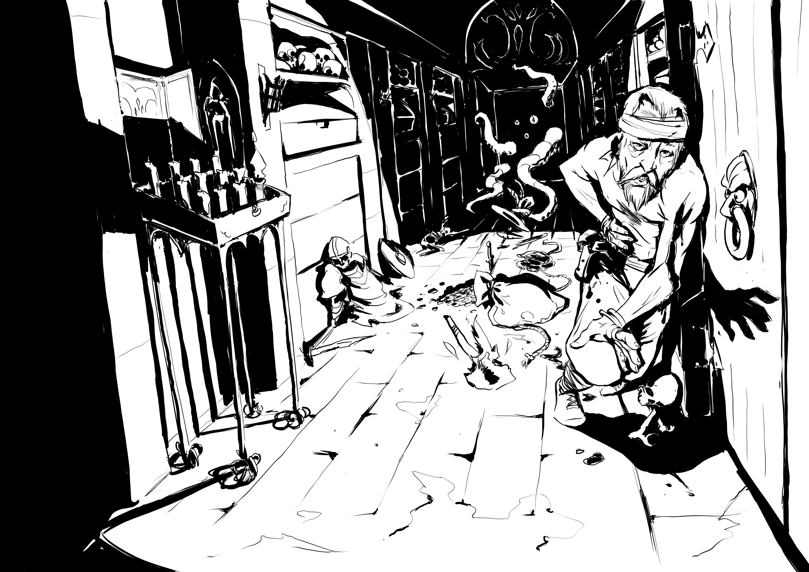

Who is this piteous creature with its sunken eyes, its long coat spattered with mud from clambering over ditches and fording streams— searching, ever searching?

Why, it's the **MORDITE PRESS BLOG**!

--- 

I return from a five-year exile, wandering far from the fields we know. I am changed, as I'm sure you are also.

The world has gone sour. When I started this blog, it was still possible to see evil as something cartoonish. I wanted to wear it as a sinister costume, to lampoon it, to take the piss.

Now, my treasured sobriquet "Lord Mordeth" is an emblem of what I detest: Lordship. Conquest. Bloody-minded grasping. This costume chafes.

My valediction, "Chaos Reigns" has become perversely manifest, and I am filled with regret. Perhaps I'll find another, in time.

My tools have betrayed me. The computer network was once a spectacular drive down a coastal highway. Now I sit in gridlocked traffic, struggling to accomplish that which was effortless before. 

The places where we met and joyously discussed our arts have been dismantled and sold off, brick by brick. I can see now how they *cursed* me; they made me something I'm not, and never wanted to be. 

Some fools have conjured a ravening demon who lurks in our works, scraping it clean and digesting it into a gleaming chrome facsimile, an insult to life itself. They're not even finished, despite the evident ruin all around us.

So I renounce it and return to the table. I pick up the dice, and I roll them. This is what they say:

*We still need these games.*

*We still need a place.* 

*We're still telling our stories, and they must be ours to tell.*

Until today, this was a blog focused on a single game which I liked very much. It may be disappointing to some that it's no longer that. All that work is still there; [I will keep it for you.](https://archive.mordite.press) 

If you liked the Mordite Mondays blog, you'll enjoy the things to come. I'm still playing games, reading and writing games. And it's become crystal clear that we need more places, honest places, to connect with games.

I'm Owen. It's nice to see you again.