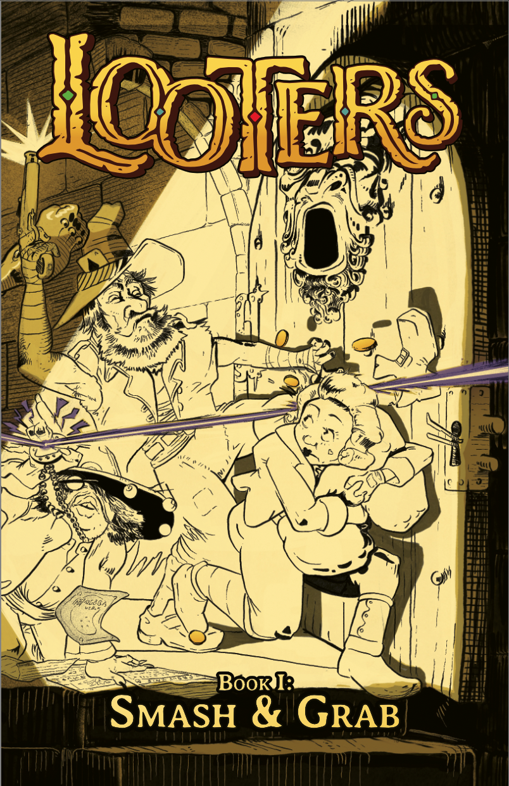

***LOOTERS: Smash & Grab*** is now available as a PDF from DriveThruRPG.

This 60-page booklet has what you need to create some looters and play the dungeon-crawling stage of the LOOTERS RPG: 

* Steps for "booking" a new looter (character creation).
* The first 4 criminal charges (classes): The Brigand, the Thief, the Heretic, and the Witch.
* Eight detailed NPC accomplices to help you do the deeds.
* Loads of weird new rules for hauling and stashing piles upon piles of coin and magic wonders.
* Unique danger rules  that emphasize your wits as much as your weapons.
* Steps for the judge to bring the dangers of the dungeon to life, with example threats, traps and monsters.
* Too many illustrations! 

***LOOTERS: Smash & Grab*** was made with one-shot sessions in mind, perfect for an action-packed introduction the the game. 

If you're hooked and you want more, *Smash & Grab* has just enough extra crunch to spend your ill-gotten gains and go back to the dungeon for more. Build up a nice stash of coin in anticipation of ***LOOTERS: Life of Crime***, coming soon.

Snag your early-access PDF from DriveThruRPG now, before the cops get here! 

...and join us on the LOOTERS RPG Discord server for a peak into what's coming next.