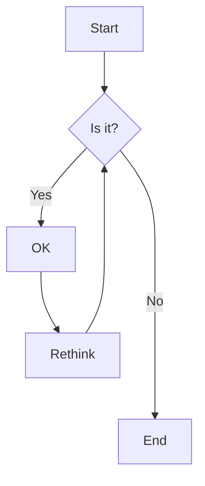
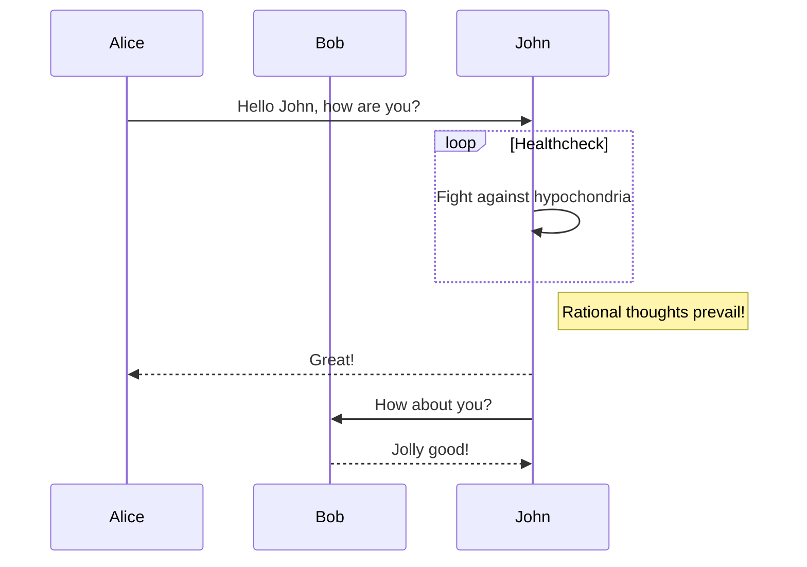
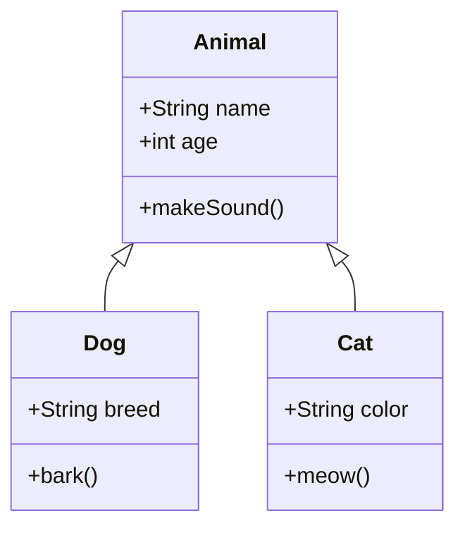
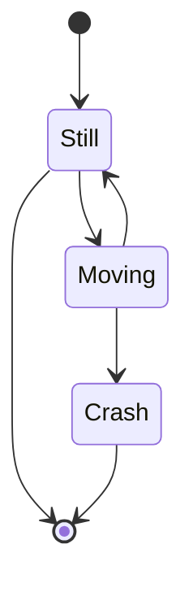
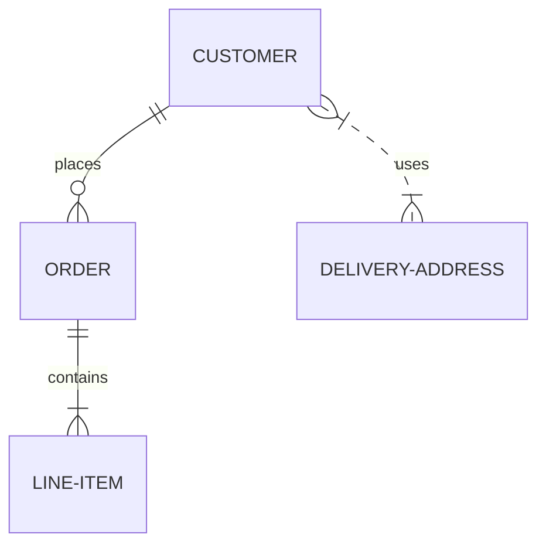
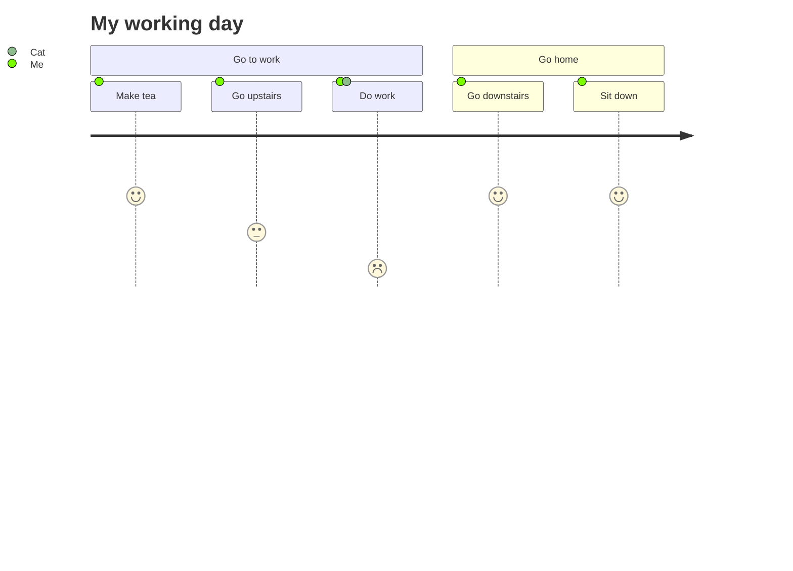
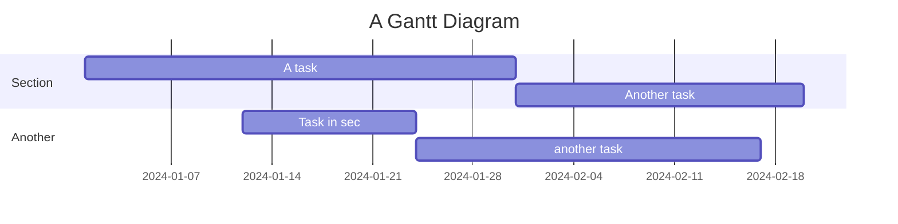
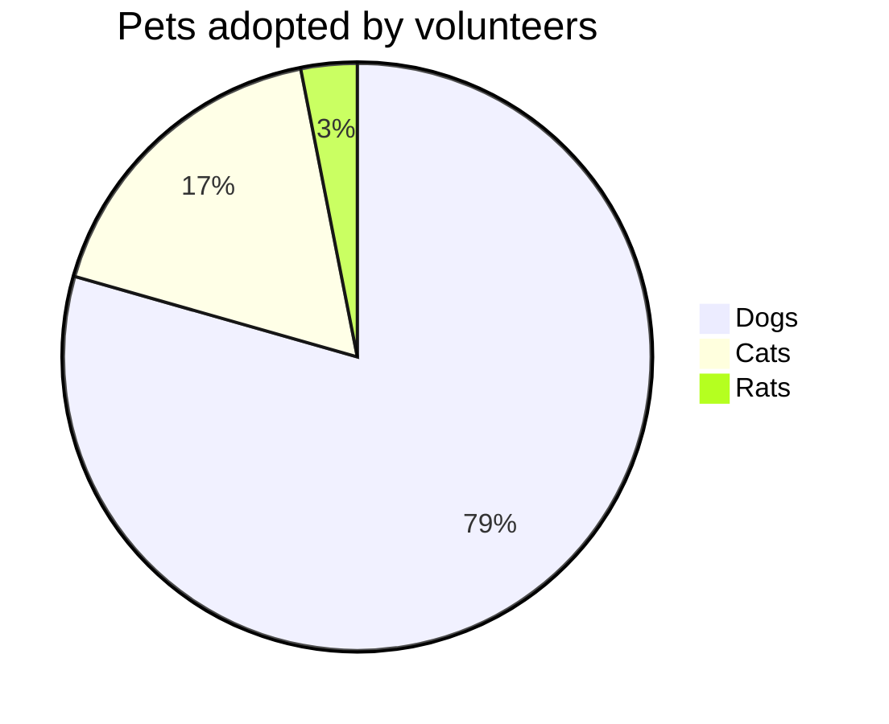
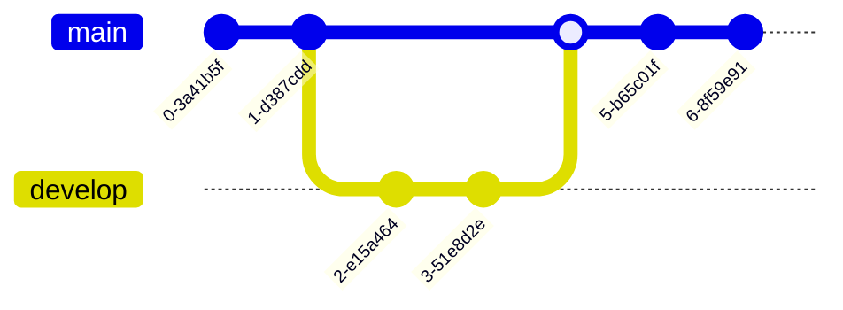
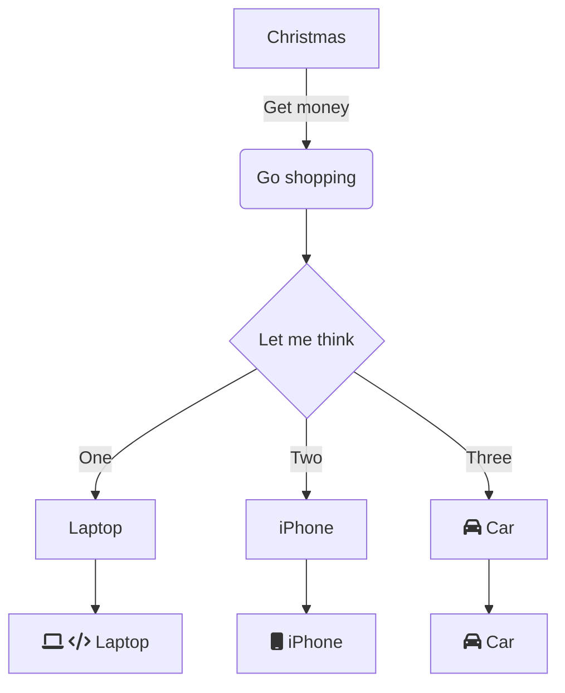

### Media embeds

### Video Files

![[attachments/video.mp4|Eye drop video]]

Video files are embedded as HTML5 video players with controls and responsive design.

### Audio Files

![[attachments/sound.wav|sound.wav]]

Audio files are embedded as HTML5 audio players with controls and filename display.

### PDF Documents

![[attachments/document.pdf|document.pdf]]

PDFs are embedded as inline viewers with download links.

Use `![[attachments/document.pdf#page=3]]` to select a specific PDF page to display.

## Auto-embeds

### YouTube Videos


YouTube videos are automatically embedded with responsive design and optimized settings.

### Twitter/X Posts


Twitter posts are embedded with theme-aware styling that matches your site's light/dark mode.

## Obsidian bases

You can embed bases with `base` directive syntax:

```base
filters:
  and:
    - file.ext == "md"
formulas:
  Slug: |-
    if(file.folder == "posts", "/posts/" + file.name.replace(".md", ""), 
      if(file.folder == "pages", "/" + file.name.replace(".md", ""), 
        if(file.folder == "special", if(file.name.replace(".md", "") == "home", "/", "/" + file.name.replace(".md", "")), 
          if(file.folder == "projects", "/projects/" + file.name.replace(".md", ""), 
            if(file.folder == "docs", "/docs/" + file.name.replace(".md", ""), 
              "/" + file.folder)))))
  Content Folder: |-
    if(file.name == "index",
      if(file.folder != "",
        if(file.folder.replace("/" + file.folder.replace(/.*\//, ""), "") != "",
          file.folder.replace("/" + file.folder.replace(/.*\//, ""), ""),
          file.folder
        ),
        "root"
      ),
      if(file.folder != "",
        file.folder,
        "root"
      )
    )
properties:
  note.title:
    displayName: Title
  note.date:
    displayName: Date
  note.pubDate:
    displayName: Date
  formula.Slug:
    displayName: Path
views:
  - type: table
    name: Posts
    filters:
      and:
        - file.folder.startsWith("posts")
    order:
      - title
      - formula.Slug
      - date
    sort:
      - property: date
        direction: DESC
    cardSize: 230
    image: note.image
    imageAspectRatio: 0.55
    columnSize:
      note.title: 235
  - type: cards
    name: Standard Pages
    filters:
      and:
        - file.folder.startsWith("pages")
    order:
      - title
      - formula.Slug
    sort:
      - property: title
        direction: ASC
  - type: cards
    name: Special Pages
    filters:
      and:
        - file.folder.startsWith("special")
    order:
      - title
      - formula.Slug
    sort:
      - property: title
        direction: ASC
  - type: cards
    name: Projects
    filters:
      and:
        - file.folder.startsWith("projects")
    order:
      - title
      - formula.Slug
    sort:
      - property: date
        direction: DESC
    image: note.image
    cardSize: 200
    imageAspectRatio: 0.6
  - type: cards
    name: Documentation
    filters:
      and:
        - file.folder.startsWith("docs")
    order:
      - title
      - formula.Slug
    sort:
      - property: lastModified
        direction: DESC
    image: note.image
    imageAspectRatio: 0.8
  - type: cards
    name: All Content
    order:
      - title
      - formula.Slug
    sort:
      - property: file.folder
        direction: ASC
    cardSize: 230
    image: note.image
    imageAspectRatio: 0.55

```

By adding a `limit` under `views` you can limit the number of items that appear. 

```base
views:
  - type: table
    name: Posts
    limit: 2
```

This is the syntax:

````markdown
```base
views:
  - type: table
    name: Posts
    limit: 2
```
````

You can also embed a `.base` as a markdown embed:

```markdown

```

Or as a wikilinks embed:

```markdown
![[Home.base]]
```
## Math

This theme includes comprehensive LaTeX math support using KaTeX for fast, client-side rendering. All math works seamlessly in both light and dark themes.

### Inline Math

Use single dollar signs for inline math: $E = mc^2$ or $\int_0^{2\pi} d\theta x+e^{-i\theta}$.

### Display Math

Use double dollar signs for centered display math:

$$
\begin{vmatrix}a & b\\
c & d
\end{vmatrix}=ad-bc
$$

$$
f(x) = x^2 + 3x + 2
$$

### Common Mathematical Notation

#### Fractions and Superscripts
- Fractions: $\frac{a}{b}$, $\frac{x^2 + 1}{x - 1}$
- Superscripts: $x^2$, $e^{i\pi} + 1 = 0$
- Subscripts: $x_1$, $H_2O$

#### Greek Letters
- $\alpha, \beta, \gamma, \delta, \epsilon, \theta, \lambda, \mu, \pi, \sigma, \phi, \omega$
- $\Gamma, \Delta, \Theta, \Lambda, \Pi, \Sigma, \Phi, \Omega$

#### Mathematical Symbols
- Summation: $\sum_{i=1}^{n} x_i$
- Product: $\prod_{i=1}^{n} x_i$
- Integral: $\int_{-\infty}^{\infty} e^{-x^2} dx = \sqrt{\pi}$
- Limit: $\lim_{x \to 0} \frac{\sin x}{x} = 1$

#### Matrices and Vectors
$$
\begin{pmatrix}
a & b \\
c & d
\end{pmatrix}
\begin{pmatrix}
x \\
y
\end{pmatrix}
=
\begin{pmatrix}
ax + by \\
cx + dy
\end{pmatrix}
$$

#### Complex Equations
$$
\nabla \times \vec{E} = -\frac{\partial \vec{B}}{\partial t}
$$

$$
i\hbar\frac{\partial}{\partial t}\Psi(\vec{r},t) = \hat{H}\Psi(\vec{r},t)
$$

### Math in Callouts

Math works perfectly within callouts:

> [!note] Mathematical Proof
> The Pythagorean theorem states that for a right triangle:
> $$a^2 + b^2 = c^2$$
> 
> Where $c$ is the hypotenuse and $a$ and $b$ are the other two sides.

> [!tip] Integration by Parts
> The formula for integration by parts is:
> $$\int u \, dv = uv - \int v \, du$$
> 
> This is particularly useful for integrals involving products of functions.

### Advanced Mathematical Typesetting

#### Aligned Equations
$$
\begin{align}
f(x) &= ax^2 + bx + c \\
f'(x) &= 2ax + b \\
f''(x) &= 2a
\end{align}
$$

#### Cases and Piecewise Functions
$$
f(x) = \begin{cases}
x^2 & \text{if } x \geq 0 \\
-x^2 & \text{if } x < 0
\end{cases}
$$

#### Set Notation
- Natural numbers: $\mathbb{N} = \{1, 2, 3, \ldots\}$
- Real numbers: $\mathbb{R}$
- Complex numbers: $\mathbb{C}$
- Set union: $A \cup B$
- Set intersection: $A \cap B$
- Subset: $A \subseteq B$

### Math with Text

You can mix math with regular text seamlessly. For example, the quadratic formula is $x = \frac{1}{2}$, which gives us the roots of any quadratic equation $ax^2 + bx + c = 0$.

### Obsidian Compatibility

All math notation works identically in Obsidian and your published blog:

- **Inline math**: `$...$` syntax
- **Display math**: `$$...$$` syntax  
- **LaTeX commands**: Full support for standard LaTeX math commands
- **Greek letters**: Use `\alpha`, `\beta`, etc.
- **Symbols**: Use `\sum`, `\int`, `\infty`, etc. 

## Diagrams

This section reproduces some Mermaid diagram examples for convenience. 

### Flowchart



### Sequence Diagram



### Class Diagram



### State Diagram



### Entity Relationship Diagram



### User Journey



### Gantt Chart



### Pie Chart



### Git Graph



### Complex Flowchart with Styling




### Error Handling Test

This should show an error state:

```mermaid
graph TD
    A[Invalid syntax
    B --> C
    INVALID_COMMAND
```

### Theme Integration

The diagrams should automatically adapt to the current theme (light/dark) and use the theme colors for better integration with the overall design.

### Responsive Design

All diagrams should be responsive and work well on mobile devices, with proper scaling and overflow handling.