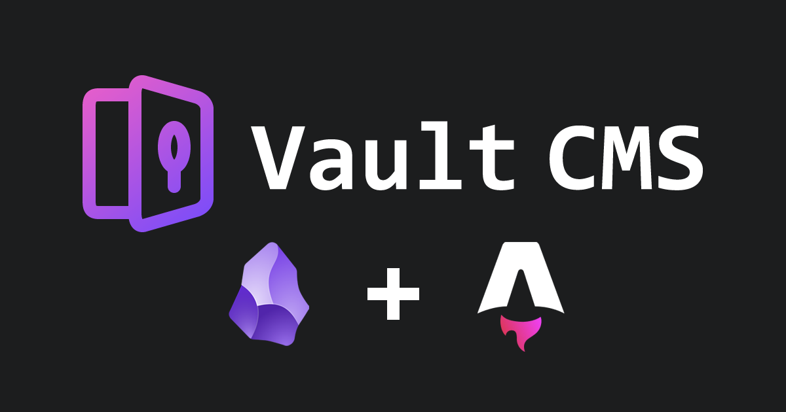

## Overview

All plugins, key bindings, and the theme can be customized to your liking, but this is what's on by default.

## Philosophy 

1. Plug-and-play Astro blogging experience. 
2. Emphasis on customization and modularity. 
3. Visual parity between backend and frontend.

## Default Settings

1. Markdown links are used in favor of wikilinks.
2. Default location for new notes is the `posts` folder.
3. Some core plugins are disabled (details below).
4. Indentation guides have been disabled.
5. Inline title has been hidden to prioritize the `title` property.
6. Custom hotkeys have been set (details below).
7. Community plugins have been enabled.

## Theme

For out-of-the-box customization, [Oxygen](https://github.com/davidvkimball/obsidian-oxygen) theme is used, based on the [Minimal theme system](https://minimal.guide/home). It uses a slick color scheme that's highly customizable. 

The [Oxygen Theme Settings](https://github.com/davidvkimball/obsidian-oxygen-settings) plugin is also installed by default, giving you complete control over your experience. You can even define your own color scheme presets. More on that [below](vault-cms-guide.md#Oxygen%20Theme%20Settings%20and%20Zen%20Mode).

## Important Hotkeys

Here's a guide for some important hotkeys set especially for this theme:
- Toggle left side panel: `CTRL + ALT + Z`
- Toggle right side panel: `CTRL + ALT + X`
- Toggle tab bar: `CTRL + ALT + S`
- Navigate back: `ALT + ←`
- Navigate forward: `ALT + →`
- Open homepage: `CTRL + M` 
- Add a new property: `CTRL + ;`
- Toggle property visibility for current note: `CTRL + ALT + P`
- Toggle reading view: `CTRL + E`
- Toggle Editing toolbar: `CTRL + SHIFT + E`
- Toggle Zen mode: `CTRL + SHIFT + Z`
- Insert remote image: `CTRL + '`
- Insert remote image into property: `CTRL + SHIFT + '`
- Insert callout: `CTRL + SHIFT + C`
- Rename current content: `CTRL + R` 
- Open SEO audit: `CTRL + SHIFT + A`
- Open Terminal: `CTRL + SHIFT + D`
- Open Astro Modular Settings: `CTRL + SHIFT + ,`
- Commit and sync git: `CTRL + SHIFT + S`

If you're on Mac, `CTRL` = `CMD`.

## Plugins 

Disabled default core plugins: 
- Canvas
- Daily notes
- Note composer
- Page preview
- Templates
- Sync

Community plugins enabled: 
- Alias Filename History
- Astro Composer
- Astro Modular Settings
- Bases CMS
- Editing Toolbar
- Explorer Focus
- Git
- Home Base
- Iconic
- Image Manager
- Oxygen Theme Settings
- Property Over Filename
- SEO
- Settings Search
- Tag Wrangler
- UI Tweaker
- Zen Mode

### Astro Modular Settings

The Astro Modular Settings plugin was specifically made for this theme. It has everything you need to easily tweak your blog's features. It edits the project's `config.ts` file, even though it's outside of the Obsidian vault's root directory. 

A wizard will open at startup which will lead you through some configuration options. You can disable this pop up if you like. 

Pretty much anything else you'd possible want to customize is in the settings of the plugin. You can also create your own theme, import and export configs, and a bunch more.

### Home Base and Bases CMS

These plugins work together so your default screen is a `.base` file that's a directory of all of your content, listed in reverse-chronological order. A home icon is pinned to your tab bar, which makes it easy to return to. You can turn this off if you'd like in Home Base's settings. 

Bases CMS lets us treat a grid of content like a content management system. You can select multiple items and do bulk edits, rename content right from that view, or toggle the draft status of an item. You're also able to configure the CMS view and even add new views to your liking. 

To edit a view, select the current view on the top left, revealing the list, and then select the right chevron arrow to open up the "configure view" options. Configure your desired properties here. At the very bottom, you can set where new notes are created when the "new" button is clicked on the top right. By default they'll be the same location as the base folder for the content type you're viewing.

### Astro Composer and Alias Filename History

Handy for easily creating new notes as Astro blog posts, pages, projects, or docs. Just create a new note with `CTRL + N`, type in a title in Title case or with special characters, and the note or folder name generated is a kebab-case version of the title without special characters. This is ideal for automating content page slugs. 

You can also define and set default properties that can be generated automatically or manually set for any open note as well. The "Standardize properties" command can help set or reorganize any missing properties or tags, especially if you update your properties template down the road.

Unlike other themes, you can use wikilinks or standard markdown links, ***without*** having to convert those to internal links for Astro with the "Convert internal links for Astro" command. This theme supports any internal link that works with Obsidian.

You can also easily grab links to headings by right clicking one and selecting "Copy Heading Link". 

`CTRL + R` allows you to easily rename blog posts, and note filenames (or parent folders) get updated in kebab-case automatically. When this happens, the old filename will be stored as an alias by default via the Alias Filename History plugin. This means redirects of the old post or page URL will go to the current post's slug, which is configured in Astro. 

You can adjust lots of settings including regex for ignoring names (like `Untitled` or a `_` prefix), timeout in seconds to store the name, or looking for changes in the parent folder name as well if you use the folder-based post option.

Astro Composer also has several useful commands. To open terminal quickly, use the `Open terminal` command. It's been modified for Windows, macOS, and Linux to start terminal in the relevant directory so you can easily do standard package manager commands with `pnpm` or `npm`. It can be activated with `CTRL + SHIFT + D`. 

You can also launch the `Edit Astro config` command, which will open your `config.ts` file. You can access this if you want, but it's a bit easier to just launch the `Open Astro Modular Settings` command instead. You can also press `CTRL + SHIFT + ,` to open it, or use the conveniently-placed icon next to the traditional Obsidian settings icon (which can be toggled off in Astro Composer's plugin settings if you don't want it there). 

### Oxygen Theme Settings, UI Tweaker, Explorer Focus, and Zen Mode

The Oxygen Theme Settings plugin helps you customize your experience if you use the provided Oxygen Obsidian theme and can help you focus on writing.

You'll notice a wide variety of color scheme options, most of which were included in the [Minimal](https://github.com/kepano/obsidian-minimal) theme upon which Oxygen is based.

Should you desire to hide any of the panels, you can use `CTRL + ALT Z` for the left side panel, `CTRL + ALT + X` for the right side panel, or `CTRL + ALT + S` for the tab bar. Pressing it again will reveal it again. 

UI Tweaker lets you hide and adjust UI elements as well. Open it up and customize it to your liking. 

With the Explorer Focus plugin, you can can simplify your file explorer view to just the directory that's immediately relevant to your currently-open file. Just click the toggle focus button or right click a directory in the file explorer pane to pare down on the number of files and folder you're seeing.

Zen Mode offers another quick option to focus on your writing. Pressing `CTRL + SHIFT + Z` will enter Zen mode. When activated, all elements removed except for your content. Use the keystroke again to exit. 

If you like, you can install the [Style Settings](https://github.com/mgmeyers/obsidian-style-settings) plugin for even more control over your experience.

### Git

With the [Git](https://obsidian.md/plugins?id=obsidian-git) plugin, you can easily publish to your Astro blog without leaving Obsidian. Simply configure with git to enable it. By default, you'll see your current git status and count of files changed (if any) in the status bar on the bottom right.

To publish, you can use `CTRL + SHIFT + S` or click the "commit-and-sync" button on the status bar. Your changes will be committed and pushed to your remote repository automatically. By default it's pinned to the far right of the status bar. You can also re-arrange status bar items to your liking using UI Tweaker.

### Image Manager

Quickly drag and drop image files, insert images with a command, or paste images directly from your clipboard. Each works directly in note content or within properties. Pull in images from Unsplash, Pexels, or Pixabay easily with just a few keystrokes. Just use `CTRL + '` to insert a remote image - and immediately set SEO-friendly alt text and a file name. Insert into the designated property with `CTRL + SHIFT + '` 

You can also insert local images with a command - which get converted to local images by default.

You can add a nice-looking banner on the top of any Markdown file, as long as a valid `image` property is defined. Matches the cover image used in the Bases CMS view by default.

### Tag Wrangler

Makes managing tabs more useful. Can easily bulk-rename tags or search your content by tags.

### Property Over File Name

When linking, searching, or displaying notes, you can use the `title` property as its primary label instead of its file name. Using title properties is more helpful visually and semantically for linking, searching, and displaying content, since note file names are actually page slugs in kebab case instead of traditional titles. 

When you link to another note, its `title` is automatically set as the hyperlinked text, but you can easily change it to something else after it's been inserted. 

Tabs display the note's `title` property instead of the file name as well. 

You can adjust this behavior in Property Over File Name settings.

### Settings Search

Simply provides a global search option for all settings in Obsidian.

### SEO

Get a snappy audit of your content for search engine rankings and AI parsing. You can get a quick snapshot of your whole vault or drill down into specific posts. You can configure the settings to turn off checks you don't care about or tweak the logic in the calculations.

### Editing Toolbar

This adds a WYSIWYG toolbar to Obsidian. Click the "toggle editing toolbar" button (added with UI Tweaker) on the title bar to show or hide it. It's hidden until revealed and completely disabled on mobile by default..

### BRAT

Used to load Astro Modular Settings and the beta plugins that aren't included in the community directory yet. Future versions of this vault will remove BRAT versions in favor of the official releases.

### Disable Tabs

This is off by default, but if enabled, opening any new tab replaces the current one only. Especially nice for when you're hiding the tab bar and don't want multiple tabs. If you enable this plugin, you might consider disabling the tab button on mobile and adjusting some of the UI Tweaker settings under the Hider > Navigation section.

### Folder Notes

Also off by default, but an option for anyone using a folder-based system of content who might want to simplify their file explorer view. Instead of hunting down the `index.md` or similar file in each folder, each parent folder assumes the name of the content housed within it, and the Markdown file can be opened by simply clicking the folder itself.

## Mobile 

### Disabling the Git Plugin

It's recommended to disable the Git plugin on mobile and use something like [Git Sync](https://github.com/ViscousPot/GitSync) for iOS and Android (or [MGit](https://github.com/maks/MGit) just for Android) instead. The Git plugin is notoriously buggy on mobile so it's better to use something else. 

Here's how to disable it: 

1. On your mobile device, open Obsidian, and open your Astro Modular site's `src/content` folder as a vault. 
2. Open the left sidebar and open Settings. 
3. Scroll down to community plugins and tap on Git from the list.
4. Scroll all the way down and select "Disable on this device".
5. Restart Obsidian. 

This method is recommended rather than merely disabling the plugin, since if you sync with your desktop it will also get disabled there, too. This way it's disabled per-device.

### Limitations

Aspects of the UI Tweaker plugin and some Image Manager features are disabled on mobile. 

### Customization 

To tweak the mobile-specific experience on the mobile version of Obsidian, you can use the UI Tweaker plugin's settings and also visit Toolbar and Appearance in settings.

#### Toolbar

Under the Toolbar settings, you can set the mobile quick action which is triggered by pulling down from the top of the screen by tapping the "Configure" option. 

Below that you can adjust what options are available to you on the mobile toolbar.

#### Appearance 

Under the Appearance settings, locate "Interface" and the "Ribbon menu configuration" option's "Manage" button. You can set your preferred quick access item from the list, and customize which items appear on the ribbon menu. 

### You're All Set

Assuming you have git working on your phone in another capacity, you now have seamless content sync between your desktop, laptop, tablet, and mobile devices.