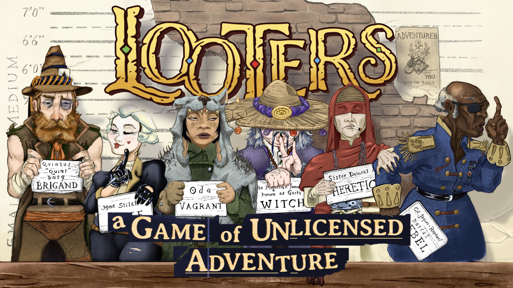
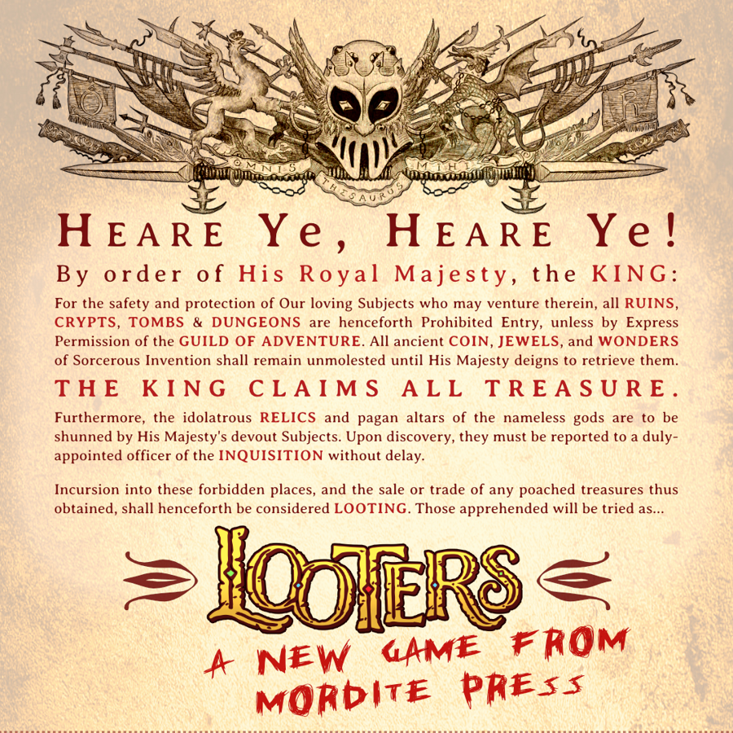
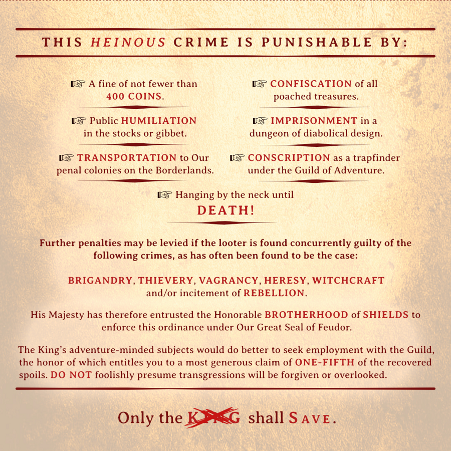

---

From the creators of _[The Vagrant's Guide to Surviving the Wild](https://www.drivethrurpg.com/en/product/301549/torchbearer-sagas-the-vagrant-s-guide-to-surviving-the-wild), [Noctis Labyrinth](https://www.drivethrurpg.com/en/product/551428/noctis-labyrinth),_ and the _Grind turns [I](https://www.drivethrurpg.com/en/product/283895/torchbearer-sagas-the-grind), [II](https://www.drivethrurpg.com/en/product/335443/torchbearer-sagas-the-grind-turn-2-mistvale-nights), & [III](https://www.drivethrurpg.com/en/product/468408/grind-iii-hell-or-highwater)_ comes an all-new, stand-alone role-playing game.

---

---

Back in the old days, any starving commoner could raid their attic for an ancestral sword, strap it to their back and plunge recklessly into some ancient ruins. A series of thrilling adventures would ensue, and they'd return with a wagon-load of riches and magical wonders. You could make a name for yourself as an _adventurer_, beholden to no one.

That’s how it used to work, anyhow.

Along came one great adventurer who went and made himself **KING**. Not content to simply rule over the kingdom, His Majesty decreed that all future dungeon-plunder would fill _his_ coffers. And so he formed The Guild of Adventure—most just call them the **GUILDERS**—and cut off all access to wondrous treasure for the common folk.

These days it’s against the law to lay down your hoe and risk life and limb in search of treasure. But just because it’s illegal doesn’t mean it’s not decent work.

Enter you, the _**LOOTERS**_, who by choice or desperation walk the path of old-fashioned adventuresome types, rules be damned.

## **What's the Story Here?**

_**LOOTERS**_ is set in a the post-medieval world that comes _after_ the earliest fantasy role-playing books. You know the ones I mean.

_It's an outlaw ballad, and superheroic adventurers are the sheriff._

You and your friends play the brigands, witches, and cultists who are usually slain in droves by "heroes," just for the crime of looting the same dungeon as the rich and powerful. It's a silly setting, but not for the people in it.

## **What Kind of RPG is this?**

_**LOOTERS**_ is an adventure RPG with some story game bits. It's a dungeon-crawler focused on teamwork, danger, and big personalities. Your looter's driven by their **motive** to adventure illegally, and they've got to rely on their **accomplices** to turn a profit and stay one step ahead of their **accusers**.

As you face down the perils of ancient dungeons, you'll build a dice pool by applying your methods, honing your specialties, and tapping into your personality quirks. 

Dungeon crawling is punishing work, and as you drag your ill-gotten loot around the dungeon you face increasing danger from fatigue, dwindling supplies and lurking monsters. The more stuff you're hauling around, the greater the risk.

**Built for hard outs and open tables**

**_LOOTERS: Smash & Grab_** was made with one-shot sessions in mind, perfect for an action-packed introduction to the game.

As looters, you've only got a limited time in the dungeon before the authorities come and run you off. Your goal is to have looted the valuables before that happens. Looters sessions end with a bang; you either get away with the loot, or you get nabbed and thrown in jail. This is great news for players with tight schedules and real-world obligations, and it sets you up for open table play where you might have a different cast of characters every time.
## **What's in the Book?**

This 60-page booklet has what you need to create some looters and play the dungeon-crawling stage of the LOOTERS RPG:

• Steps for "booking" a new looter (character creation).
• The first 4 criminal charges (classes): The **Brigand**, the **Thief**, the **Heretic**, and the **Witch**.
• Eight detailed NPC accomplices to help you do the deeds.
• Loads of weird new rules for hauling and stashing piles upon piles of coin and magic wonders.
• Unique danger rules that emphasize your wits as much as your weapons.
• Steps for the judge to bring the dangers of the dungeon to life, with example threats, traps and monsters.
• Too many illustrations!

## What's Next?
If you're hooked and you want more, _Smash & Grab_ has just enough extra crunch to spend your ill-gotten gains and go back to the dungeon for more. Build up a nice stash of coin in anticipation of **_LOOTERS: Life of Crime_**, coming soon.

Snag your early-access PDF from [itch.io](https://mordite-press.itch.io/looters-smash-grab) or [DriveThruRPG](https://www.drivethrurpg.com/en/product/573045/looters-smash-grab) now, before the cops get here!

...and join us on the [LOOTERS RPG Discord server](https://www.mordite.press/posts/join-the-looters-discord-server) for a peek into what's coming next.
